# RBAC Module - Visual Diagrams

## 1. System Architecture Overview


## 2. Permission Calculation Flow

```mermaid
graph LR
    subgraph "Permission Hierarchy"
        A[User] --> B{Is Administrator?}
        B -->|Yes| C[ALL PERMISSIONS<br/>✅ Bypasses normal calculation<br/>✅ Cannot be overridden<br/>✅ Automatic grant]
        B -->|No| D[Normal Permission Calculation]
    end

    subgraph "Three-Tier Permission System"
        D --> E[1. Designation Permissions<br/>📋 Base role permissions<br/>👔 Job title based<br/>🔄 Inherited by all users]
        E --> F[2. Group Permissions<br/>👥 Team/project permissions<br/>🎯 Functional additions<br/>➕ Supplement designation]
        F --> G[3. Override Permissions<br/>👤 Individual user permissions<br/>🎛️ Highest priority<br/>✅ Grant or ❌ Deny]
    end

    subgraph "Conflict Resolution Engine"
        G --> H{Conflicts Detected?}
        H -->|Yes| I[Apply Priority Rules<br/>1. Explicit Deny Override<br/>2. Administrator Grant<br/>3. Explicit Grant Override<br/>4. Group Grant<br/>5. Designation Grant<br/>6. Default Deny]
        H -->|No| J[Direct Permission Merge]
        I --> K[Final Effective Permissions]
        J --> K
    end

    subgraph "Scope & Limitations"
        K --> L[Apply Scope Limitations<br/>🌍 Geographic Scope<br/>🏢 Functional Scope<br/>⏰ Temporal Scope<br/>🔐 Conditional Requirements]
    end

    subgraph "Caching & Delivery"
        L --> M[Cache Results<br/>⚡ Redis Storage<br/>🕐 1 hour TTL<br/>🔄 Auto-invalidation]
        M --> N[Return to User<br/>📱 Frontend Display<br/>🔍 Real-time Checking<br/>📊 Dashboard Updates]
    end

    style A fill:#e3f2fd
    style C fill:#c8e6c9
    style D fill:#fff9c4
    style E fill:#f3e5f5
    style F fill:#e1f5fe
    style G fill:#fce4ec
    style H fill:#fff3e0
    style I fill:#ffebee
    style J fill:#e8f5e8
    style K fill:#e0f2f1
    style L fill:#f1f8e9
    style M fill:#fafafa
    style N fill:#e8eaf6
```



## 3. User Experience Flow

```mermaid
graph TD
    subgraph "Dashboard Views"
        A[🏠 Overview Tab<br/>📊 Permission Matrix<br/>📈 System Statistics<br/>👥 All Users vs Permissions]
        B[👤 User Analysis Tab<br/>🔍 Individual User Deep-dive<br/>📋 Permission Breakdown<br/>⚠️ Risk Assessment]
        C[🔐 Permission Analysis Tab<br/>🎯 Permission-centric View<br/>👥 Who has what permissions<br/>📊 Usage Statistics]
        D[📈 Analytics Tab<br/>📉 Trends & Insights<br/>⚠️ Risk Dashboard<br/>📋 Compliance Reports]
    end

    subgraph "Permission Assignment Workflows"
        E[🎯 Designation Assignment<br/>1️⃣ Select Designation<br/>2️⃣ Choose Permissions<br/>3️⃣ Set Level & Reason<br/>4️⃣ Submit & Audit]
        F[👥 Group Assignment<br/>1️⃣ Create/Select Group<br/>2️⃣ Add Users<br/>3️⃣ Assign Permissions<br/>4️⃣ Set Parameters]
        G[👤 Override Assignment<br/>1️⃣ Select User<br/>2️⃣ Choose Permission<br/>3️⃣ Grant/Deny Override<br/>4️⃣ Business Justification]
    end

    subgraph "My Permissions Experience"
        H[📱 Personal Dashboard<br/>✅ Current Permissions<br/>🏷️ Administrator Badge<br/>📊 Permission Summary<br/>🔍 Source Breakdown]
        I[📋 Permission Categories<br/>🔧 User Management<br/>📁 Project Management<br/>🏢 Site Management<br/>⚙️ System Administration]
        J[⚠️ Risk Indicators<br/>🟢 Low Risk<br/>🟡 Medium Risk<br/>🔴 High Risk<br/>⚫ Critical Risk]
    end

    subgraph "Security & Compliance"
        K[🔒 Multi-layer Security<br/>🔐 JWT Authentication<br/>🏢 Tenant Isolation<br/>👁️ Permission Validation<br/>🛡️ Resource Access Control]
        L[📋 Audit & Compliance<br/>📝 Complete Audit Trail<br/>⚖️ SOX Compliance<br/>🏛️ ISO 27001<br/>🔐 GDPR Support]
        M[🚨 Threat Mitigation<br/>🔺 Privilege Escalation<br/>📈 Permission Creep<br/>👤 Insider Threats<br/>💻 Account Compromise]
    end

    %% Navigation flows
    A -.-> B
    B -.-> C
    C -.-> D
    D -.-> A

    E -.-> F
    F -.-> G
    G -.-> E

    H --> I
    I --> J

    K --> L
    L --> M

    %% Cross-connections
    A --> E
    B --> G
    C --> F
    H --> A

    style A fill:#e3f2fd
    style B fill:#f3e5f5
    style C fill:#e8f5e8
    style D fill:#fff3e0
    style E fill:#fce4ec
    style F fill:#e1f5fe
    style G fill:#f1f8e9
    style H fill:#e8eaf6
    style I fill:#e0f2f1
    style J fill:#ffebee
    style K fill:#e8f5e8
    style L fill:#fff9c4
    style M fill:#ffebee
```



## 4. API Data Flow Sequence


## 5. Component Architecture Detail

```mermaid
graph TB
    subgraph "Frontend Components Architecture"
        A["🎛️ ComprehensivePermissionDashboard.tsx<br/>📊 Main dashboard container<br/>🔄 Tab state management<br/>📡 API data coordination"]

        B["📋 PermissionAssignmentPanel.tsx<br/>🎯 Multi-step assignment workflow<br/>✅ Form validation & submission<br/>🔄 State management for assignment types"]

        C["👤 MyPermissionsPage.tsx<br/>📱 Personal permission view<br/>🏷️ Administrator badge logic<br/>📊 Real-time permission display"]

        D["🔧 rbacAPI.ts<br/>🌐 API service layer<br/>📡 HTTP request handling<br/>❌ Error management"]
    end

    subgraph "Backend API Architecture"
        E["🎯 PermissionGroupViewSet<br/>📊 comprehensive_dashboard endpoint<br/>👥 Group management<br/>🔄 User assignments"]

        F["👤 UserPermissionViewSet<br/>👁️ Permission checking<br/>📋 User profile management<br/>🔍 Designation queries"]

        G["🏢 TenantDesignationViewSet<br/>🎯 Permission assignment to roles<br/>📋 Designation management<br/>✅ Assignment validation"]

        H["📋 PermissionRegistryViewSet<br/>🔐 Permission CRUD operations<br/>🔍 Permission search & filtering<br/>📊 Bulk operations"]
    end

    subgraph "Service Layer"
        I["⚙️ TenantRBACService<br/>🧮 Permission calculation engine<br/>🔍 Effective permission resolution<br/>👑 Administrator privilege handling"]

        J["📝 PermissionAuditService<br/>📋 Change tracking<br/>🔍 Audit trail management<br/>📊 Compliance reporting"]

        K["⚡ CacheService<br/>🗄️ Redis cache management<br/>⏱️ Cache invalidation<br/>🔄 Performance optimization"]
    end

    subgraph "Database Models"
        L["📋 PermissionRegistry<br/>🔐 Permission definitions<br/>⚠️ Risk levels<br/>🏷️ Categories"]

        M["👤 TenantUserProfile<br/>👥 User tenant relationships<br/>🏢 Department assignments<br/>📊 Profile metadata"]

        N["🎯 TenantDesignation<br/>📋 Role definitions<br/>🏢 Organizational hierarchy<br/>⚖️ Authority levels"]

        O["👥 PermissionGroup<br/>🎯 Functional teams<br/>📋 Project-based permissions<br/>🔄 Dynamic memberships"]

        P["👤 UserPermissionOverride<br/>🎛️ Individual exceptions<br/>⏰ Temporal restrictions<br/>📝 Business justifications"]

        Q["📝 PermissionAuditTrail<br/>📋 Complete change history<br/>👤 Actor tracking<br/>🌐 IP address logging"]
    end

    %% Frontend connections
    A --> D
    B --> D
    C --> D

    %% API connections
    D --> E
    D --> F
    D --> G
    D --> H

    %% Service connections
    E --> I
    F --> I
    G --> I
    H --> I
    I --> J
    I --> K

    %% Database connections
    I --> L
    I --> M
    I --> N
    I --> O
    I --> P
    J --> Q

    %% Cache connections
    K -.-> M
    K -.-> L
    K -.-> Q

    style A fill:#e3f2fd
    style B fill:#f3e5f5
    style C fill:#e8f5e8
    style D fill:#fff3e0
    style E fill:#fce4ec
    style F fill:#e1f5fe
    style G fill:#f1f8e9
    style H fill:#e8eaf6
    style I fill:#fff9c4
    style J fill:#ffebee
    style K fill:#e0f2f1
    style L fill:#f9fbe7
    style M fill:#f3e5f5
    style N fill:#e8f5e8
    style O fill:#e1f5fe
    style P fill:#fce4ec
    style Q fill:#fff3e0
```



## How to Use These Diagrams

### Online Rendering:

1. **Mermaid Live Editor**: https://mermaid.live/
2. **GitHub/GitLab**: Paste code in `.md` files (native support)
3. **VS Code**: Install Mermaid Preview extension
4. **Notion**: Use Mermaid blocks
5. **Confluence**: Mermaid macro

### Export Options:

- **PNG/SVG**: From Mermaid Live Editor
- **PDF**: Print from browser
- **Integration**: Embed in documentation systems

### Local Setup:

```bash
npm install -g @mermaid-js/mermaid-cli
mmdc -i diagram.mmd -o diagram.png
```
