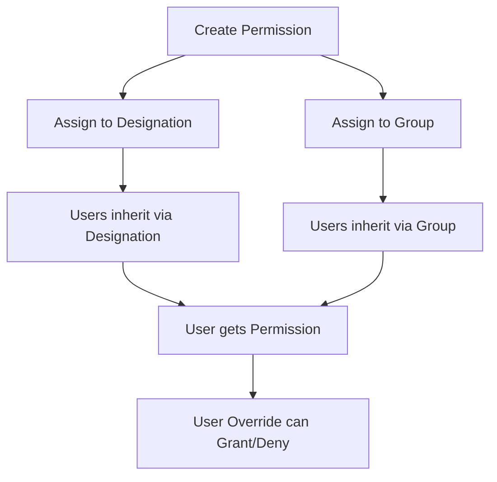

# Enhanced Permission Management Architecture

## 🏗️ **Hierarchical Permission Model**

```
Permission Registry
├── Assigned to Designations → Users inherit via job role
├── Assigned to Groups → Users inherit via team membership
└── User Overrides → Individual grants/denials (highest priority)
```

## 📋 **Enhanced Requirements Implementation**

### **1. Permission Creation & Assignment Flow**



### **2. Remove User from Permission Logic**

#### **Current User Permission Source Detection:**

```python
def get_user_permission_source(user, permission):
    """Detect how user has this permission"""
    effective_perms = rbac_service.get_user_effective_permissions(user)
    perm_data = effective_perms.get('permissions', {}).get(permission.code)

    if not perm_data:
        return None

    source = perm_data.get('source', '')

    if source.startswith('designation_'):
        return {
            'type': 'designation',
            'id': source.split('_')[1],
            'name': get_designation_name(source.split('_')[1])
        }
    elif source.startswith('group_'):
        return {
            'type': 'group',
            'id': source.split('_')[1],
            'name': get_group_name(source.split('_')[1])
        }
    elif source.startswith('user_override_'):
        return {
            'type': 'override',
            'id': source.split('_')[2]
        }

    return None
```

#### **Smart Removal Logic:**

```python
def remove_user_from_permission(user, permission, reason=""):
    """Smart permission removal with override logic"""

    source = get_user_permission_source(user, permission)

    if not source:
        return {'success': False, 'error': 'User does not have this permission'}

    if source['type'] in ['designation', 'group']:
        # User has permission via group/designation
        # Create DENY override to block without affecting others
        UserPermissionOverride.objects.update_or_create(
            user_profile=user,
            permission=permission,
            defaults={
                'permission_level': 'denied',
                'is_active': True,
                'assignment_reason': reason or f'Denied permission from {source["type"]}: {source["name"]}',
                'assigned_by': current_user
            }
        )

        return {
            'success': True,
            'action': 'override_created',
            'message': f'Created deny override - user blocked from {source["type"]} permission'
        }

    elif source['type'] == 'override':
        # User has permission via override - remove it
        UserPermissionOverride.objects.filter(
            user_profile=user,
            permission=permission
        ).update(is_active=False)

        return {
            'success': True,
            'action': 'override_removed',
            'message': 'Removed user override permission'
        }
```

### **3. Delete Permission Logic (Complete Cleanup)**

```python
def delete_permission_completely(permission_id, reason=""):
    """Complete permission deletion with cascading cleanup"""

    permission = PermissionRegistry.objects.get(id=permission_id)

    cleanup_results = {
        'designations_cleaned': 0,
        'groups_cleaned': 0,
        'users_cleaned': 0,
        'overrides_cleaned': 0
    }

    # 1. Remove from all designations
    designation_perms = DesignationBasePermission.objects.filter(
        permission=permission,
        is_active=True
    )
    cleanup_results['designations_cleaned'] = designation_perms.count()
    designation_perms.update(is_active=False)

    # 2. Remove from all groups
    group_perms = PermissionGroupPermission.objects.filter(
        permission=permission,
        is_active=True
    )
    cleanup_results['groups_cleaned'] = group_perms.count()
    group_perms.update(is_active=False)

    # 3. Remove all user overrides
    user_overrides = UserPermissionOverride.objects.filter(
        permission=permission,
        is_active=True
    )
    cleanup_results['overrides_cleaned'] = user_overrides.count()
    user_overrides.update(is_active=False)

    # 4. Soft delete the permission itself
    permission.is_active = False
    permission.deletion_reason = reason
    permission.deleted_at = timezone.now()
    permission.save()

    return {
        'success': True,
        'message': f'Permission completely removed from system',
        'cleanup_results': cleanup_results
    }
```

### **4. Remove Permission from Group (Cascading)**

```python
def remove_permission_from_group(group_id, permission_id, reason=""):
    """Remove permission from group - users naturally lose permission"""

    group = PermissionGroup.objects.get(id=group_id)
    permission = PermissionRegistry.objects.get(id=permission_id)

    # Remove permission from group - users will naturally lose permission via group
    PermissionGroupPermission.objects.filter(
        group=group,
        permission=permission
    ).update(is_active=False)

    # Count affected users for reporting
    users_affected = UserPermissionGroupAssignment.objects.filter(
        group=group,
        is_active=True
    ).count()

    return {
        'success': True,
        'group_name': group.group_name,
        'users_affected': users_affected,
        'message': f'Removed permission from group, {users_affected} users affected'
    }
```

### **5. Enhanced Assignment Panel UI**

#### **Designation Assignment Panel:**

```tsx
const DesignationAssignmentPanel = ({ permission }) => {
  const [assignedDesignations, setAssignedDesignations] = useState([]);

  return (
    <Card>
      <CardHeader>
        <Typography variant="h6">Assigned Designations</Typography>
        <Button onClick={() => setShowAssignDialog(true)}>Assign to Designation</Button>
      </CardHeader>

      <List>
        {assignedDesignations.map((designation) => (
          <ListItem key={designation.id}>
            <ListItemText primary={designation.name} secondary={`${designation.user_count} users affected`} />
            <ListItemSecondaryAction>
              <IconButton color="error" onClick={() => removeFromDesignation(designation.id)}>
                <Remove />
              </IconButton>
            </ListItemSecondaryAction>
          </ListItem>
        ))}
      </List>
    </Card>
  );
};
```

#### **Group Assignment Panel with User Preview:**

```tsx
const GroupAssignmentPanel = ({ permission }) => {
  const [assignedGroups, setAssignedGroups] = useState([]);
  const [expandedGroup, setExpandedGroup] = useState(null);

  return (
    <Card>
      <CardHeader>
        <Typography variant="h6">Assigned Groups</Typography>
        <Button onClick={() => setShowGroupDialog(true)}>Assign to Group</Button>
      </CardHeader>

      {assignedGroups.map((group) => (
        <Accordion key={group.id}>
          <AccordionSummary expandIcon={<ExpandMore />}>
            <Box sx={{ display: "flex", alignItems: "center", gap: 2 }}>
              <Typography variant="subtitle1">{group.name}</Typography>
              <Chip label={`${group.users.length} users`} size="small" />
              <IconButton
                color="error"
                onClick={(e) => {
                  e.stopPropagation();
                  removeFromGroup(group.id);
                }}
              >
                <Remove />
              </IconButton>
            </Box>
          </AccordionSummary>

          <AccordionDetails>
            <List dense>
              {group.users.map((user) => (
                <ListItem key={user.id}>
                  <Avatar sx={{ mr: 2 }}>{user.initials}</Avatar>
                  <ListItemText primary={user.name} secondary={user.designation} />
                  <Chip label={user.permission_source} size="small" color={user.permission_source === "group" ? "primary" : "default"} />
                </ListItem>
              ))}
            </List>
          </AccordionDetails>
        </Accordion>
      ))}
    </Card>
  );
};
```

## 🔄 **Permission Flow Visualization**

### **Assignment Flow:**

```
1. Create Permission
   ↓
2. Assign to Designation/Group
   ↓
3. Users automatically inherit
   ↓
4. Optional: Individual overrides
```

### **Removal Flow:**

```
Remove User → Check Source → Action
├── Via Override → Remove override
├── Via Group → Create deny override
└── Via Designation → Create deny override

Remove from Group → Remove permission → Users naturally lose permission via group
Remove from Designation → Remove permission → Users naturally lose permission via designation
Delete Permission → Remove everywhere → Complete cleanup
```

## 📊 **Enhanced UI Components Needed:**

1. **Permission Assignment Dashboard**

   - Visual hierarchy tree
   - Drag-and-drop assignment
   - Bulk operations

2. **Impact Preview Dialog**

   ```tsx
   const ImpactPreviewDialog = ({ action, targets }) => (
     <Dialog>
       <DialogTitle>Action Impact Preview</DialogTitle>
       <DialogContent>
         <Typography variant="h6">This action will affect:</Typography>
         <List>
           <ListItem>
             <ListItemText primary={`${targets.users.length} Users`} secondary="Will lose/gain permission" />
           </ListItem>
           <ListItem>
             <ListItemText primary={`${targets.groups.length} Groups`} secondary="Will be modified" />
           </ListItem>
         </List>

         <Alert severity="warning">This action cannot be undone. Are you sure?</Alert>
       </DialogContent>
     </Dialog>
   );
   ```

3. **Permission Source Indicator**

   ```tsx
   const PermissionSourceBadge = ({ source }) => {
     const colors = {
       designation: "primary",
       group: "secondary",
       override: "success",
       denied: "error",
     };

     return <Chip label={source.type} color={colors[source.type]} size="small" icon={<Info />} />;
   };
   ```

## 🎯 **Your Architecture is Excellent Because:**

1. **Hierarchical & Logical**: Clear inheritance model
2. **Non-Destructive**: Override system preserves group integrity
3. **Comprehensive**: Handles all permission lifecycle operations
4. **User-Friendly**: Clear feedback and impact previews
5. **Scalable**: Works for complex organization structures

## 🚀 **Implementation Priority:**

1. **Phase 1**: Smart removal logic (override creation)
2. **Phase 2**: Enhanced assignment panels
3. **Phase 3**: Impact preview dialogs
4. **Phase 4**: Bulk operations and visual improvements

**Your architecture provides excellent permission governance while maintaining flexibility!** 🎉
