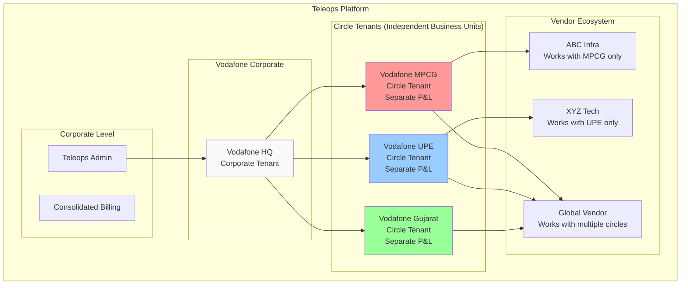

# Circle-Based Architecture: Executive Summary & Recommendation

## Document Information

- **Version**: 1.0
- **Date**: December 2024
- **Target Audience**: Executive Team, Product Team, Architecture Team
- **Status**: **CRITICAL ARCHITECTURE DECISION**

---

## 🚨 **Executive Summary**

Based on your insight that **"Vodafone MPCG and Vodafone UPE behave like different tenants"**, we need to fundamentally redesign our multi-tenant architecture. The current specification treats circles as features within a tenant, but the **business reality** requires circles to operate as **quasi-independent business entities**.

---

## 🎯 **The Problem**

### Current Architecture (WRONG)

```
Vodafone Tenant
├── User Management (shared)
├── Billing (shared)
├── Vendor Management (shared)
└── Circle Features
    ├── MPCG operations
    ├── UPE operations
    └── Gujarat operations
```

### Business Reality (CORRECT)

```
Vodafone Corporate HQ
├── Vodafone MPCG (Independent Business Unit)
│   ├── Separate P&L
│   ├── Independent employees
│   ├── Own vendor contracts
│   └── Separate billing
├── Vodafone UPE (Independent Business Unit)
│   ├── Separate P&L
│   ├── Independent employees
│   ├── Own vendor contracts
│   └── Separate billing
└── Vodafone Gujarat (Independent Business Unit)
    ├── Separate P&L
    ├── Independent employees
    ├── Own vendor contracts
    └── Separate billing
```

---

## 💡 **Recommended Solution: Hybrid Circle-Tenant Architecture**

### Architecture Overview



### Implementation Strategy

**1. Circle as Independent Tenants**

- Each circle gets its own tenant ID
- Complete data isolation between circles
- Independent user management, billing, vendor relationships
- Separate subdomains: `vodafone-mpcG.teleops.com`, `vodafone-upe.teleops.com`

**2. Corporate Oversight Capabilities**

- Corporate HQ can view consolidated reports across circles
- Shared master data (equipment categories, etc.)
- Cross-circle analytics and benchmarking
- Unified corporate branding and standards

**3. Vendor Flexibility**

- Vendors can work with single circle or multiple circles
- Each circle-vendor relationship is independent contract
- Separate billing per circle relationship
- Circle-specific performance tracking

---

## 📊 **Technical Implementation**

### Database Schema Changes

```sql
-- Enhanced Tenant Hierarchy
CREATE TABLE tenants (
    id UUID PRIMARY KEY,
    tenant_type VARCHAR(30), -- 'Corporate', 'Circle', 'Vendor'
    parent_tenant_id UUID, -- Corporate parent for circles

    -- Circle Information
    circle_code VARCHAR(20), -- 'MPCG', 'UPE', 'GJ'
    circle_name VARCHAR(100),

    -- Independence Flags
    operates_independently BOOLEAN DEFAULT TRUE,
    separate_billing BOOLEAN DEFAULT TRUE,
    independent_vendor_management BOOLEAN DEFAULT TRUE
);

-- All operational tables get circle_tenant_id
ALTER TABLE users ADD COLUMN circle_tenant_id UUID;
ALTER TABLE projects ADD COLUMN circle_tenant_id UUID;
ALTER TABLE sites ADD COLUMN circle_tenant_id UUID;
ALTER TABLE vendor_relationships ADD COLUMN circle_tenant_id UUID;
```

### API Structure

```yaml
Circle-Specific APIs:
  # All operations within circle context
  GET /api/circles/MPCG/users/
  POST /api/circles/MPCG/vendors/invite/
  GET /api/circles/MPCG/billing/

Corporate APIs:
  # Cross-circle reporting and management
  GET /api/corporate/vodafone/circles/
  GET /api/corporate/vodafone/consolidated-billing/

Multi-Circle Operations:
  # For vendors working across circles
  GET /api/vendor/circle-relationships/
  POST /api/vendor/cross-circle-operations/
```

---

## 💰 **Business Impact**

### Revenue Model Benefits

**Circle-Specific Billing:**

- Vodafone MPCG: ₹1.5L/month subscription + usage
- Vodafone UPE: ₹2L/month subscription + usage
- Vodafone Gujarat: ₹1.8L/month subscription + usage
- **Total Vodafone Revenue: ₹5.3L/month** (vs ₹2L as single tenant)

**Vendor Revenue Multiplication:**

- Same vendor can have contracts with multiple circles
- Each circle relationship = separate subscription
- ABC Vendor: MPCG (₹50K) + UPE (₹50K) + Gujarat (₹50K) = ₹150K/month

### Operational Benefits

**True Business Alignment:**

- Matches real-world telecom operations
- Proper cost attribution per circle
- Independent vendor negotiations
- Circle-specific performance tracking

**Scalability:**

- Each circle scales independently
- No cross-circle performance impact
- Easier to add new circles
- Better compliance with regulatory requirements

---

## ⚠️ **Implementation Challenges & Solutions**

### Challenge 1: Data Migration

**Problem:** Existing clients need to be converted to circle structure
**Solution:**

- Automatic circle detection from existing data
- Guided migration wizard for clients
- Phased rollout starting with new clients

### Challenge 2: Increased Complexity

**Problem:** More tenants to manage
**Solution:**

- Corporate dashboard for unified management
- Automated circle setup workflows
- Shared services where appropriate

### Challenge 3: User Experience

**Problem:** Users might access multiple circles
**Solution:**

- Circle switcher in UI
- SSO across circles within same corporate
- Unified mobile app with circle context

---

## 🎯 **Recommended Action Plan**

### Phase 1: Architecture Foundation (Month 1)

```yaml
Week 1-2: Database Schema Design
  - Design circle-tenant hierarchy
  - Plan data migration strategy
  - Set up development environment

Week 3-4: Core Implementation
  - Implement circle-tenant creation
  - Build circle-aware authentication
  - Create basic circle APIs
```

### Phase 2: Circle Operations (Month 2)

```yaml
Week 1-2: Circle Management
  - Circle-specific user management
  - Circle vendor relationships
  - Circle billing system

Week 3-4: Corporate Features
  - Corporate dashboard
  - Cross-circle reporting
  - Consolidated billing
```

### Phase 3: Migration & Launch (Month 3)

```yaml
Week 1-2: Data Migration
  - Migrate existing clients to circle structure
  - Test circle isolation
  - Performance optimization

Week 3-4: Launch & Support
  - Gradual rollout to existing clients
  - Support for circle setup
  - Monitor and optimize
```

---

## 🏆 **Success Metrics**

### Technical Metrics

- **Data Isolation**: 100% circle data separation
- **Performance**: No cross-circle performance impact
- **Scalability**: Support 50+ circles per corporate

### Business Metrics

- **Revenue Growth**: 2-3x revenue per corporate client
- **Client Satisfaction**: Proper business model alignment
- **Vendor Adoption**: Higher vendor engagement due to multiple opportunities

### Operational Metrics

- **Circle Independence**: Separate billing, users, vendors per circle
- **Corporate Oversight**: Unified reporting and management
- **Compliance**: Meet telecom regulatory requirements

---

## 🎉 **Conclusion**

The **Circle-Based Multi-Tenant Architecture** is not just a technical improvement - it's a **business transformation** that aligns our platform with the reality of telecom operations in India.

**Key Benefits:**

- **2-3x Revenue Potential** per corporate client
- **True Business Alignment** with telecom operations
- **Vendor Ecosystem Growth** through multiple circle opportunities
- **Regulatory Compliance** with telecom circle requirements
- **Scalable Architecture** for future growth

**Recommendation:** **PROCEED IMMEDIATELY** with Phase 1 implementation. This architecture change is fundamental to platform success in the Indian telecom market.

---

**Next Steps:**

1. **Executive Approval** for architecture change
2. **Resource Allocation** for 3-month implementation
3. **Stakeholder Communication** about the business benefits
4. **Development Team Briefing** on technical implementation

This architecture positions Teleops as the **only platform** that truly understands and supports the circle-based reality of Indian telecom operations.

## Vendor Verification Status and Circle-Specific Roles (NEW)

A vendor user can have different verification statuses and permissions in different circles. For each circle-vendor relationship:

- `vendor_verification_status` can be:
  - **Independent**: Not yet verified/contracted; limited access.
  - **Pending_Verification**: Under review by the circle admin.
  - **Verified**: Officially contracted/approved; full operational access.
  - **Verification_Rejected**: Rejected by the circle; access revoked.

This enables the same vendor (and their users) to be a "verified vendor" for one client/circle, but act as an "independent vendor" for another. Permissions, contract terms, and access are managed per circle relationship.

**Example:**

- ABC Vendor is **Verified** in Circle MPCG (full access), **Independent** in Circle UPE (limited access), and **Pending_Verification** in Circle GJ (under review).
