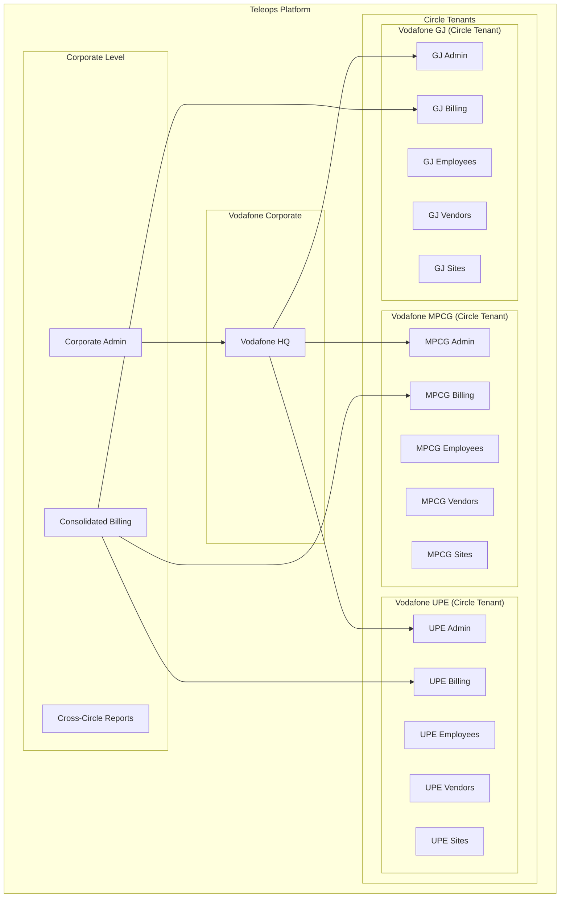

# Circle-Based Multi-Tenant Architecture Specification

## Document Information

- **Version**: 1.0
- **Date**: December 2024
- **Target Audience**: Architecture Team, Development Team, Product Team
- **Status**: Core Architecture Foundation

---

## Executive Summary

This document defines the **Circle-Based Multi-Tenant Architecture** for the Teleops platform, recognizing that in Indian telecommunications, **circles operate as quasi-independent business entities**. For example, Vodafone MPCG and Vodafone UPE function as separate businesses with independent billing, management, vendor relationships, and operations.

---

## Business Context

### Telecom Circle Reality

```yaml
Real-World Examples:
  Vodafone India:
    - Vodafone Maharashtra & Goa (MH)
    - Vodafone Gujarat (GJ)
    - Vodafone UP East (UPE)
    - Vodafone MP & Chhattisgarh (MPCG)

  Each Circle Operates Independently:
    - Separate P&L statements
    - Independent vendor relationships
    - Circle-specific management hierarchy
    - Separate billing and revenue tracking
    - Independent operational teams
    - Circle-specific pricing and contracts

Business Implications:
  - Vodafone MPCG contracts vendors independently from Vodafone UPE
  - Billing is calculated separately per circle
  - Employee structures are circle-specific
  - Sites and projects are circle-bound
  - Vendor performance is tracked per circle
  - Management decisions are circle-autonomous
```

### Current Industry Practice

```yaml
How Telecom Companies Actually Work:
  Company Structure:
    - Corporate HQ: Strategic oversight and shared services
    - Circle Operations: Independent business units
    - Shared Resources: Some technology, legal, finance support

  Circle Independence Level:
    - Revenue Recognition: Per circle
    - Vendor Management: Circle-specific relationships
    - Employee Management: Circle-based hiring and management
    - Project Execution: Circle-contained operations
    - Performance Metrics: Circle-level KPIs

  Cross-Circle Activities:
    - Technology sharing: Limited
    - Vendor sharing: Rare, requires separate contracts
    - Employee transfers: Formal process
    - Data sharing: Aggregated reporting only
```

---

## Proposed Architecture: **Hybrid Circle-Tenant Model**

### Architecture Overview



---

## Technical Implementation

### 1. Tenant Hierarchy Structure

```sql
-- Enhanced Tenant Table with Circle Architecture
CREATE TABLE tenants (
    id UUID PRIMARY KEY DEFAULT uuid_generate_v4(),

    -- Tenant Hierarchy
    tenant_type VARCHAR(30) NOT NULL, -- 'Corporate', 'Circle', 'Vendor'
    parent_tenant_id UUID REFERENCES tenants(id), -- Corporate parent for circles

    -- Organization Details
    organization_name VARCHAR(255) NOT NULL,
    organization_code VARCHAR(50) UNIQUE, -- e.g., 'VOD_MPCG', 'VOD_UPE'

    -- Circle Information (for Circle tenants)
    circle_code VARCHAR(20), -- 'MPCG', 'UPE', 'GJ', etc.
    circle_name VARCHAR(100), -- 'Madhya Pradesh & Chhattisgarh'

    -- Business Details
    business_registration_number VARCHAR(100),
    industry_sector VARCHAR(100) DEFAULT 'Telecommunications',
    gst_number VARCHAR(20),

    -- Platform Configuration
    subdomain VARCHAR(100) UNIQUE, -- e.g., 'vodafone-MPCG-teleops'
    subscription_plan VARCHAR(50),
    billing_cycle VARCHAR(20) DEFAULT 'Monthly',

    -- Status Management
    registration_status VARCHAR(30) DEFAULT 'Active',
    activation_status VARCHAR(30) DEFAULT 'Active',
    is_active BOOLEAN DEFAULT TRUE,

    -- Business Operational Settings
    operates_independently BOOLEAN DEFAULT TRUE, -- Circle independence flag
    shared_vendor_pool BOOLEAN DEFAULT FALSE, -- Can share vendors with parent
    cross_circle_reporting BOOLEAN DEFAULT TRUE, -- Allow parent reporting

    -- Audit Fields
    created_at TIMESTAMP WITH TIME ZONE DEFAULT NOW(),
    updated_at TIMESTAMP WITH TIME ZONE DEFAULT NOW(),
    activated_at TIMESTAMP WITH TIME ZONE,

    -- Constraints
    CHECK (tenant_type IN ('Corporate', 'Circle', 'Vendor')),
    CHECK (
        (tenant_type = 'Circle' AND parent_tenant_id IS NOT NULL AND circle_code IS NOT NULL) OR
        (tenant_type = 'Corporate' AND parent_tenant_id IS NULL) OR
        (tenant_type = 'Vendor')
    )
);

-- Circle Master Data (Enhanced)
CREATE TABLE telecom_circles (
    id SERIAL PRIMARY KEY,
    circle_code VARCHAR(20) UNIQUE NOT NULL,
    circle_name VARCHAR(100) NOT NULL,
    region VARCHAR(50),
    state_coverage TEXT[],
    major_cities TEXT[],
    population_coverage BIGINT,
    is_active BOOLEAN DEFAULT TRUE,
    created_at TIMESTAMP WITH TIME ZONE DEFAULT NOW()
);

-- Corporate-Circle Relationships
CREATE TABLE corporate_circle_relationships (
    id BIGSERIAL PRIMARY KEY,
    corporate_tenant_id UUID NOT NULL REFERENCES tenants(id),
    circle_tenant_id UUID NOT NULL REFERENCES tenants(id),

    -- Relationship Configuration
    relationship_type VARCHAR(30) DEFAULT 'Parent_Circle',
    governance_level VARCHAR(30) DEFAULT 'Autonomous', -- Autonomous, Managed, Controlled

    -- Financial Configuration
    separate_billing BOOLEAN DEFAULT TRUE,
    cost_center_code VARCHAR(50),
    budget_authority_level DECIMAL(15,2),

    -- Operational Configuration
    independent_vendor_management BOOLEAN DEFAULT TRUE,
    independent_employee_management BOOLEAN DEFAULT TRUE,
    shared_technology_access BOOLEAN DEFAULT TRUE,

    -- Reporting Configuration
    reports_to_corporate BOOLEAN DEFAULT TRUE,
    data_sharing_level VARCHAR(30) DEFAULT 'Aggregated', -- None, Aggregated, Full

    -- Status
    is_active BOOLEAN DEFAULT TRUE,
    effective_from DATE DEFAULT CURRENT_DATE,
    effective_to DATE,

    created_at TIMESTAMP WITH TIME ZONE DEFAULT NOW(),
    updated_at TIMESTAMP WITH TIME ZONE DEFAULT NOW(),

    UNIQUE(corporate_tenant_id, circle_tenant_id),
    CHECK (governance_level IN ('Autonomous', 'Managed', 'Controlled')),
    CHECK (data_sharing_level IN ('None', 'Aggregated', 'Full'))
);
```

### 2. Circle-Specific Data Models

```sql
-- All operational tables include circle_tenant_id for data isolation

-- Circle-Specific User Profiles
CREATE TABLE user_profiles (
    id BIGSERIAL PRIMARY KEY,
    user_id INTEGER NOT NULL REFERENCES auth_user(id),

    -- Circle Isolation
    circle_tenant_id UUID NOT NULL REFERENCES tenants(id),

    -- User Details
    employee_id VARCHAR(50), -- Unique within circle
    phone_number VARCHAR(20),
    designation_id BIGINT REFERENCES designations(id),

    -- Circle-Specific Fields
    circle_employee_code VARCHAR(50), -- Circle-specific ID
    circle_joining_date DATE,
    circle_exit_date DATE,

    -- Status
    is_active BOOLEAN DEFAULT TRUE,
    created_at TIMESTAMP WITH TIME ZONE DEFAULT NOW(),

    UNIQUE(circle_tenant_id, employee_id),
    UNIQUE(circle_tenant_id, user_id)
);

-- Circle-Specific Site Management
CREATE TABLE sites (
    id BIGSERIAL PRIMARY KEY,

    -- Circle Isolation
    circle_tenant_id UUID NOT NULL REFERENCES tenants(id),

    -- Site Details
    site_name VARCHAR(255) NOT NULL,
    site_code VARCHAR(100), -- Unique within circle
    latitude DECIMAL(10, 8),
    longitude DECIMAL(11, 8),
    address TEXT,

    -- Circle-Specific Configuration
    circle_region VARCHAR(50),
    circle_district VARCHAR(100),

    -- Status
    is_active BOOLEAN DEFAULT TRUE,
    created_at TIMESTAMP WITH TIME ZONE DEFAULT NOW(),

    UNIQUE(circle_tenant_id, site_code)
);

-- Enhanced Multi-Level Vendor Relationships (NEW)
CREATE TABLE vendor_relationships (
    id UUID PRIMARY KEY DEFAULT gen_random_uuid(),

    -- Core Relationship
    client_tenant_id UUID NOT NULL REFERENCES tenants(id) ON DELETE CASCADE,
    vendor_tenant_id UUID REFERENCES tenants(id) ON DELETE CASCADE,

    -- Vendor Information
    vendor_code VARCHAR(100) NOT NULL, -- Client-generated vendor code
    vendor_name VARCHAR(255),
    vendor_email VARCHAR(255),

    -- Relationship Types & Hierarchy
    relationship_type VARCHAR(50) NOT NULL DEFAULT 'Primary_Vendor',
    relationship_status VARCHAR(50) NOT NULL DEFAULT 'Invitation_Sent',
    verification_status VARCHAR(50) NOT NULL DEFAULT 'Independent',

    -- Multi-Level Hierarchy Support
    parent_relationship_id UUID REFERENCES vendor_relationships(id) ON DELETE CASCADE,
    hierarchy_level INTEGER DEFAULT 1, -- 1=Direct, 2=Sub-vendor, 3=Sub-sub-vendor

    -- Service Configuration
    service_scope VARCHAR(50) DEFAULT 'Circle_Wide',
    service_areas JSONB DEFAULT '[]',
    service_capabilities JSONB DEFAULT '[]',

    -- Financial Terms
    billing_rate DECIMAL(12,2),
    revenue_share_percentage DECIMAL(5,2), -- For sub-contracting
    payment_terms VARCHAR(100),
    currency VARCHAR(10) DEFAULT 'INR',
    billing_frequency VARCHAR(20) DEFAULT 'Monthly',

    -- Performance Tracking
    performance_rating DECIMAL(3,2),
    quality_score DECIMAL(3,2),

    -- Contract Management
    contract_start_date DATE,
    contract_end_date DATE,

    -- Status and Timestamps
    is_active BOOLEAN DEFAULT TRUE,
    created_at TIMESTAMP WITH TIME ZONE DEFAULT NOW(),
    updated_at TIMESTAMP WITH TIME ZONE DEFAULT NOW(),

    -- Constraints
    UNIQUE(client_tenant_id, vendor_code),
    UNIQUE(client_tenant_id, vendor_tenant_id, relationship_type),
    CHECK (relationship_type IN ('Primary_Vendor', 'Subcontractor', 'Partnership', 'Service_Provider', 'Preferred_Vendor', 'Backup_Vendor')),
    CHECK (relationship_status IN ('Invitation_Sent', 'Pending_Approval', 'Active', 'Suspended', 'Terminated', 'Expired')),
    CHECK (verification_status IN ('Independent', 'Pending_Verification', 'Verified', 'Verification_Rejected', 'Requires_Update')),
    CHECK (hierarchy_level > 0),
    CHECK (revenue_share_percentage IS NULL OR (revenue_share_percentage >= 0 AND revenue_share_percentage <= 100))
);

-- Circle-Specific Vendor Relationships (Legacy - Maintained for Backward Compatibility)
CREATE TABLE circle_vendor_relationships (
    id BIGSERIAL PRIMARY KEY,

    -- Circle and Vendor
    circle_tenant_id UUID NOT NULL REFERENCES tenants(id),
    vendor_tenant_id UUID NOT NULL REFERENCES tenants(id),

    -- Relationship Details
    vendor_code VARCHAR(100), -- Circle's internal vendor code
    relationship_status VARCHAR(30) DEFAULT 'Active',
    contract_start_date DATE,
    contract_end_date DATE,

    -- Vendor Verification Status (NEW)
    vendor_verification_status VARCHAR(50) NOT NULL DEFAULT 'Independent', -- 'Independent', 'Pending_Verification', 'Verified', 'Verification_Rejected'

    -- Circle-Specific Configuration
    service_areas TEXT[], -- Districts/regions within circle
    service_capabilities TEXT[],
    performance_rating DECIMAL(3,2),

    -- Financial Terms (Circle-specific)
    payment_terms VARCHAR(100),
    currency VARCHAR(10) DEFAULT 'INR',
    billing_frequency VARCHAR(20) DEFAULT 'Monthly',

    -- Status
    is_active BOOLEAN DEFAULT TRUE,
    created_at TIMESTAMP WITH TIME ZONE DEFAULT NOW(),

    UNIQUE(circle_tenant_id, vendor_tenant_id),
    UNIQUE(circle_tenant_id, vendor_code),
    CHECK (vendor_verification_status IN ('Independent', 'Pending_Verification', 'Verified', 'Verification_Rejected'))
);

---

### Enhanced Multi-Level Vendor Relationships (UPDATED)

The enhanced vendor relationship system supports complex multi-level hierarchies and cross-tenant vendor networks while maintaining backward compatibility with existing circle-vendor relationships.

#### Multi-Level Vendor Hierarchies

**Hierarchy Examples:**
- **Level 1**: Vodafone MPCG → vedag (Primary Vendor)
- **Level 2**: vedag → Verveland (Subcontractor with 25% revenue share)
- **Level 3**: Verveland → LocalCrew (Sub-subcontractor with 15% revenue share)

**Cross-Tenant Vendor Networks:**
- **Corporate-to-Corporate**: Ericsson MPCG → Vodafone MPCG (Service Provider relationship)
- **Multi-Client Vendor**: Verveland works for Vodafone, Ericsson, AND vedag simultaneously
- **Circle-to-Circle**: Independent circle service arrangements

#### Vendor Verification Status (Enhanced)

Each vendor relationship has independent verification status and permissions:
- **Independent**: Not yet verified; limited access
- **Pending_Verification**: Under review by client admin
- **Verified**: Officially contracted; full operational access
- **Verification_Rejected**: Rejected by client; access revoked
- **Requires_Update**: Verification needs renewal

#### Enhanced Multi-Client Operations

**Verveland Example (Multi-Client Vendor):**
- **Vodafone MPCG**: Vendor Code "VOD-MPCG-VERV-001" (Verified status)
- **Ericsson Gujarat**: Vendor Code "ERI-GJ-VERVELAND-2024" (Verified status)
- **vedag (subcontractor)**: Vendor Code "VEDAG-SUB-001" (Subcontractor status)

Each relationship operates independently with separate:
- Billing and revenue tracking
- Performance metrics and ratings
- Communication channels and access levels
- Compliance and verification requirements

---

-- Circle-Specific Projects
CREATE TABLE projects (
    id BIGSERIAL PRIMARY KEY,

    -- Circle Isolation
    circle_tenant_id UUID NOT NULL REFERENCES tenants(id),

    -- Project Details
    project_name VARCHAR(255) NOT NULL,
    project_code VARCHAR(100), -- Unique within circle
    project_type VARCHAR(50),

    -- Circle-Specific Details
    circle_budget DECIMAL(15,2),
    circle_priority VARCHAR(20),
    circle_manager_id BIGINT REFERENCES user_profiles(id),

    -- Status
    status VARCHAR(30) DEFAULT 'Planning',
    is_active BOOLEAN DEFAULT TRUE,
    created_at TIMESTAMP WITH TIME ZONE DEFAULT NOW(),

    UNIQUE(circle_tenant_id, project_code)
);

-- Circle-Specific Billing
CREATE TABLE circle_billing_records (
    id BIGSERIAL PRIMARY KEY,

    -- Circle and Period
    circle_tenant_id UUID NOT NULL REFERENCES tenants(id),
    billing_period DATE NOT NULL, -- First day of billing month

    -- Revenue Components
    subscription_revenue DECIMAL(15,2) DEFAULT 0,
    usage_revenue DECIMAL(15,2) DEFAULT 0,
    premium_features_revenue DECIMAL(15,2) DEFAULT 0,
    vendor_fees_revenue DECIMAL(15,2) DEFAULT 0,

    -- Cost Components
    platform_costs DECIMAL(15,2) DEFAULT 0,
    support_costs DECIMAL(15,2) DEFAULT 0,
    infrastructure_costs DECIMAL(15,2) DEFAULT 0,

    -- Calculated Fields
    gross_revenue DECIMAL(15,2) GENERATED ALWAYS AS (
        subscription_revenue + usage_revenue + premium_features_revenue + vendor_fees_revenue
    ) STORED,
    total_costs DECIMAL(15,2) GENERATED ALWAYS AS (
        platform_costs + support_costs + infrastructure_costs
    ) STORED,
    net_revenue DECIMAL(15,2) GENERATED ALWAYS AS (
        (subscription_revenue + usage_revenue + premium_features_revenue + vendor_fees_revenue) -
        (platform_costs + support_costs + infrastructure_costs)
    ) STORED,

    -- Status
    billing_status VARCHAR(30) DEFAULT 'Draft',
    generated_at TIMESTAMP WITH TIME ZONE DEFAULT NOW(),
    approved_at TIMESTAMP WITH TIME ZONE,

    UNIQUE(circle_tenant_id, billing_period),
    CHECK (billing_status IN ('Draft', 'Generated', 'Approved', 'Invoiced', 'Paid'))
);
```

### 3. Access Control and Permissions

```sql
-- Circle-Based Permission Model
CREATE TABLE circle_permissions (
    id BIGSERIAL PRIMARY KEY,
    user_id INTEGER NOT NULL REFERENCES auth_user(id),
    circle_tenant_id UUID NOT NULL REFERENCES tenants(id),

    -- Permission Scope
    permission_scope VARCHAR(30) DEFAULT 'Circle_Only', -- Circle_Only, Cross_Circle, Corporate

    -- Circle-Specific Permissions
    can_manage_circle_users BOOLEAN DEFAULT FALSE,
    can_manage_circle_vendors BOOLEAN DEFAULT FALSE,
    can_view_circle_billing BOOLEAN DEFAULT FALSE,
    can_create_circle_projects BOOLEAN DEFAULT FALSE,
    can_access_circle_reports BOOLEAN DEFAULT FALSE,

    -- Cross-Circle Permissions (for corporate users)
    can_view_all_circles BOOLEAN DEFAULT FALSE,
    can_manage_circle_relationships BOOLEAN DEFAULT FALSE,
    can_access_corporate_reports BOOLEAN DEFAULT FALSE,

    -- Status
    is_active BOOLEAN DEFAULT TRUE,
    granted_at TIMESTAMP WITH TIME ZONE DEFAULT NOW(),
    granted_by INTEGER REFERENCES auth_user(id),

    UNIQUE(user_id, circle_tenant_id)
);

-- Row Level Security for Circle Data Isolation
-- Enable RLS on all circle-specific tables

-- Example for user_profiles table
ALTER TABLE user_profiles ENABLE ROW LEVEL SECURITY;

CREATE POLICY user_profiles_circle_isolation ON user_profiles
    FOR ALL TO authenticated_users
    USING (
        circle_tenant_id IN (
            SELECT circle_tenant_id
            FROM circle_permissions
            WHERE user_id = current_user_id()
            AND is_active = TRUE
        )
        OR
        -- Corporate users can see all circles under their corporate tenant
        EXISTS (
            SELECT 1
            FROM circle_permissions cp
            JOIN corporate_circle_relationships ccr ON cp.circle_tenant_id = ccr.corporate_tenant_id
            WHERE cp.user_id = current_user_id()
            AND cp.can_view_all_circles = TRUE
            AND ccr.circle_tenant_id = user_profiles.circle_tenant_id
        )
    );
```

---

## API Architecture

### 1. Circle-Aware API Structure

```yaml
API Endpoint Structure:
  Circle-Specific Endpoints:
    # All operations within a circle context
    GET    /api/circles/{circle_code}/users/
    POST   /api/circles/{circle_code}/users/
    GET    /api/circles/{circle_code}/vendors/
    POST   /api/circles/{circle_code}/vendors/invite/
    GET    /api/circles/{circle_code}/sites/
    POST   /api/circles/{circle_code}/projects/
    GET    /api/circles/{circle_code}/billing/

  Corporate-Level Endpoints:
    # Cross-circle operations and reporting
    GET    /api/corporate/circles/
    GET    /api/corporate/consolidated-billing/
    GET    /api/corporate/cross-circle-reports/
    POST   /api/corporate/circles/{circle_code}/configure/

  Multi-Circle Operations:
    # Operations that can span circles (with permissions)
    GET    /api/multi-circle/vendor-performance/
    POST   /api/multi-circle/resource-transfer/
    GET    /api/multi-circle/consolidated-reports/

Authentication Context:
  JWT Token Structure:
    {
      "user_id": 123,
      "corporate_tenant_id": "vodafone-corp-uuid",
      "circle_tenant_id": "vodafone-MPCG-uuid",
      "circle_code": "MPCG",
      "permissions": ["circle.manage_users", "circle.view_billing"],
      "cross_circle_access": ["UPE", "GJ"] // If applicable
    }
```

### 2. Business Logic Services

```python
class CircleTenantService:
    """Business logic for circle-based multi-tenancy"""

    def create_circle_tenant(self, corporate_tenant_id, circle_data):
        """Create new circle tenant under corporate parent"""
        # Validate corporate tenant exists
        corporate_tenant = self.get_tenant(corporate_tenant_id)
        if corporate_tenant.tenant_type != 'Corporate':
            raise ValidationError("Parent must be corporate tenant")

        # Create circle tenant
        circle_tenant = Tenant.objects.create(
            tenant_type='Circle',
            parent_tenant_id=corporate_tenant_id,
            organization_name=f"{corporate_tenant.organization_name} {circle_data['circle_name']}",
            organization_code=f"{corporate_tenant.organization_code}_{circle_data['circle_code']}",
            circle_code=circle_data['circle_code'],
            circle_name=circle_data['circle_name'],
            subdomain=f"{corporate_tenant.organization_code.lower()}-{circle_data['circle_code'].lower()}-teleops",
            operates_independently=circle_data.get('operates_independently', True),
            subscription_plan=circle_data.get('subscription_plan', 'Professional')
        )

        # Create corporate-circle relationship
        CorporateCircleRelationship.objects.create(
            corporate_tenant_id=corporate_tenant_id,
            circle_tenant_id=circle_tenant.id,
            governance_level=circle_data.get('governance_level', 'Autonomous'),
            separate_billing=circle_data.get('separate_billing', True),
            independent_vendor_management=circle_data.get('independent_vendor_management', True)
        )

        # Initialize circle-specific data
        self.initialize_circle_tenant(circle_tenant)

        return circle_tenant

    def get_user_circle_context(self, user_id):
        """Get user's circle access context"""
        permissions = CirclePermissions.objects.filter(
            user_id=user_id,
            is_active=True
        ).select_related('circle_tenant')

        context = {
            'primary_circle': None,
            'accessible_circles': [],
            'corporate_access': False,
            'cross_circle_permissions': []
        }

        for perm in permissions:
            circle_info = {
                'circle_tenant_id': perm.circle_tenant_id,
                'circle_code': perm.circle_tenant.circle_code,
                'circle_name': perm.circle_tenant.circle_name,
                'permissions': self.get_permission_list(perm)
            }

            context['accessible_circles'].append(circle_info)

            if perm.can_view_all_circles:
                context['corporate_access'] = True

            # Set primary circle (first one or one with most permissions)
            if not context['primary_circle'] or len(circle_info['permissions']) > len(context['primary_circle']['permissions']):
                context['primary_circle'] = circle_info

        return context

    def validate_circle_operation(self, user_id, circle_tenant_id, required_permission):
        """Validate if user can perform operation in specific circle"""
        permission = CirclePermissions.objects.filter(
            user_id=user_id,
            circle_tenant_id=circle_tenant_id,
            is_active=True
        ).first()

        if not permission:
            # Check if user has corporate access to this circle
            corporate_permission = self.check_corporate_access(user_id, circle_tenant_id)
            if not corporate_permission:
                return False
            permission = corporate_permission

        # Check specific permission
        return getattr(permission, required_permission, False)

    def get_circle_billing_summary(self, circle_tenant_id, period):
        """Get billing summary for specific circle"""
        billing_record = CircleBillingRecord.objects.filter(
            circle_tenant_id=circle_tenant_id,
            billing_period=period
        ).first()

        if not billing_record:
            return self.generate_billing_record(circle_tenant_id, period)

        return billing_record

    def get_corporate_consolidated_billing(self, corporate_tenant_id, period):
        """Get consolidated billing across all circles"""
        # Get all circles under corporate tenant
        circle_relationships = CorporateCircleRelationship.objects.filter(
            corporate_tenant_id=corporate_tenant_id,
            is_active=True
        ).select_related('circle_tenant')

        consolidated_data = {
            'corporate_tenant_id': corporate_tenant_id,
            'billing_period': period,
            'circles': [],
            'totals': {
                'gross_revenue': 0,
                'total_costs': 0,
                'net_revenue': 0
            }
        }

        for relationship in circle_relationships:
            circle_billing = self.get_circle_billing_summary(
                relationship.circle_tenant_id,
                period
            )

            circle_data = {
                'circle_code': relationship.circle_tenant.circle_code,
                'circle_name': relationship.circle_tenant.circle_name,
                'billing_data': circle_billing
            }

            consolidated_data['circles'].append(circle_data)
            consolidated_data['totals']['gross_revenue'] += circle_billing.gross_revenue
            consolidated_data['totals']['total_costs'] += circle_billing.total_costs
            consolidated_data['totals']['net_revenue'] += circle_billing.net_revenue

        return consolidated_data

class CircleUserManagementService:
    """Circle-specific user management"""

    def create_circle_user(self, circle_tenant_id, user_data, created_by):
        """Create user within specific circle"""
        # Validate creator has permission in this circle
        if not self.validate_circle_operation(created_by.id, circle_tenant_id, 'can_manage_circle_users'):
            raise PermissionError("No permission to manage users in this circle")

        # Create Django user
        user = User.objects.create_user(
            username=user_data['email'],
            email=user_data['email'],
            first_name=user_data['first_name'],
            last_name=user_data['last_name'],
            password=user_data['password']
        )

        # Create circle-specific profile
        profile = UserProfile.objects.create(
            user_id=user.id,
            circle_tenant_id=circle_tenant_id,
            employee_id=user_data['employee_id'],
            phone_number=user_data['phone_number'],
            circle_employee_code=self.generate_circle_employee_code(circle_tenant_id),
            circle_joining_date=date.today(),
            created_by=created_by
        )

        # Grant default circle permissions
        CirclePermissions.objects.create(
            user_id=user.id,
            circle_tenant_id=circle_tenant_id,
            permission_scope='Circle_Only',
            granted_by=created_by
        )

        return profile

    def transfer_user_to_circle(self, user_id, from_circle_id, to_circle_id, transferring_admin):
        """Transfer user from one circle to another"""
        # This is a complex operation requiring corporate approval
        # Create transfer request, deactivate in source, create in target
        pass

class EnhancedVendorManagementService:
    """Enhanced multi-level vendor relationship management"""

    def create_vendor_relationship(self, client_tenant_id, vendor_data, creating_user):
        """Create enhanced vendor relationship with hierarchy support"""
        # Validate user can manage vendors for this client
        if not self.validate_vendor_management_permission(creating_user.id, client_tenant_id):
            raise PermissionError("No permission to manage vendor relationships")

        # Determine hierarchy level
        hierarchy_level = 1
        if vendor_data.get('parent_relationship_id'):
            parent_relationship = VendorRelationship.objects.get(
                id=vendor_data['parent_relationship_id']
            )
            hierarchy_level = parent_relationship.hierarchy_level + 1

        # Create enhanced vendor relationship
        relationship = VendorRelationship.objects.create(
            client_tenant_id=client_tenant_id,
            vendor_tenant_id=vendor_data.get('vendor_tenant_id'),
            vendor_name=vendor_data['vendor_name'],
            vendor_code=vendor_data['vendor_code'],
            vendor_email=vendor_data['vendor_email'],
            relationship_type=vendor_data.get('relationship_type', 'Primary_Vendor'),
            parent_relationship_id=vendor_data.get('parent_relationship_id'),
            hierarchy_level=hierarchy_level,
            service_scope=vendor_data.get('service_scope', 'Circle_Wide'),
            service_areas=vendor_data.get('service_areas', []),
            service_capabilities=vendor_data.get('service_capabilities', []),
            billing_rate=vendor_data.get('billing_rate'),
            revenue_share_percentage=vendor_data.get('revenue_share_percentage'),
            contract_start_date=vendor_data.get('contract_start_date'),
            contract_end_date=vendor_data.get('contract_end_date'),
            created_by=creating_user
        )

        # Send appropriate invitation
        self.send_vendor_relationship_invitation(relationship)

        return relationship

    def create_subcontractor_relationship(self, parent_vendor_id, subcontractor_data, creating_user):
        """Create sub-contractor relationship with revenue sharing"""
        # Get parent relationship
        parent_relationship = VendorRelationship.objects.get(id=parent_vendor_id)

        # Validate parent vendor can create subcontractor relationships
        if not self.validate_subcontractor_permission(creating_user, parent_relationship):
            raise PermissionError("No permission to create subcontractor relationships")

        # Create subcontractor relationship
        subcontractor_relationship = self.create_vendor_relationship(
            client_tenant_id=parent_relationship.client_tenant_id,
            vendor_data={
                **subcontractor_data,
                'parent_relationship_id': parent_vendor_id,
                'relationship_type': 'Subcontractor'
            },
            creating_user=creating_user
        )

        return subcontractor_relationship

    def get_vendor_hierarchy(self, relationship_id):
        """Get complete vendor hierarchy for a relationship"""
        relationship = VendorRelationship.objects.get(id=relationship_id)

        # Get hierarchy path
        hierarchy = []
        current = relationship
        while current:
            hierarchy.append({
                'id': current.id,
                'vendor_name': current.vendor_name or current.vendor_tenant.organization_name,
                'hierarchy_level': current.hierarchy_level,
                'relationship_type': current.relationship_type,
                'revenue_share_percentage': current.revenue_share_percentage,
                'billing_rate': current.billing_rate
            })
            current = current.parent_relationship

        # Get sub-relationships
        sub_relationships = VendorRelationship.objects.filter(
            parent_relationship_id=relationship_id
        ).order_by('hierarchy_level', 'created_at')

        return {
            'hierarchy_path': hierarchy,
            'sub_relationships': sub_relationships,
            'total_hierarchy_levels': max([r['hierarchy_level'] for r in hierarchy]) if hierarchy else 1
        }

    def calculate_revenue_distribution(self, primary_relationship_id, total_revenue):
        """Calculate revenue distribution across vendor hierarchy"""
        hierarchy = self.get_vendor_hierarchy(primary_relationship_id)
        distribution = {}

        remaining_revenue = total_revenue

        # Calculate distribution based on hierarchy and revenue sharing
        for level_relationship in hierarchy['sub_relationships']:
            if level_relationship.revenue_share_percentage:
                share_amount = total_revenue * (level_relationship.revenue_share_percentage / 100)
                distribution[level_relationship.id] = {
                    'vendor_name': level_relationship.vendor_name,
                    'revenue_share': share_amount,
                    'percentage': level_relationship.revenue_share_percentage
                }
                remaining_revenue -= share_amount

        # Primary vendor gets remaining revenue
        distribution['primary'] = {
            'vendor_name': hierarchy['hierarchy_path'][0]['vendor_name'],
            'revenue_share': remaining_revenue,
            'percentage': (remaining_revenue / total_revenue) * 100 if total_revenue > 0 else 0
        }

        return distribution

class CircleVendorManagementService:
    """Circle-specific vendor management (Legacy - Maintained for Backward Compatibility)"""

    def invite_vendor_to_circle(self, circle_tenant_id, vendor_data, inviting_user):
        """Invite vendor to specific circle (Legacy method)"""
        # Validate user can manage vendors in this circle
        if not self.validate_circle_operation(inviting_user.id, circle_tenant_id, 'can_manage_circle_vendors'):
            raise PermissionError("No permission to manage vendors in this circle")

        # Create circle-vendor relationship (legacy)
        relationship = CircleVendorRelationship.objects.create(
            circle_tenant_id=circle_tenant_id,
            vendor_tenant_id=vendor_data['vendor_tenant_id'],
            vendor_code=vendor_data['vendor_code'],
            service_areas=vendor_data.get('service_areas', []),
            service_capabilities=vendor_data.get('service_capabilities', []),
            contract_start_date=vendor_data.get('contract_start_date'),
            contract_end_date=vendor_data.get('contract_end_date'),
            payment_terms=vendor_data.get('payment_terms'),
            created_by=inviting_user
        )

        # Send invitation to vendor
        self.send_circle_vendor_invitation(relationship)

        return relationship
```

---

## Migration Strategy

### Phase 1: Architecture Setup (Month 1)

```yaml
Database Schema:
  - Create new tenant hierarchy tables
  - Implement circle-based data models
  - Set up row-level security policies
  - Create circle permission system

API Updates:
  - Implement circle-aware authentication
  - Create circle-specific endpoint structure
  - Update existing endpoints with circle context
  - Add corporate-level management APIs
```

### Phase 2: Circle Tenant Creation (Month 2)

```yaml
Tenant Onboarding:
  - Corporate tenant registration
  - Circle tenant creation workflow
  - Circle-specific configuration
  - Data migration for existing clients

User Management:
  - Circle-specific user creation
  - Permission assignment system
  - Cross-circle access management
  - Corporate user management
```

### Phase 3: Circle Operations (Month 3)

```yaml
Operational Features:
  - Circle-specific vendor management
  - Circle-based project management
  - Circle billing and revenue tracking
  - Circle performance analytics

Integration:
  - Corporate reporting dashboard
  - Cross-circle data aggregation
  - Circle-specific mobile app contexts
  - Billing system integration
```

### Phase 4: Advanced Features (Month 4)

```yaml
Advanced Capabilities:
  - Resource sharing between circles
  - Cross-circle vendor performance
  - Consolidated corporate reporting
  - Advanced analytics and insights

Optimization:
  - Performance tuning for circle isolation
  - Caching strategies for multi-circle data
  - Advanced security and compliance
  - Mobile app optimization
```

---

## Benefits of This Architecture

### ✅ **Business Benefits**

- **True Circle Independence**: Each circle operates as separate business entity
- **Accurate Billing**: Circle-specific revenue and cost tracking
- **Vendor Management**: Independent vendor relationships per circle
- **Management Autonomy**: Circle-specific management structures
- **Compliance**: Meets real-world telecom operational requirements

### ✅ **Technical Benefits**

- **Data Isolation**: Complete separation of circle data
- **Scalability**: Independent scaling per circle
- **Security**: Row-level security for data protection
- **Flexibility**: Support for different governance models
- **Reporting**: Both circle-specific and consolidated reporting

### ✅ **Operational Benefits**

- **Performance Tracking**: Circle-specific KPIs and metrics
- **Cost Management**: Accurate cost allocation per circle
- **Resource Optimization**: Circle-specific resource management
- **User Experience**: Context-aware interfaces
- **Compliance**: Regulatory compliance per circle requirements

This architecture properly reflects the reality that **Vodafone MPCG and Vodafone UPE are essentially different businesses** operating under the same corporate umbrella, each with independent operations, billing, and vendor relationships.
