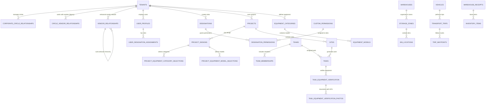

# Teleops Database Schema Documentation

## Overview

This document provides comprehensive documentation for the Teleops **Circle-Based Multi-Tenant Platform** database schema, featuring the new **Domain-Driven Database Architecture** with **VLT-style verification engine**. The platform implements a sophisticated three-tier tenant hierarchy (Corporate → Circle → Vendor) with **7 complete business domains containing 63 models** for comprehensive field operations.

---

## 🚀 **NEW: Domain-Driven Database Architecture**

### **Architecture Overview**

The Teleops platform now implements a **sophisticated domain-driven database design** that organizes tables by **business domains** rather than technical concerns. This provides:

- **🎯 Business-focused organization** - Tables grouped by business capability
- **📱 VLT-style verification support** - GPS workflows, equipment verification, mobile operations
- **⚡ Enhanced performance** - Domain-specific indexes and optimization strategies
- **🔄 Parallel architecture** - New domain tables alongside existing structure (zero risk)

### **Domain Database Organization**

```sql
-- 🏗️ TENANT MANAGEMENT DOMAIN
-- Core multi-tenant hierarchy with circle independence
CREATE SCHEMA tenant_management;

-- 🔐 IDENTITY & ACCESS DOMAIN
-- Advanced RBAC with hierarchical designations
CREATE SCHEMA identity_access;

-- 💼 VENDOR OPERATIONS DOMAIN
-- Dual-mode vendor operations with billing analytics
CREATE SCHEMA vendor_operations;

-- 📋 PROJECT MANAGEMENT DOMAIN
-- Complete project lifecycle from design to execution
CREATE SCHEMA project_management;

-- 📍 SITE OPERATIONS DOMAIN (VLT-Style)
-- GPS verification, boundaries, mobile integration
CREATE SCHEMA site_operations;

-- 🔧 EQUIPMENT MANAGEMENT DOMAIN (VLT-Style)
-- Category→Model hierarchy with verification workflows
CREATE SCHEMA equipment_management;

-- 📱 TASK FIELD OPERATIONS DOMAIN (VLT-Style)
-- VLT verification engine with GPS workflows
CREATE SCHEMA task_field_operations;
```

---

## 🎯 **VLT-Style Verification Database Architecture**

### **1. Site Operations Domain**

**Enhanced site management with GPS boundaries and mobile integration:**

```sql
-- Enhanced site master data with GPS capabilities
CREATE TABLE site_operations.sites_enhanced (
    id UUID PRIMARY KEY DEFAULT gen_random_uuid(),
    tenant_id UUID NOT NULL REFERENCES tenants(id),

    -- Site Identity
    site_id VARCHAR(100) NOT NULL,
    global_id VARCHAR(100) NOT NULL,
    site_name VARCHAR(255) NOT NULL,
    site_code VARCHAR(50),

    -- GPS Location (Enhanced for mobile)
    latitude DECIMAL(10,7) NOT NULL,  -- Required for mobile operations
    longitude DECIMAL(10,7) NOT NULL, -- Required for mobile operations
    elevation DECIMAL(8,2),

    -- VLT Verification Requirements
    verification_level VARCHAR(20) DEFAULT 'Standard',
    gps_verification_required BOOLEAN DEFAULT TRUE,
    photo_verification_required BOOLEAN DEFAULT TRUE,
    boundary_verification_required BOOLEAN DEFAULT FALSE,

    -- Mobile Support
    mobile_network_coverage VARCHAR(20) DEFAULT 'Good',
    wifi_available BOOLEAN DEFAULT FALSE,
    offline_sync_supported BOOLEAN DEFAULT TRUE,

    -- Site Classification
    site_type VARCHAR(20) NOT NULL,
    technology_type VARCHAR(20) DEFAULT 'Mixed',
    site_complexity VARCHAR(20) DEFAULT 'Standard',

    -- Operational Data
    operational_status VARCHAR(20) DEFAULT 'Active',
    last_visited TIMESTAMP WITH TIME ZONE,
    total_visits INTEGER DEFAULT 0,

    CONSTRAINT uk_site_tenant_id UNIQUE(tenant_id, site_id),
    CONSTRAINT uk_site_tenant_global UNIQUE(tenant_id, global_id)
);

-- GPS boundaries and geofencing
CREATE TABLE site_operations.site_boundaries (
    id UUID PRIMARY KEY DEFAULT gen_random_uuid(),
    site_id UUID NOT NULL REFERENCES site_operations.sites_enhanced(id),

    -- Boundary Definition
    boundary_type VARCHAR(20) DEFAULT 'Radius',
    center_latitude DECIMAL(10,7) NOT NULL,
    center_longitude DECIMAL(10,7) NOT NULL,
    radius_meters INTEGER DEFAULT 100,

    -- Rectangular Boundary
    north_latitude DECIMAL(10,7),
    south_latitude DECIMAL(10,7),
    east_longitude DECIMAL(10,7),
    west_longitude DECIMAL(10,7),

    -- Polygon Boundary
    polygon_coordinates JSONB DEFAULT '[]',

    -- Verification Settings
    verification_strictness VARCHAR(20) DEFAULT 'Standard',
    tolerance_meters INTEGER DEFAULT 100,

    -- Geofencing
    geofencing_enabled BOOLEAN DEFAULT TRUE,
    entry_notification BOOLEAN DEFAULT TRUE,
    exit_notification BOOLEAN DEFAULT TRUE,

    is_active BOOLEAN DEFAULT TRUE,
    created_at TIMESTAMP WITH TIME ZONE DEFAULT NOW()
);

-- VLT-style site verification workflows
CREATE TABLE site_operations.site_verifications (
    id UUID PRIMARY KEY DEFAULT gen_random_uuid(),
    site_id UUID NOT NULL REFERENCES site_operations.sites_enhanced(id),

    -- Verification Details
    verification_type VARCHAR(20) NOT NULL,
    verification_code VARCHAR(50) UNIQUE NOT NULL,
    verification_name VARCHAR(255) NOT NULL,

    -- VLT Requirements
    requires_gps_check BOOLEAN DEFAULT TRUE,
    requires_photo_documentation BOOLEAN DEFAULT TRUE,
    requires_boundary_check BOOLEAN DEFAULT FALSE,
    gps_accuracy_required INTEGER DEFAULT 10,
    minimum_photos_required INTEGER DEFAULT 3,

    -- Status and Progress
    status VARCHAR(20) DEFAULT 'Pending',
    completion_percentage INTEGER DEFAULT 0,
    verification_result VARCHAR(20),
    compliance_score DECIMAL(5,2) DEFAULT 0,

    -- Assignment
    assigned_to_id INTEGER NOT NULL REFERENCES auth_user(id),
    scheduled_start TIMESTAMP WITH TIME ZONE NOT NULL,
    scheduled_end TIMESTAMP WITH TIME ZONE NOT NULL,
    actual_start TIMESTAMP WITH TIME ZONE,
    actual_end TIMESTAMP WITH TIME ZONE,

    -- Documentation
    verification_photos JSONB DEFAULT '[]',
    verification_documents JSONB DEFAULT '[]',
    findings TEXT,
    recommendations TEXT,

    created_at TIMESTAMP WITH TIME ZONE DEFAULT NOW()
);

-- Mobile synchronization management
CREATE TABLE site_operations.mobile_sync_sessions (
    id UUID PRIMARY KEY DEFAULT gen_random_uuid(),
    user_id INTEGER NOT NULL REFERENCES auth_user(id),
    device_id VARCHAR(255) NOT NULL,

    -- Sync Configuration
    sync_type VARCHAR(20) NOT NULL,
    sync_direction VARCHAR(20) DEFAULT 'Bidirectional',
    site_id UUID REFERENCES site_operations.sites_enhanced(id),

    -- Progress and Status
    status VARCHAR(20) DEFAULT 'Pending',
    progress_percentage INTEGER DEFAULT 0,
    total_records INTEGER DEFAULT 0,
    processed_records INTEGER DEFAULT 0,
    successful_records INTEGER DEFAULT 0,

    -- Performance Metrics
    data_size_bytes BIGINT DEFAULT 0,
    transfer_speed_kbps DECIMAL(10,2),
    network_type VARCHAR(20),

    -- Timing
    started_at TIMESTAMP WITH TIME ZONE,
    completed_at TIMESTAMP WITH TIME ZONE,

    created_at TIMESTAMP WITH TIME ZONE DEFAULT NOW()
);
```

### **2. Equipment Management Domain**

**Category→Model hierarchy with VLT-style verification:**

```sql
-- Tenant-created equipment categories
CREATE TABLE equipment_management.equipment_categories (
    id UUID PRIMARY KEY DEFAULT gen_random_uuid(),
    tenant_id UUID NOT NULL REFERENCES tenants(id),

    -- Category Identity
    category_name VARCHAR(255) NOT NULL,
    category_code VARCHAR(50) NOT NULL,
    category_description TEXT,

    -- Hierarchical Structure
    parent_category_id UUID REFERENCES equipment_management.equipment_categories(id),
    hierarchy_level INTEGER DEFAULT 1,
    hierarchy_path VARCHAR(500),

    -- VLT Verification Requirements
    verification_type VARCHAR(20) DEFAULT 'Serial_Number',
    requires_serial_number BOOLEAN DEFAULT TRUE,
    requires_model_verification BOOLEAN DEFAULT TRUE,
    requires_photo_documentation BOOLEAN DEFAULT TRUE,
    requires_gps_verification BOOLEAN DEFAULT FALSE,

    -- Category Properties
    is_container BOOLEAN DEFAULT FALSE,
    allows_equipment BOOLEAN DEFAULT TRUE,
    complexity_rating VARCHAR(20) DEFAULT 'Standard',
    expected_model_count INTEGER DEFAULT 1,
    standard_verification_time INTEGER DEFAULT 5,

    -- Business Rules
    business_rules JSONB DEFAULT '{}',
    verification_checklist JSONB DEFAULT '[]',
    industry_standards JSONB DEFAULT '[]',

    -- Status
    status VARCHAR(20) DEFAULT 'Active',
    sort_order INTEGER DEFAULT 100,

    CONSTRAINT uk_category_tenant_name UNIQUE(tenant_id, category_name),
    CONSTRAINT uk_category_tenant_code UNIQUE(tenant_id, category_code)
);

-- Equipment models within categories
CREATE TABLE equipment_management.equipment_models (
    id UUID PRIMARY KEY DEFAULT gen_random_uuid(),
    category_id UUID NOT NULL REFERENCES equipment_management.equipment_categories(id),

    -- Model Identity
    model_name VARCHAR(255) NOT NULL,
    model_code VARCHAR(50) NOT NULL,
    model_description TEXT,

    -- Manufacturer Information
    manufacturer VARCHAR(255) NOT NULL,
    manufacturer_model_number VARCHAR(100),
    manufacturer_part_number VARCHAR(100),

    -- VLT Verification Support
    has_serial_number BOOLEAN DEFAULT TRUE,
    serial_number_pattern VARCHAR(100),
    serial_number_example VARCHAR(100),
    serial_number_location VARCHAR(255),

    verification_complexity VARCHAR(20) DEFAULT 'Standard',
    estimated_verification_time INTEGER DEFAULT 10,
    verification_instructions TEXT,
    photo_requirements JSONB DEFAULT '[]',

    -- Technical Specifications
    technical_specifications JSONB DEFAULT '{}',
    physical_dimensions JSONB DEFAULT '{}',
    identification_features JSONB DEFAULT '[]',

    -- Lifecycle
    introduction_date DATE,
    discontinuation_date DATE,
    replacement_model_id UUID REFERENCES equipment_management.equipment_models(id),

    -- Status and Statistics
    status VARCHAR(20) DEFAULT 'Active',
    is_active BOOLEAN DEFAULT TRUE,
    total_equipment_count INTEGER DEFAULT 0,
    verification_success_rate DECIMAL(5,2) DEFAULT 100.00,

    CONSTRAINT uk_model_category_name UNIQUE(category_id, model_name),
    CONSTRAINT uk_model_category_code UNIQUE(category_id, model_code)
);

-- Equipment inventory management
CREATE TABLE equipment_management.equipment_inventories (
    id UUID PRIMARY KEY DEFAULT gen_random_uuid(),
    tenant_id UUID NOT NULL REFERENCES tenants(id),

    -- Inventory Details
    inventory_name VARCHAR(255) NOT NULL,
    inventory_code VARCHAR(50) NOT NULL,
    inventory_type VARCHAR(20) NOT NULL,

    -- Location
    site_id UUID REFERENCES site_operations.sites_enhanced(id),
    location_details TEXT,
    storage_conditions JSONB DEFAULT '{}',

    -- Capacity
    capacity_limit INTEGER,
    weight_limit DECIMAL(10,2),
    volume_limit DECIMAL(10,2),

    -- Access Control
    access_level VARCHAR(20) DEFAULT 'Restricted',
    responsible_person_id INTEGER NOT NULL REFERENCES auth_user(id),

    is_active BOOLEAN DEFAULT TRUE,

    CONSTRAINT uk_inventory_tenant_code UNIQUE(tenant_id, inventory_code)
);

-- Individual equipment items
CREATE TABLE equipment_management.equipment_items (
    id UUID PRIMARY KEY DEFAULT gen_random_uuid(),
    model_id UUID NOT NULL REFERENCES equipment_management.equipment_models(id),
    inventory_id UUID NOT NULL REFERENCES equipment_management.equipment_inventories(id),

    -- Item Identity
    item_tag VARCHAR(100) NOT NULL,
    serial_number VARCHAR(100),
    asset_number VARCHAR(100),

    -- Physical Properties
    condition VARCHAR(20) DEFAULT 'Good',
    condition_notes TEXT,

    -- Location Tracking
    current_location VARCHAR(255),
    location_verified_at TIMESTAMP WITH TIME ZONE,

    -- Assignment
    assigned_to_id INTEGER REFERENCES auth_user(id),
    project_id UUID, -- References to project domain
    site_id UUID REFERENCES site_operations.sites_enhanced(id),

    -- Verification
    last_verified_at TIMESTAMP WITH TIME ZONE,
    verified_by_id INTEGER REFERENCES auth_user(id),
    verification_notes TEXT,
    compliance_status VARCHAR(20) DEFAULT 'Unknown',

    -- Status
    status VARCHAR(20) DEFAULT 'Active',

    CONSTRAINT uk_item_inventory_tag UNIQUE(inventory_id, item_tag)
);
```

### **3. Task Field Operations Domain**

**VLT verification engine with GPS workflows:**

```sql
-- VLT-style field tasks
CREATE TABLE task_field_operations.field_tasks (
    id UUID PRIMARY KEY DEFAULT gen_random_uuid(),

    -- Task Identity
    task_code VARCHAR(50) UNIQUE NOT NULL,
    task_name VARCHAR(255) NOT NULL,
    task_type VARCHAR(30) NOT NULL,
    description TEXT NOT NULL,

    -- Project and Site Context
    project_id UUID NOT NULL, -- References project domain
    site_id UUID NOT NULL REFERENCES site_operations.sites_enhanced(id),
    parent_task_id UUID, -- References project management task

    -- VLT Verification Requirements
    requires_gps_verification BOOLEAN DEFAULT TRUE,
    gps_accuracy_required INTEGER DEFAULT 10,
    requires_equipment_scan BOOLEAN DEFAULT TRUE,
    requires_photo_verification BOOLEAN DEFAULT TRUE,
    minimum_photos_required INTEGER DEFAULT 3,
    requires_serial_verification BOOLEAN DEFAULT TRUE,

    -- Planning
    estimated_duration_hours DECIMAL(5,2) NOT NULL,
    skill_requirements JSONB DEFAULT '[]',
    safety_requirements JSONB DEFAULT '[]',
    tools_required JSONB DEFAULT '[]',

    -- Assignment
    assigned_team_id UUID, -- References project team
    team_lead_id INTEGER REFERENCES auth_user(id),

    -- Scheduling
    scheduled_start TIMESTAMP WITH TIME ZONE NOT NULL,
    scheduled_end TIMESTAMP WITH TIME ZONE NOT NULL,
    actual_start TIMESTAMP WITH TIME ZONE,
    actual_end TIMESTAMP WITH TIME ZONE,

    -- Status and Progress
    status VARCHAR(30) DEFAULT 'Pending',
    priority VARCHAR(20) DEFAULT 'Medium',
    completion_percentage INTEGER DEFAULT 0,

    -- Quality and Verification
    verification_score DECIMAL(5,2) DEFAULT 0,
    quality_score DECIMAL(5,2) DEFAULT 0,
    issues_found INTEGER DEFAULT 0,
    critical_issues INTEGER DEFAULT 0,

    -- Results
    task_result VARCHAR(20),
    findings TEXT,
    recommendations TEXT,

    -- Mobile Support
    supports_offline BOOLEAN DEFAULT TRUE,
    sync_required BOOLEAN DEFAULT TRUE,
    mobile_optimized BOOLEAN DEFAULT TRUE,

    -- Approval
    requires_approval BOOLEAN DEFAULT TRUE,
    approved_by_id INTEGER REFERENCES auth_user(id),
    approved_at TIMESTAMP WITH TIME ZONE,

    created_by_id INTEGER NOT NULL REFERENCES auth_user(id),
    created_at TIMESTAMP WITH TIME ZONE DEFAULT NOW()
);

-- Task execution tracking
CREATE TABLE task_field_operations.task_executions (
    id UUID PRIMARY KEY DEFAULT gen_random_uuid(),
    field_task_id UUID NOT NULL REFERENCES task_field_operations.field_tasks(id),

    -- Execution Details
    execution_status VARCHAR(30) NOT NULL,
    executed_by_id INTEGER NOT NULL REFERENCES auth_user(id),
    execution_time TIMESTAMP WITH TIME ZONE DEFAULT NOW(),

    -- GPS Information
    gps_latitude DECIMAL(10,7),
    gps_longitude DECIMAL(10,7),
    gps_accuracy DECIMAL(8,2),

    -- Device Information
    device_id VARCHAR(255),
    app_version VARCHAR(50),
    network_type VARCHAR(20),

    -- Results
    verification_score DECIMAL(5,2),
    time_taken_minutes DECIMAL(6,2),
    issues_found INTEGER DEFAULT 0,

    -- Documentation
    notes TEXT,
    photos_captured JSONB DEFAULT '[]',
    data_collected JSONB DEFAULT '{}',

    -- Quality
    quality_check_passed BOOLEAN,
    compliance_verified BOOLEAN,

    -- Offline Support
    executed_offline BOOLEAN DEFAULT FALSE,
    synced_at TIMESTAMP WITH TIME ZONE
);

-- GPS verification tracking
CREATE TABLE task_field_operations.gps_verifications (
    id UUID PRIMARY KEY DEFAULT gen_random_uuid(),
    field_task_id UUID NOT NULL REFERENCES task_field_operations.field_tasks(id),

    -- GPS Verification Details
    verification_type VARCHAR(20) NOT NULL,
    required_accuracy INTEGER NOT NULL,
    actual_accuracy DECIMAL(8,2) NOT NULL,

    -- Location Data
    verified_latitude DECIMAL(10,7) NOT NULL,
    verified_longitude DECIMAL(10,7) NOT NULL,
    site_latitude DECIMAL(10,7) NOT NULL,
    site_longitude DECIMAL(10,7) NOT NULL,
    distance_from_site DECIMAL(8,2) NOT NULL,

    -- Verification Result
    verification_status VARCHAR(20) NOT NULL,
    meets_accuracy_requirement BOOLEAN NOT NULL,
    within_site_boundary BOOLEAN NOT NULL,

    -- Context
    verified_by_id INTEGER NOT NULL REFERENCES auth_user(id),
    verification_time TIMESTAMP WITH TIME ZONE DEFAULT NOW(),
    device_info JSONB DEFAULT '{}',

    -- Additional Data
    satellite_count INTEGER,
    gps_fix_quality VARCHAR(20),
    verification_notes TEXT
);
```

### **Performance Optimization for Domains**

```sql
-- Domain-specific indexes for VLT operations
CREATE INDEX CONCURRENTLY idx_sites_gps_location
    ON site_operations.sites_enhanced USING GIST(
        ll_to_earth(latitude::FLOAT8, longitude::FLOAT8)
    );

CREATE INDEX CONCURRENTLY idx_site_boundaries_center
    ON site_operations.site_boundaries(center_latitude, center_longitude);

CREATE INDEX CONCURRENTLY idx_field_tasks_status_priority
    ON task_field_operations.field_tasks(status, priority, scheduled_start);

CREATE INDEX CONCURRENTLY idx_equipment_items_serial
    ON equipment_management.equipment_items(serial_number)
    WHERE serial_number IS NOT NULL;

CREATE INDEX CONCURRENTLY idx_gps_verifications_accuracy
    ON task_field_operations.gps_verifications(actual_accuracy, verification_status);

-- Mobile sync optimization
CREATE INDEX CONCURRENTLY idx_mobile_sync_device_status
    ON site_operations.mobile_sync_sessions(device_id, status, created_at);
```

---

## Database Architecture

### Database Technology

- **Primary Database**: PostgreSQL 14+
- **Connection Pooling**: PgBouncer
- **Backup Strategy**: Continuous WAL archiving + Daily full backups
- **High Availability**: Read replicas for reporting queries
- **Monitoring**: pg_stat_statements + custom metrics
- **Spatial Extensions**: PostGIS for GPS coordinates and location queries

### Circle-Based Multi-Tenant Strategy

```sql
-- Tenant isolation through row-level security with circle awareness
CREATE POLICY tenant_isolation ON tenant_tables
    FOR ALL USING (tenant_id = current_setting('app.current_tenant')::UUID);

CREATE POLICY circle_isolation ON circle_scoped_tables
    FOR ALL USING (
        tenant_id = current_setting('app.current_tenant')::UUID OR
        EXISTS (
            SELECT 1 FROM corporate_circle_relationships ccr
            WHERE ccr.circle_tenant_id = current_setting('app.current_tenant')::UUID
            AND ccr.corporate_tenant_id = tenant_id
        )
    );

-- Circle-specific data access patterns
CREATE POLICY vendor_circle_access ON project_data
    FOR ALL USING (
        EXISTS (
            SELECT 1 FROM circle_vendor_relationships cvr
            WHERE cvr.vendor_tenant_id = current_setting('app.current_tenant')::UUID
            AND cvr.circle_tenant_id = tenant_id
            AND cvr.is_active = true
        )
    );
```

---

## Entity Relationship Diagram



---

## Core Circle-Based Tenant Management

### 1. Tenants (Circle-Based Architecture)

#### tenants

**Purpose**: Multi-tenant hierarchy with corporate, circle, and vendor entities

```sql
CREATE TABLE tenants (
    id UUID PRIMARY KEY DEFAULT gen_random_uuid(),

    -- Tenant Hierarchy
    tenant_type VARCHAR(30) NOT NULL, -- 'Corporate', 'Circle', 'Vendor'
    parent_tenant_id UUID REFERENCES tenants(id), -- Corporate parent for circles

    -- Organization Information
    organization_name VARCHAR(255) NOT NULL,
    organization_code VARCHAR(50) UNIQUE, -- e.g., 'VOD_MPCG', 'VOD_UPE'
    business_registration_number VARCHAR(100),
    industry_sector VARCHAR(100) DEFAULT 'Telecommunications',
    country VARCHAR(100) NOT NULL DEFAULT 'India',
    primary_business_address TEXT NOT NULL,
    website VARCHAR(255),

    -- Circle Information (for Circle tenants)
    circle_code VARCHAR(20), -- 'MPCG', 'UPE', 'GJ', etc.
    circle_name VARCHAR(100), -- 'Madhya Pradesh & Chhattisgarh'

    -- Platform Configuration
    subdomain VARCHAR(100) UNIQUE NOT NULL,
    subscription_plan VARCHAR(50) NOT NULL DEFAULT 'Professional',

    -- Contact Information
    primary_contact_name VARCHAR(255) NOT NULL,
    primary_contact_email VARCHAR(255) NOT NULL UNIQUE,
    primary_contact_phone VARCHAR(20) NOT NULL,
    secondary_contact_name VARCHAR(255),
    secondary_contact_email VARCHAR(255),
    secondary_contact_phone VARCHAR(20),
    administrative_contact_email VARCHAR(255),

    -- Business Details (for vendors)
    vendor_license_number VARCHAR(100),
    specialization TEXT[], -- array of specializations
    coverage_areas TEXT[], -- array of regions/states
    service_capabilities TEXT[], -- array of service types
    years_in_business INTEGER,
    employee_count INTEGER,
    equipment_capabilities TEXT,
    certifications TEXT[],

    -- Business Operational Settings
    operates_independently BOOLEAN DEFAULT TRUE, -- Circle independence flag
    shared_vendor_pool BOOLEAN DEFAULT FALSE, -- Can share vendors with parent
    cross_circle_reporting BOOLEAN DEFAULT TRUE, -- Allow parent reporting

    -- Tenant Status
    registration_status VARCHAR(50) NOT NULL DEFAULT 'Pending',
    activation_status VARCHAR(50) NOT NULL DEFAULT 'Inactive',
    is_active BOOLEAN DEFAULT FALSE,

    -- Approval Information
    approved_by INTEGER REFERENCES auth_user(id),
    approved_at TIMESTAMP WITH TIME ZONE,
    rejection_reason TEXT,

    -- Subscription Configuration
    subscription_features JSONB DEFAULT '{}',
    resource_limits JSONB DEFAULT '{}',

    -- Timestamps
    registered_at TIMESTAMP WITH TIME ZONE DEFAULT NOW(),
    activated_at TIMESTAMP WITH TIME ZONE,
    deactivated_at TIMESTAMP WITH TIME ZONE,
    created_at TIMESTAMP WITH TIME ZONE DEFAULT NOW(),
    updated_at TIMESTAMP WITH TIME ZONE DEFAULT NOW(),

    -- Constraints
    CHECK (tenant_type IN ('Corporate', 'Circle', 'Vendor')),
    CHECK (
        (tenant_type = 'Circle' AND parent_tenant_id IS NOT NULL AND circle_code IS NOT NULL) OR
        (tenant_type = 'Corporate' AND parent_tenant_id IS NULL) OR
        (tenant_type = 'Vendor')
    ),
    CHECK (subscription_plan IN ('Basic', 'Professional', 'Enterprise', 'Custom')),
    CHECK (registration_status IN ('Pending', 'Approved', 'Rejected', 'Expired')),
    CHECK (activation_status IN ('Inactive', 'Active', 'Suspended', 'Terminated'))
);

-- Indexes for Circle-Based Architecture
CREATE INDEX idx_tenants_type ON tenants(tenant_type);
CREATE INDEX idx_tenants_parent ON tenants(parent_tenant_id);
CREATE INDEX idx_tenants_circle_code ON tenants(circle_code);
CREATE INDEX idx_tenants_status ON tenants(registration_status, activation_status);
CREATE INDEX idx_tenants_subdomain ON tenants(subdomain);
CREATE INDEX idx_tenants_organization_code ON tenants(organization_code);
```

#### corporate_circle_relationships

**Purpose**: Corporate oversight of circle operations

```sql
CREATE TABLE corporate_circle_relationships (
    id BIGSERIAL PRIMARY KEY,
    corporate_tenant_id UUID NOT NULL REFERENCES tenants(id) ON DELETE CASCADE,
    circle_tenant_id UUID NOT NULL REFERENCES tenants(id) ON DELETE CASCADE,

    -- Relationship Configuration
    relationship_type VARCHAR(30) DEFAULT 'Parent_Circle',
    governance_level VARCHAR(30) DEFAULT 'Autonomous', -- Autonomous, Managed, Controlled

    -- Financial Configuration
    separate_billing BOOLEAN DEFAULT TRUE,
    cost_center_code VARCHAR(50),
    budget_authority_level DECIMAL(15,2),

    -- Operational Configuration
    independent_vendor_management BOOLEAN DEFAULT TRUE,
    independent_employee_management BOOLEAN DEFAULT TRUE,
    shared_technology_access BOOLEAN DEFAULT TRUE,

    -- Reporting Configuration
    reports_to_corporate BOOLEAN DEFAULT TRUE,
    data_sharing_level VARCHAR(30) DEFAULT 'Aggregated', -- None, Aggregated, Full

    -- Status
    is_active BOOLEAN DEFAULT TRUE,
    effective_from DATE DEFAULT CURRENT_DATE,
    effective_to DATE,

    created_at TIMESTAMP WITH TIME ZONE DEFAULT NOW(),
    updated_at TIMESTAMP WITH TIME ZONE DEFAULT NOW(),

    UNIQUE(corporate_tenant_id, circle_tenant_id),
    CHECK (governance_level IN ('Autonomous', 'Managed', 'Controlled')),
    CHECK (data_sharing_level IN ('None', 'Aggregated', 'Full'))
);

-- Indexes
CREATE INDEX idx_corporate_circle_corp ON corporate_circle_relationships(corporate_tenant_id);
CREATE INDEX idx_corporate_circle_circle ON corporate_circle_relationships(circle_tenant_id);
CREATE INDEX idx_corporate_circle_active ON corporate_circle_relationships(is_active);
```

#### circle_vendor_relationships

**Purpose**: Circle-specific vendor relationships and permissions

```sql
CREATE TABLE circle_vendor_relationships (
    id BIGSERIAL PRIMARY KEY,
    circle_tenant_id UUID NOT NULL REFERENCES tenants(id) ON DELETE CASCADE,
    vendor_tenant_id UUID REFERENCES tenants(id) ON DELETE CASCADE,

    -- Vendor Information (for invitation process)
    vendor_name VARCHAR(255), -- Vendor name before registration
    vendor_code VARCHAR(100), -- Client-generated vendor code (from client's existing vendor management system)
    vendor_email VARCHAR(255), -- Vendor email for invitation

    -- Circle-Specific Service Details
    service_areas TEXT[], -- Districts/regions within circle
    service_capabilities TEXT[], -- Dismantling, Installation, Maintenance, Survey
    performance_rating DECIMAL(3,2),

    -- Relationship Details
    relationship_type VARCHAR(50) NOT NULL DEFAULT 'Circle_Vendor',
    relationship_status VARCHAR(50) NOT NULL DEFAULT 'Circle_Invitation_Sent',

    -- Financial Terms (Circle-specific)
    billing_rate DECIMAL(10,2),
    payment_terms VARCHAR(100),
    currency VARCHAR(10) DEFAULT 'INR',
    billing_frequency VARCHAR(20) DEFAULT 'Monthly',

    -- Permissions and Access
    vendor_permissions JSONB DEFAULT '{}', -- permissions vendor has for circle data
    communication_allowed BOOLEAN DEFAULT TRUE,
    contact_access_level VARCHAR(50) DEFAULT 'Basic', -- Basic, Full, Restricted

    -- Invitation Management
    invitation_token VARCHAR(255),
    invitation_sent_at TIMESTAMP WITH TIME ZONE,
    invitation_expires_at TIMESTAMP WITH TIME ZONE,

    -- Relationship Management
    invited_by INTEGER REFERENCES auth_user(id),
    approved_by INTEGER REFERENCES auth_user(id),
    approved_at TIMESTAMP WITH TIME ZONE,
    contract_start_date DATE,
    contract_end_date DATE,

    -- Status and Notes
    notes TEXT,
    is_active BOOLEAN DEFAULT TRUE,

    -- Audit Fields
    created_at TIMESTAMP WITH TIME ZONE DEFAULT NOW(),
    updated_at TIMESTAMP WITH TIME ZONE DEFAULT NOW(),

    -- Constraints
    UNIQUE(circle_tenant_id, vendor_code), -- Circle-specific vendor codes
    UNIQUE(circle_tenant_id, vendor_tenant_id), -- One relationship per circle-vendor pair
    CHECK (relationship_type IN ('Circle_Vendor', 'Partnership', 'Subcontractor')),
    CHECK (relationship_status IN ('Circle_Invitation_Sent', 'Active', 'Suspended', 'Terminated', 'Expired')),
    CHECK (contact_access_level IN ('Basic', 'Full', 'Restricted', 'None'))
);

-- Indexes
CREATE INDEX idx_circle_vendor_circle ON circle_vendor_relationships(circle_tenant_id);
CREATE INDEX idx_circle_vendor_vendor ON circle_vendor_relationships(vendor_tenant_id);
CREATE INDEX idx_circle_vendor_code ON circle_vendor_relationships(vendor_code);
CREATE INDEX idx_circle_vendor_status ON circle_vendor_relationships(relationship_status);
CREATE INDEX idx_circle_vendor_active ON circle_vendor_relationships(is_active);
```

#### vendor*relationships *(NEW - Enhanced Model)\_

**Purpose**: Enhanced vendor relationship model supporting multi-level hierarchies and any-to-any tenant relationships

> **✨ NEW**: This enhanced model supersedes `circle_vendor_relationships` for complex vendor scenarios while maintaining backward compatibility.

```sql
CREATE TABLE vendor_relationships (
    id UUID PRIMARY KEY DEFAULT gen_random_uuid(),

    -- Core Relationship
    client_tenant_id UUID NOT NULL REFERENCES tenants(id) ON DELETE CASCADE,
    vendor_tenant_id UUID REFERENCES tenants(id) ON DELETE CASCADE,

    -- Vendor Information (for invitation/pre-registration)
    vendor_name VARCHAR(255), -- Vendor name before registration
    vendor_code VARCHAR(100) NOT NULL, -- Client-generated vendor code (unique within client)
    vendor_email VARCHAR(255), -- Vendor email for invitation

    -- Relationship Types & Hierarchy
    relationship_type VARCHAR(50) NOT NULL DEFAULT 'Primary_Vendor',
    relationship_status VARCHAR(50) NOT NULL DEFAULT 'Invitation_Sent',
    verification_status VARCHAR(50) NOT NULL DEFAULT 'Independent',

    -- Multi-Level Hierarchy Support
    parent_relationship_id UUID REFERENCES vendor_relationships(id) ON DELETE CASCADE,
    hierarchy_level INTEGER DEFAULT 1, -- 1=Direct, 2=Sub-vendor, 3=Sub-sub-vendor

    -- Service Configuration
    service_scope VARCHAR(50) DEFAULT 'Circle_Wide',
    service_areas JSONB DEFAULT '[]', -- Geographic areas
    service_capabilities JSONB DEFAULT '[]', -- Service types

    -- Performance Tracking
    performance_rating DECIMAL(3,2),
    quality_score DECIMAL(3,2),
    delivery_score DECIMAL(3,2),

    -- Financial Terms
    billing_rate DECIMAL(12,2),
    billing_unit VARCHAR(50) DEFAULT 'Per_Project',
    payment_terms VARCHAR(100),
    currency VARCHAR(10) DEFAULT 'INR',
    billing_frequency VARCHAR(20) DEFAULT 'Monthly',
    revenue_share_percentage DECIMAL(5,2), -- For sub-contracting

    -- Access & Permissions
    vendor_permissions JSONB DEFAULT '{}',
    data_access_level VARCHAR(50) DEFAULT 'Basic',
    communication_allowed BOOLEAN DEFAULT TRUE,

    -- Contract Management
    contract_start_date DATE,
    contract_end_date DATE,
    auto_renewal BOOLEAN DEFAULT FALSE,
    notice_period_days INTEGER DEFAULT 30,

    -- Invitation Management
    invitation_token VARCHAR(255),
    invitation_sent_at TIMESTAMP WITH TIME ZONE,
    invitation_expires_at TIMESTAMP WITH TIME ZONE,

    -- Approval Workflow
    created_by INTEGER REFERENCES auth_user(id),
    approved_by INTEGER REFERENCES auth_user(id),
    approved_at TIMESTAMP WITH TIME ZONE,

    -- Status & Metadata
    notes TEXT,
    internal_notes TEXT,
    is_active BOOLEAN DEFAULT TRUE,
    is_preferred BOOLEAN DEFAULT FALSE,
    is_critical BOOLEAN DEFAULT FALSE,

    -- Timestamps
    created_at TIMESTAMP WITH TIME ZONE DEFAULT NOW(),
    updated_at TIMESTAMP WITH TIME ZONE DEFAULT NOW(),
    last_activity_at TIMESTAMP WITH TIME ZONE,

    -- Constraints
    UNIQUE(client_tenant_id, vendor_code), -- Client-specific vendor codes
    UNIQUE(client_tenant_id, vendor_tenant_id, relationship_type), -- Prevent duplicate relationships
    CHECK (relationship_type IN ('Primary_Vendor', 'Subcontractor', 'Partnership', 'Service_Provider', 'Preferred_Vendor', 'Backup_Vendor')),
    CHECK (relationship_status IN ('Invitation_Sent', 'Pending_Approval', 'Active', 'Suspended', 'Terminated', 'Expired', 'Under_Review')),
    CHECK (verification_status IN ('Independent', 'Pending_Verification', 'Verified', 'Verification_Rejected', 'Requires_Update')),
    CHECK (service_scope IN ('Circle_Wide', 'Regional', 'District_Specific', 'Project_Based', 'Task_Specific', 'On_Demand')),
    CHECK (data_access_level IN ('None', 'Basic', 'Project_Specific', 'Circle_Data', 'Full_Access')),
    CHECK (hierarchy_level > 0),
    CHECK (revenue_share_percentage IS NULL OR (revenue_share_percentage >= 0 AND revenue_share_percentage <= 100))
);

-- Indexes for Enhanced Vendor Relationships
CREATE INDEX idx_vendor_relationships_client ON vendor_relationships(client_tenant_id, relationship_status);
CREATE INDEX idx_vendor_relationships_vendor ON vendor_relationships(vendor_tenant_id, relationship_status);
CREATE INDEX idx_vendor_relationships_code ON vendor_relationships(vendor_code);
CREATE INDEX idx_vendor_relationships_type ON vendor_relationships(relationship_type, is_active);
CREATE INDEX idx_vendor_relationships_hierarchy ON vendor_relationships(hierarchy_level);
CREATE INDEX idx_vendor_relationships_parent ON vendor_relationships(parent_relationship_id);
CREATE INDEX idx_vendor_relationships_verification ON vendor_relationships(verification_status);
CREATE INDEX idx_vendor_relationships_created ON vendor_relationships(created_at);
```

**Enhanced Relationship Examples**:

```yaml
Multi-Level Vendor Hierarchies:
  Level 1: Vodafone MPCG → vedag (Primary Vendor)
  Level 2: vedag → Verveland (Subcontractor)
  Level 3: Verveland → LocalCrew (Sub-subcontractor)

Cross-Corporate Vendor Networks: Ericsson MPCG → Vodafone MPCG (Service Provider)
  Verveland → Multiple Clients (Vodafone, Ericsson, vedag)

Revenue Sharing Models: Parent keeps 75%, Sub-vendor gets 25%
  Automatic revenue calculation based on hierarchy
```

#### Industry-Standard Vendor Code Management

**Business Context**: In the telecom industry, clients (telecom operators) maintain their own vendor management systems and generate vendor codes for their service providers. The Teleops platform recognizes and integrates with this existing business practice.

**Enhanced Key Principles**:

1. **Client-Generated Vendor Codes**: Vendor codes are created by clients in their existing vendor management systems, not by the Teleops platform.

2. **Multi-Client Vendor Support**: A single vendor (e.g., Verveland) can work with multiple clients (e.g., Vodafone, Ericsson, Vedang) and will have different vendor codes for each client relationship.

3. **Multi-Level Code Hierarchy**: Sub-vendors can have their own vendor codes while maintaining parent-child relationships.

4. **No Platform Code Generation**: The Teleops platform does NOT generate vendor codes. Clients provide these codes during the vendor invitation process.

**Example Scenario**:

```yaml
Verveland Infrastructure Services:
  Vodafone MPCG Client: Vendor Code "VOD-MPCG-VERV-001"
  Ericsson Gujarat Client: Vendor Code "ERI-GJ-VERVELAND-2024"
  Vedang UP East Client: Vendor Code "VED-UPE-INFRA-042"

Business Process: 1. Client maintains vendor codes in their existing vendor management system
  2. When inviting vendor to Teleops, client provides their internal vendor code
  3. Teleops stores and uses this client-generated code for all communications
  4. Vendor receives invitation with client's vendor code for reference
```

**Database Implementation**:

- `vendor_code` field stores the client-provided code
- `UNIQUE(circle_tenant_id, vendor_code)` ensures no duplicate codes within a client
- Same vendor can have different codes with different clients
- Platform acts as integration layer, not vendor code authority

#### telecom_circles

**Purpose**: Master data for Indian telecom circles

```sql
CREATE TABLE telecom_circles (
    id SERIAL PRIMARY KEY,
    circle_code VARCHAR(20) UNIQUE NOT NULL,
    circle_name VARCHAR(100) NOT NULL,
    region VARCHAR(50), -- North, South, East, West, etc.
    state_coverage TEXT[], -- states covered by this circle
    is_active BOOLEAN DEFAULT TRUE,
    created_at TIMESTAMP WITH TIME ZONE DEFAULT NOW(),
    updated_at TIMESTAMP WITH TIME ZONE DEFAULT NOW()
);

-- Insert standard telecom circles
INSERT INTO telecom_circles (circle_code, circle_name, region, state_coverage) VALUES
('AP', 'Andhra Pradesh', 'South', ARRAY['Andhra Pradesh']),
('AS', 'Assam', 'North East', ARRAY['Assam']),
('BH', 'Bihar', 'East', ARRAY['Bihar']),
('CH', 'Chennai', 'South', ARRAY['Tamil Nadu']),
('GJ', 'Gujarat', 'West', ARRAY['Gujarat']),
('HR', 'Haryana', 'North', ARRAY['Haryana']),
('HP', 'Himachal Pradesh', 'North', ARRAY['Himachal Pradesh']),
('JK', 'Jammu & Kashmir', 'North', ARRAY['Jammu & Kashmir']),
('KA', 'Karnataka', 'South', ARRAY['Karnataka']),
('KL', 'Kerala', 'South', ARRAY['Kerala']),
('KO', 'Kolkata', 'East', ARRAY['West Bengal']),
('MH', 'Maharashtra & Goa', 'West', ARRAY['Maharashtra', 'Goa']),
('MPCG', 'Madhya Pradesh & Chhattisgarh', 'Central', ARRAY['Madhya Pradesh', 'Chhattisgarh']),
('MU', 'Mumbai', 'West', ARRAY['Maharashtra']),
('NE', 'North East', 'North East', ARRAY['Arunachal Pradesh', 'Manipur', 'Meghalaya', 'Mizoram', 'Nagaland', 'Tripura']),
('OR', 'Odisha', 'East', ARRAY['Odisha']),
('PB', 'Punjab', 'North', ARRAY['Punjab']),
('RJ', 'Rajasthan', 'North', ARRAY['Rajasthan']),
('TN', 'Tamil Nadu', 'South', ARRAY['Tamil Nadu']),
('UPE', 'UP (East)', 'North', ARRAY['Uttar Pradesh']),
('UPW', 'UP (West)', 'North', ARRAY['Uttar Pradesh']),
('WB', 'West Bengal', 'East', ARRAY['West Bengal']),
('MC', 'Mumbai Corporate', 'West', ARRAY['Maharashtra']);

-- Indexes
CREATE INDEX idx_telecom_circles_code ON telecom_circles(circle_code);
CREATE INDEX idx_telecom_circles_region ON telecom_circles(region);
```

---

## User Management & Access Control

### 2. User Profiles & Team Management

#### user_profiles

**Purpose**: Extended user information with tenant isolation

```sql
CREATE TABLE user_profiles (
    id BIGSERIAL PRIMARY KEY,
    tenant_id UUID NOT NULL REFERENCES tenants(id) ON DELETE CASCADE,
    user_id INTEGER NOT NULL REFERENCES auth_user(id) ON DELETE CASCADE,

    -- Professional Information
    employee_id VARCHAR(50),
    job_title VARCHAR(100),
    department VARCHAR(100),
    date_of_joining DATE,
    years_of_experience INTEGER DEFAULT 0,
    reporting_manager_id INTEGER REFERENCES auth_user(id) ON DELETE SET NULL,

    -- Contact Information
    phone_number VARCHAR(20) NOT NULL,
    secondary_phone VARCHAR(20),
    business_address TEXT,
    emergency_contact_name VARCHAR(255),
    emergency_contact_phone VARCHAR(20),
    preferred_communication VARCHAR(50) DEFAULT 'Email',

    -- Profile Details
    profile_photo_url TEXT,
    date_of_birth DATE,
    skills JSONB DEFAULT '[]',
    certifications JSONB DEFAULT '[]',

    -- Operational Context
    geographic_scope JSONB DEFAULT '[]', -- regions/circles user can access
    functional_scope JSONB DEFAULT '[]', -- departments/functions
    operational_permissions JSONB DEFAULT '{}',

    -- Employment Status
    employment_type VARCHAR(50) DEFAULT 'Employee', -- Employee, Contractor, Consultant
    is_active BOOLEAN DEFAULT TRUE,
    activation_status VARCHAR(50) DEFAULT 'Pending',

    -- Security
    last_password_change TIMESTAMP WITH TIME ZONE DEFAULT NOW(),
    password_expires_at TIMESTAMP WITH TIME ZONE,
    login_attempts INTEGER DEFAULT 0,
    locked_until TIMESTAMP WITH TIME ZONE,
    last_login_ip INET,

    -- Audit Fields
    created_by INTEGER REFERENCES auth_user(id),
    created_at TIMESTAMP WITH TIME ZONE DEFAULT NOW(),
    updated_by INTEGER REFERENCES auth_user(id),
    updated_at TIMESTAMP WITH TIME ZONE DEFAULT NOW(),

    -- Constraints
    UNIQUE(tenant_id, user_id),
    UNIQUE(tenant_id, employee_id),
    CHECK (employment_type IN ('Employee', 'Contractor', 'Consultant', 'Vendor')),
    CHECK (activation_status IN ('Pending', 'Active', 'Suspended', 'Deactivated')),
    CHECK (preferred_communication IN ('Email', 'Phone', 'SMS', 'WhatsApp')),
    CHECK (login_attempts >= 0)
);

-- Indexes
CREATE INDEX idx_user_profiles_tenant ON user_profiles(tenant_id);
CREATE INDEX idx_user_profiles_employee_id ON user_profiles(tenant_id, employee_id);
CREATE INDEX idx_user_profiles_manager ON user_profiles(reporting_manager_id);
CREATE INDEX idx_user_profiles_active ON user_profiles(is_active);
CREATE INDEX idx_user_profiles_geographic ON user_profiles USING GIN(geographic_scope);
```

#### teams

**Purpose**: Work teams with flexible organizational structure

```sql
CREATE TABLE teams (
    id BIGSERIAL PRIMARY KEY,
    tenant_id UUID NOT NULL REFERENCES tenants(id) ON DELETE CASCADE,

    -- Team Information
    team_name VARCHAR(255) NOT NULL,
    team_code VARCHAR(100) NOT NULL,
    description TEXT,

    -- Status
    is_active BOOLEAN DEFAULT TRUE,
    created_by INTEGER REFERENCES auth_user(id),
    created_at TIMESTAMP WITH TIME ZONE DEFAULT NOW(),
    updated_at TIMESTAMP WITH TIME ZONE DEFAULT NOW(),

    UNIQUE(tenant_id, team_code)
);

-- Indexes
CREATE INDEX idx_teams_tenant ON teams(tenant_id);
CREATE INDEX idx_teams_code ON teams(tenant_id, team_code);
```

#### team_memberships

**Purpose**: Team membership with roles and periods

```sql
CREATE TABLE team_memberships (
    id BIGSERIAL PRIMARY KEY,
    team_id BIGINT NOT NULL REFERENCES teams(id) ON DELETE CASCADE,
    user_profile_id BIGINT NOT NULL REFERENCES user_profiles(id) ON DELETE CASCADE,

    -- Membership Details
    membership_role VARCHAR(50) DEFAULT 'Member',

    -- Period
    joined_at TIMESTAMP WITH TIME ZONE DEFAULT NOW(),

    -- Status
    is_active BOOLEAN DEFAULT TRUE,
    added_by INTEGER REFERENCES auth_user(id),
    created_at TIMESTAMP WITH TIME ZONE DEFAULT NOW(),

    UNIQUE(team_id, user_profile_id),
    CHECK (membership_role IN ('Member', 'Senior_Member', 'Team_Lead', 'Deputy_Manager', 'Manager'))
);

-- Indexes
CREATE INDEX idx_team_memberships_team ON team_memberships(team_id);
CREATE INDEX idx_team_memberships_user ON team_memberships(user_profile_id);
CREATE INDEX idx_team_memberships_active ON team_memberships(is_active);
```

### 3. Tenant-Driven Designation Management

#### designations

**Purpose**: Tenant-created organizational roles and hierarchy

```sql
CREATE TABLE designations (
    id BIGSERIAL PRIMARY KEY,
    tenant_id UUID NOT NULL REFERENCES tenants(id) ON DELETE CASCADE,

    -- Designation Information (Tenant-Defined)
    designation_name VARCHAR(255) NOT NULL,
    designation_code VARCHAR(100) NOT NULL,
    designation_level INTEGER NOT NULL DEFAULT 10,
    department VARCHAR(100), -- Tenant-defined department
    description TEXT,

    -- Hierarchy Configuration (Tenant-Controlled)
    parent_designation_id BIGINT REFERENCES designations(id) ON DELETE SET NULL,
    can_manage_subordinates BOOLEAN DEFAULT FALSE,
    approval_authority_level INTEGER DEFAULT 0, -- Tenant-defined authority levels
    delegation_allowed BOOLEAN DEFAULT FALSE,
    max_subordinates INTEGER DEFAULT NULL, -- Team size limits
    hierarchy_path TEXT, -- Materialized path for efficient queries

    -- Custom Permission Configuration (Tenant-Defined)
    permissions JSONB NOT NULL DEFAULT '[]',
    feature_access JSONB NOT NULL DEFAULT '{}',
    data_access_level VARCHAR(50) NOT NULL DEFAULT 'View_Only',
    custom_capabilities JSONB DEFAULT '{}', -- Tenant-specific capabilities

    -- Scope Configuration (Tenant-Defined)
    geographic_scope JSONB DEFAULT '[]', -- Tenant-defined geographic areas
    functional_scope JSONB DEFAULT '[]', -- Tenant-defined functional areas
    cross_functional_access BOOLEAN DEFAULT FALSE,
    multi_location_access BOOLEAN DEFAULT FALSE,

    -- Business Rules (Tenant-Configurable)
    can_manage_users BOOLEAN DEFAULT FALSE,
    can_create_projects BOOLEAN DEFAULT FALSE,
    can_assign_tasks BOOLEAN DEFAULT FALSE,
    can_approve_expenses BOOLEAN DEFAULT FALSE,
    can_access_reports BOOLEAN DEFAULT FALSE,
    expense_approval_limit DECIMAL(15,2) DEFAULT 0.00, -- Tenant-defined limits

    -- System Fields
    is_system_role BOOLEAN DEFAULT FALSE, -- Only true for Super Admin
    is_active BOOLEAN DEFAULT TRUE,
    is_template BOOLEAN DEFAULT FALSE, -- For tenant-created templates

    -- Audit Fields
    created_by INTEGER REFERENCES auth_user(id) ON DELETE SET NULL,
    created_at TIMESTAMP WITH TIME ZONE DEFAULT NOW(),
    updated_by INTEGER REFERENCES auth_user(id) ON DELETE SET NULL,
    updated_at TIMESTAMP WITH TIME ZONE DEFAULT NOW(),
    deleted_at TIMESTAMP WITH TIME ZONE,

    -- Constraints
    UNIQUE(tenant_id, designation_code),
    CHECK (designation_level > 0),
    CHECK (data_access_level IN ('Full', 'Limited', 'Restricted', 'View_Only')),
    CHECK (approval_authority_level >= 0),
    CHECK (max_subordinates IS NULL OR max_subordinates > 0),
    CHECK (expense_approval_limit >= 0)
);

-- Indexes
CREATE INDEX idx_designations_tenant ON designations(tenant_id);
CREATE INDEX idx_designations_code ON designations(tenant_id, designation_code);
CREATE INDEX idx_designations_level ON designations(designation_level);
CREATE INDEX idx_designations_parent ON designations(parent_designation_id);
CREATE INDEX idx_designations_active ON designations(is_active);
CREATE INDEX idx_designations_system ON designations(is_system_role);
CREATE INDEX idx_designations_geographic ON designations USING GIN(geographic_scope);
CREATE INDEX idx_designations_functional ON designations USING GIN(functional_scope);
```

#### user_designation_assignments

**Purpose**: Flexible user-designation mapping with overrides

```sql
CREATE TABLE user_designation_assignments (
    id BIGSERIAL PRIMARY KEY,
    user_profile_id BIGINT NOT NULL REFERENCES user_profiles(id) ON DELETE CASCADE,
    designation_id BIGINT NOT NULL REFERENCES designations(id) ON DELETE CASCADE,

    -- Assignment Details
    is_primary_designation BOOLEAN DEFAULT TRUE,
    is_temporary BOOLEAN DEFAULT FALSE,
    assignment_reason VARCHAR(255),

    -- Scope Overrides (Tenant-Defined)
    geographic_scope_override JSONB DEFAULT '{}',
    functional_scope_override JSONB DEFAULT '{}',
    permission_overrides JSONB DEFAULT '{}', -- Additional or restricted permissions

    -- Time Period
    effective_from DATE NOT NULL DEFAULT CURRENT_DATE,
    effective_to DATE,
    auto_expire BOOLEAN DEFAULT FALSE,

    -- Approval and Assignment
    assigned_by INTEGER REFERENCES auth_user(id) ON DELETE SET NULL,
    approved_by INTEGER REFERENCES auth_user(id) ON DELETE SET NULL,
    approval_required BOOLEAN DEFAULT FALSE,

    -- Status
    assignment_status VARCHAR(50) DEFAULT 'Active',
    is_active BOOLEAN DEFAULT TRUE,

    -- Audit Fields
    created_at TIMESTAMP WITH TIME ZONE DEFAULT NOW(),
    updated_at TIMESTAMP WITH TIME ZONE DEFAULT NOW(),

    UNIQUE(user_profile_id, designation_id, effective_from),
    CHECK (assignment_status IN ('Pending', 'Active', 'Suspended', 'Expired', 'Revoked'))
);

-- Indexes
CREATE INDEX idx_user_designations_user ON user_designation_assignments(user_profile_id);
CREATE INDEX idx_user_designations_designation ON user_designation_assignments(designation_id);
CREATE INDEX idx_user_designations_active ON user_designation_assignments(is_active);
CREATE INDEX idx_user_designations_primary ON user_designation_assignments(is_primary_designation);
```

---

## Equipment Inventory & Project Design

### 4. Simplified Equipment Management

#### equipment_categories

**Purpose**: Equipment category organization (Category → Model hierarchy)

```sql
CREATE TABLE equipment_categories (
    id BIGSERIAL PRIMARY KEY,
    tenant_id UUID REFERENCES tenants(id) ON DELETE CASCADE,

    -- Category Information
    category_name VARCHAR(255) NOT NULL,
    description TEXT,
    unit_of_measurement VARCHAR(50) NOT NULL DEFAULT 'Unit',

    -- Verification Configuration
    requires_serial_number BOOLEAN DEFAULT true,
    serial_number_optional BOOLEAN DEFAULT false,
    allow_custom_model BOOLEAN DEFAULT true,

    -- System Configuration
    is_predefined BOOLEAN DEFAULT false,
    is_active BOOLEAN DEFAULT true,

    -- Audit Fields
    created_by INTEGER REFERENCES auth_user(id) ON DELETE SET NULL,
    created_at TIMESTAMP WITH TIME ZONE DEFAULT NOW(),
    updated_at TIMESTAMP WITH TIME ZONE DEFAULT NOW(),
    deleted_at TIMESTAMP WITH TIME ZONE,

    -- Constraints
    UNIQUE(tenant_id, category_name),
    CHECK (unit_of_measurement IN ('Unit', 'Meter', 'Kilogram', 'Liter', 'Square Meter'))
);

-- Indexes
CREATE INDEX idx_equipment_categories_tenant ON equipment_categories(tenant_id);
CREATE INDEX idx_equipment_categories_predefined ON equipment_categories(is_predefined);
CREATE INDEX idx_equipment_categories_active ON equipment_categories(is_active);
```

#### equipment_models

**Purpose**: Specific models within equipment categories

```sql
CREATE TABLE equipment_models (
    id BIGSERIAL PRIMARY KEY,
    category_id BIGINT NOT NULL REFERENCES equipment_categories(id) ON DELETE CASCADE,

    -- Model Information
    model_name VARCHAR(255) NOT NULL,
    manufacturer VARCHAR(255),
    description TEXT,
    specifications JSONB DEFAULT '{}',

    -- Model Configuration
    is_custom_model BOOLEAN DEFAULT false,
    is_active BOOLEAN DEFAULT true,

    -- Audit Fields
    created_by INTEGER REFERENCES auth_user(id) ON DELETE SET NULL,
    created_at TIMESTAMP WITH TIME ZONE DEFAULT NOW(),
    updated_at TIMESTAMP WITH TIME ZONE DEFAULT NOW(),
    deleted_at TIMESTAMP WITH TIME ZONE,

    -- Constraints
    UNIQUE(category_id, model_name)
);

-- Indexes
CREATE INDEX idx_equipment_models_category ON equipment_models(category_id);
CREATE INDEX idx_equipment_models_active ON equipment_models(is_active);
CREATE INDEX idx_equipment_models_custom ON equipment_models(is_custom_model);
```

### 5. Project Management with Design Phase

#### projects

**Purpose**: Projects with type classification and design workflow

```sql
CREATE TABLE projects (
    id BIGSERIAL PRIMARY KEY,
    tenant_id UUID NOT NULL REFERENCES tenants(id) ON DELETE CASCADE,

    -- Project Information
    name VARCHAR(255) NOT NULL,
    project_code VARCHAR(50),
    project_type VARCHAR(50) NOT NULL DEFAULT 'Dismantle', -- Dismantle, Other
    activity TEXT NOT NULL,
    description TEXT,

    -- Business Context
    client_id BIGINT REFERENCES client_customers(id) ON DELETE SET NULL,
    customer_id BIGINT REFERENCES client_customers(id) ON DELETE SET NULL,
    circle VARCHAR(255),

    -- Timeline
    start_date DATE,
    end_date DATE,
    estimated_duration_days INTEGER,

    -- Project Metrics
    total_sites INTEGER DEFAULT 0,
    completed_sites INTEGER DEFAULT 0,
    total_budget DECIMAL(15,2),
    complexity_rating VARCHAR(20),

    -- Status and Management
    status VARCHAR(20) DEFAULT 'active',
    priority VARCHAR(20) DEFAULT 'medium',
    project_manager_id INTEGER REFERENCES auth_user(id) ON DELETE SET NULL,

    -- Audit Fields
    created_by INTEGER REFERENCES auth_user(id) ON DELETE SET NULL,
    created_at TIMESTAMP WITH TIME ZONE DEFAULT NOW(),
    updated_at TIMESTAMP WITH TIME ZONE DEFAULT NOW(),
    deleted_at TIMESTAMP WITH TIME ZONE NULL,

    CHECK (project_type IN ('Dismantle', 'Other')),
    CHECK (status IN ('draft', 'active', 'on_hold', 'completed', 'cancelled')),
    CHECK (priority IN ('low', 'medium', 'high', 'critical')),
    CHECK (complexity_rating IN ('Low', 'Medium', 'High', 'Critical'))
);

-- Indexes
CREATE INDEX idx_projects_tenant ON projects(tenant_id);
CREATE INDEX idx_projects_code ON projects(tenant_id, project_code);
CREATE INDEX idx_projects_type ON projects(project_type);
CREATE INDEX idx_projects_status ON projects(status);
CREATE INDEX idx_projects_manager ON projects(project_manager_id);
```

#### project_designs

**Purpose**: Equipment design phase for dismantling projects

```sql
CREATE TABLE project_designs (
    id BIGSERIAL PRIMARY KEY,
    project_id BIGINT NOT NULL REFERENCES projects(id) ON DELETE CASCADE,

    -- Design Status
    design_status VARCHAR(50) NOT NULL DEFAULT 'Draft',

    -- Design Metrics
    total_equipment_categories_count INTEGER DEFAULT 0,
    total_equipment_models_count INTEGER DEFAULT 0,
    estimated_duration_days INTEGER,
    complexity_rating VARCHAR(20),

    -- Design Information
    design_notes TEXT,

    -- Approval Information
    submitted_for_review_at TIMESTAMP WITH TIME ZONE,
    reviewed_by INTEGER REFERENCES auth_user(id),
    reviewed_at TIMESTAMP WITH TIME ZONE,
    approved_by INTEGER REFERENCES auth_user(id),
    approved_at TIMESTAMP WITH TIME ZONE,

    -- Audit Fields
    created_by INTEGER NOT NULL REFERENCES auth_user(id),
    created_at TIMESTAMP WITH TIME ZONE DEFAULT NOW(),
    updated_at TIMESTAMP WITH TIME ZONE DEFAULT NOW(),

    -- Constraints
    UNIQUE(project_id),
    CHECK (design_status IN ('Draft', 'Under Review', 'Approved', 'Locked')),
    CHECK (complexity_rating IN ('Low', 'Medium', 'High', 'Critical'))
);

-- Indexes
CREATE INDEX idx_project_designs_project ON project_designs(project_id);
CREATE INDEX idx_project_designs_status ON project_designs(design_status);
```

#### project_equipment_category_selections

**Purpose**: Equipment categories selected in project design

```sql
CREATE TABLE project_equipment_category_selections (
    id BIGSERIAL PRIMARY KEY,
    project_id BIGINT NOT NULL REFERENCES projects(id) ON DELETE CASCADE,
    category_id BIGINT NOT NULL REFERENCES equipment_categories(id) ON DELETE CASCADE,

    -- Category Selection Details
    category_name VARCHAR(255) NOT NULL, -- For reference
    specifications TEXT, -- Category-specific specifications
    notes TEXT, -- Category-specific notes
    is_required BOOLEAN DEFAULT true, -- Required vs optional category
    priority_level VARCHAR(20) DEFAULT 'normal', -- Priority level

    -- Audit Fields
    created_by INTEGER NOT NULL REFERENCES auth_user(id),
    created_at TIMESTAMP WITH TIME ZONE DEFAULT NOW(),
    updated_at TIMESTAMP WITH TIME ZONE DEFAULT NOW(),

    -- Constraints
    CHECK (priority_level IN ('low', 'normal', 'high', 'critical')),
    UNIQUE(project_id, category_id) -- Prevent duplicate category selections
);

-- Indexes
CREATE INDEX idx_category_selections_project ON project_equipment_category_selections(project_id);
CREATE INDEX idx_category_selections_category ON project_equipment_category_selections(category_id);
CREATE INDEX idx_category_selections_required ON project_equipment_category_selections(is_required);
```

#### project_equipment_model_selections

**Purpose**: Equipment models selected in project design

```sql
CREATE TABLE project_equipment_model_selections (
    id BIGSERIAL PRIMARY KEY,
    project_id BIGINT NOT NULL REFERENCES projects(id) ON DELETE CASCADE,
    category_id BIGINT NOT NULL REFERENCES equipment_categories(id) ON DELETE CASCADE,
    model_id BIGINT NOT NULL REFERENCES equipment_models(id) ON DELETE CASCADE,

    -- Model Selection Details
    model_name VARCHAR(255) NOT NULL, -- For reference
    specifications TEXT, -- Model-specific specifications
    notes TEXT, -- Model-specific notes
    is_required BOOLEAN DEFAULT true, -- Required vs optional model
    priority_level VARCHAR(20) DEFAULT 'normal', -- Priority level

    -- Audit Fields
    created_by INTEGER NOT NULL REFERENCES auth_user(id),
    created_at TIMESTAMP WITH TIME ZONE DEFAULT NOW(),
    updated_at TIMESTAMP WITH TIME ZONE DEFAULT NOW(),

    -- Constraints
    CHECK (priority_level IN ('low', 'normal', 'high', 'critical')),
    UNIQUE(project_id, model_id) -- Prevent duplicate model selections
);

-- Indexes
CREATE INDEX idx_model_selections_project ON project_equipment_model_selections(project_id);
CREATE INDEX idx_model_selections_category ON project_equipment_model_selections(category_id);
CREATE INDEX idx_model_selections_model ON project_equipment_model_selections(model_id);
CREATE INDEX idx_model_selections_required ON project_equipment_model_selections(is_required);
```

---

## Site & Task Management

### 6. Site Management

#### sites

**Purpose**: Individual work sites within projects

```sql
CREATE TABLE sites (
    id BIGSERIAL PRIMARY KEY,
    tenant_id UUID NOT NULL REFERENCES tenants(id) ON DELETE CASCADE,
    project_id BIGINT NOT NULL REFERENCES projects(id) ON DELETE CASCADE,

    -- Site Identification
    global_id VARCHAR(255) UNIQUE,
    site_id VARCHAR(255) NOT NULL,
    site_name VARCHAR(255),
    site_code VARCHAR(50),

    -- Location Information
    town VARCHAR(255),
    state VARCHAR(100),
    country VARCHAR(100) DEFAULT 'India',
    latitude DECIMAL(10, 8),
    longitude DECIMAL(11, 8),
    elevation DECIMAL(8, 2),

    -- Site Details
    planned_activity TEXT,
    site_type VARCHAR(50) DEFAULT 'bts',
    access_instructions TEXT,
    safety_requirements TEXT,

    -- Site Metrics
    equipment_count INTEGER DEFAULT 0,
    estimated_value DECIMAL(12,2),
    priority_level INTEGER DEFAULT 3,

    -- Status
    status VARCHAR(20) DEFAULT 'allocated',

    -- Audit Fields
    created_by INTEGER REFERENCES auth_user(id) ON DELETE SET NULL,
    created_at TIMESTAMP WITH TIME ZONE DEFAULT NOW(),
    updated_at TIMESTAMP WITH TIME ZONE DEFAULT NOW(),
    deleted_at TIMESTAMP WITH TIME ZONE NULL,

    UNIQUE(tenant_id, project_id, site_id),
    CHECK (status IN ('allocated', 'assigned', 'wip', 'done', 'cancelled')),
    CHECK (priority_level BETWEEN 1 AND 5)
);

-- Indexes
CREATE INDEX idx_sites_tenant ON sites(tenant_id);
CREATE INDEX idx_sites_project ON sites(project_id);
CREATE INDEX idx_sites_status ON sites(status);
CREATE INDEX idx_sites_location ON sites USING GIST (ST_Point(longitude, latitude));
CREATE INDEX idx_sites_global_id ON sites(global_id);
```

### 7. Task Management with VLT-Style Verification

#### tasks

**Purpose**: Work tasks with VLT-compatible status progression

```sql
CREATE TABLE tasks (
    id BIGSERIAL PRIMARY KEY,
    tenant_id UUID NOT NULL REFERENCES tenants(id) ON DELETE CASCADE,
    project_id BIGINT NOT NULL REFERENCES projects(id) ON DELETE CASCADE,

    -- Task Information
    task_name VARCHAR(255) NOT NULL,
    task_description TEXT,
    task_type VARCHAR(50) DEFAULT 'Dismantling',

    -- Sites (JSON array for multi-site tasks like MW)
    sites JSONB NOT NULL, -- Array of site IDs

    -- Assignment
    assigned_team_id BIGINT REFERENCES teams(id) ON DELETE SET NULL,

    -- Timeline
    start_date DATE,
    end_date DATE,
    estimated_duration_days INTEGER,

    -- Status (VLT-compatible)
    status VARCHAR(20) DEFAULT 'CREATED',

    -- Progress
    progress_percentage INTEGER DEFAULT 0,
    total_equipment_count INTEGER DEFAULT 0,
    verified_equipment_count INTEGER DEFAULT 0,

    -- Notes
    notes TEXT,
    special_instructions TEXT,

    -- Audit Fields
    created_by INTEGER REFERENCES auth_user(id) ON DELETE SET NULL,
    created_at TIMESTAMP WITH TIME ZONE DEFAULT NOW(),
    updated_at TIMESTAMP WITH TIME ZONE DEFAULT NOW(),

    CHECK (status IN ('CREATED', 'ALLOCATED', 'ASSIGNING', 'ASSIGNED', 'IN_PROGRESS', 'DONE', 'CANCELLED')),
    CHECK (progress_percentage BETWEEN 0 AND 100)
);

-- Indexes
CREATE INDEX idx_tasks_tenant ON tasks(tenant_id);
CREATE INDEX idx_tasks_project ON tasks(project_id);
CREATE INDEX idx_tasks_team ON tasks(assigned_team_id);
CREATE INDEX idx_tasks_status ON tasks(status);
CREATE INDEX idx_tasks_sites ON tasks USING GIN(sites);
```

#### task_equipment_verification

**Purpose**: VLT-style equipment verification with GPS tracking

**Note**: Equipment references use foreign key IDs (equipment_category_id, equipment_model_id) for proper normalization and referential integrity. String names are available through JOIN operations with equipment_categories and equipment_models tables.

```sql
CREATE TABLE task_equipment_verification (
    id BIGSERIAL PRIMARY KEY,
    task_id BIGINT NOT NULL REFERENCES tasks(id) ON DELETE CASCADE,
    site_id BIGINT NOT NULL REFERENCES sites(id) ON DELETE CASCADE,

    -- Equipment Information (Tenant-Created Category → Model hierarchy)
    equipment_category_id BIGINT NOT NULL REFERENCES equipment_categories(id) ON DELETE CASCADE,
    equipment_model_id BIGINT NOT NULL REFERENCES equipment_models(id) ON DELETE CASCADE,
    planned_serial_number VARCHAR(255),

    -- Verification Status
    verification_status VARCHAR(50) NOT NULL DEFAULT 'Not_Started',
    is_found BOOLEAN, -- null = not verified, true = found, false = not found
    actual_serial_number VARCHAR(255),
    serial_number_match BOOLEAN,
    not_found_reason VARCHAR(255),
    condition_assessment TEXT,
    verification_notes TEXT,

    -- GPS Location (Mandatory)
    gps_coordinates POINT,
    gps_accuracy DECIMAL(8,2), -- meters (acceptable: ≤10m, target: ≤5m)
    gps_captured_at TIMESTAMP WITH TIME ZONE,

    -- Verification Metadata
    verified_by INTEGER REFERENCES auth_user(id),
    verified_at TIMESTAMP WITH TIME ZONE,

    -- Audit Fields
    created_at TIMESTAMP WITH TIME ZONE DEFAULT NOW(),
    updated_at TIMESTAMP WITH TIME ZONE DEFAULT NOW(),

    -- Constraints (Updated for Tenant-Created Categories)
    CHECK (verification_status IN ('Not_Started', 'In_Progress', 'Completed')),
    CHECK (not_found_reason IN ('Not Found', 'Used by BSS', 'Engaged with other Technology', 'Post RFI', 'Others')),
    UNIQUE(task_id, site_id, equipment_category_id, equipment_model_id)
);

-- Indexes
CREATE INDEX idx_equipment_verification_task ON task_equipment_verification(task_id);
CREATE INDEX idx_equipment_verification_site ON task_equipment_verification(site_id);
-- Index removed - use equipment_category_id index below
CREATE INDEX idx_equipment_verification_category_id ON task_equipment_verification(equipment_category_id);
CREATE INDEX idx_equipment_verification_model_id ON task_equipment_verification(equipment_model_id);
CREATE INDEX idx_equipment_verification_status ON task_equipment_verification(verification_status);
CREATE INDEX idx_equipment_verification_found ON task_equipment_verification(is_found);
CREATE INDEX idx_equipment_verification_verified_at ON task_equipment_verification(verified_at);
CREATE INDEX idx_equipment_verification_gps ON task_equipment_verification USING GIST(gps_coordinates);
```

#### task_equipment_verification_photos

**Purpose**: Mandatory GPS-tagged photos for equipment verification

```sql
CREATE TABLE task_equipment_verification_photos (
    id BIGSERIAL PRIMARY KEY,
    verification_id BIGINT NOT NULL REFERENCES task_equipment_verification(id) ON DELETE CASCADE,

    -- Photo Information
    photo_filename VARCHAR(255) NOT NULL,
    photo_path VARCHAR(500) NOT NULL,
    photo_type VARCHAR(50) NOT NULL, -- 'equipment_found', 'equipment_condition', 'site_overview', 'not_found_area'

    -- GPS Information (Mandatory)
    gps_coordinates POINT NOT NULL,
    gps_accuracy DECIMAL(8,2), -- meters (acceptable: ≤10m, target: ≤5m)
    gps_captured_at TIMESTAMP WITH TIME ZONE NOT NULL,

    -- Photo Metadata
    file_size BIGINT,
    image_width INTEGER,
    image_height INTEGER,
    exif_data JSONB,

    -- Audit Fields
    uploaded_by INTEGER REFERENCES auth_user(id),
    uploaded_at TIMESTAMP WITH TIME ZONE DEFAULT NOW(),

    -- Constraints
    CHECK (photo_type IN ('equipment_found', 'equipment_condition', 'site_overview', 'not_found_area'))
);

-- Indexes
CREATE INDEX idx_equipment_photos_verification ON task_equipment_verification_photos(verification_id);
CREATE INDEX idx_equipment_photos_type ON task_equipment_verification_photos(photo_type);
CREATE INDEX idx_equipment_photos_uploaded_at ON task_equipment_verification_photos(uploaded_at);
CREATE INDEX idx_equipment_photos_gps ON task_equipment_verification_photos USING GIST(gps_coordinates);
```

---

## Additional Core Tables

### 8. Client & Customer Management

#### client_customers

**Purpose**: Client and customer entities for projects

```sql
CREATE TABLE client_customers (
    id BIGSERIAL PRIMARY KEY,
    tenant_id UUID NOT NULL REFERENCES tenants(id) ON DELETE CASCADE,

    -- Organization Information
    name VARCHAR(255) NOT NULL,
    code VARCHAR(50),
    type VARCHAR(50) NOT NULL, -- 'Client', 'Customer'
    industry VARCHAR(100),

    -- Contact Information
    primary_contact_name VARCHAR(255),
    primary_contact_email VARCHAR(255),
    primary_contact_phone VARCHAR(20),
    business_address TEXT,

    -- Business Details
    registration_number VARCHAR(100),
    tax_number VARCHAR(100),
    website VARCHAR(255),

    -- Status
    is_active BOOLEAN DEFAULT TRUE,

    -- Audit Fields
    created_by INTEGER REFERENCES auth_user(id),
    created_at TIMESTAMP WITH TIME ZONE DEFAULT NOW(),
    updated_at TIMESTAMP WITH TIME ZONE DEFAULT NOW(),

    UNIQUE(tenant_id, code),
    CHECK (type IN ('Client', 'Customer'))
);

-- Indexes
CREATE INDEX idx_client_customers_tenant ON client_customers(tenant_id);
CREATE INDEX idx_client_customers_type ON client_customers(type);
CREATE INDEX idx_client_customers_active ON client_customers(is_active);
```

#### vendor*created_clients *(NEW - Dual-Mode Operations)\_

**Purpose**: Client entities created by vendors for non-integrated client management

```sql
CREATE TABLE vendor_created_clients (
    id BIGSERIAL PRIMARY KEY,
    vendor_tenant_id UUID NOT NULL REFERENCES tenants(id) ON DELETE CASCADE,

    -- Client Organization Information
    client_name VARCHAR(255) NOT NULL,
    client_code VARCHAR(50),
    client_type VARCHAR(50) DEFAULT 'Non_Integrated', -- 'Non_Integrated', 'Prospect', 'Converting'
    industry VARCHAR(100) DEFAULT 'Telecommunications',
    business_registration_number VARCHAR(100),

    -- Contact Information
    primary_contact_name VARCHAR(255),
    primary_contact_email VARCHAR(255),
    primary_contact_phone VARCHAR(20),
    secondary_contact_name VARCHAR(255),
    secondary_contact_email VARCHAR(255),
    secondary_contact_phone VARCHAR(20),

    -- Business Address
    headquarters_address TEXT,
    regional_office_address TEXT,
    city VARCHAR(100),
    state VARCHAR(100),
    postal_code VARCHAR(20),
    country VARCHAR(100) DEFAULT 'India',

    -- Business Details
    tax_number VARCHAR(100),
    gst_number VARCHAR(20),
    website VARCHAR(255),
    employee_count INTEGER,
    annual_revenue DECIMAL(15,2),
    currency VARCHAR(10) DEFAULT 'INR',

    -- Vendor-Client Relationship
    relationship_start_date DATE DEFAULT CURRENT_DATE,
    relationship_type VARCHAR(50) DEFAULT 'Service_Provider', -- 'Service_Provider', 'Partner', 'Contractor'
    service_scope TEXT,
    contract_reference VARCHAR(100),
    billing_model VARCHAR(50) DEFAULT 'Project_Based', -- 'Project_Based', 'Monthly', 'Annual'

    -- Platform Configuration
    branding_logo VARCHAR(255), -- URL/path to client logo
    primary_color VARCHAR(10), -- Hex color code for client branding
    secondary_color VARCHAR(10),
    client_subdomain VARCHAR(100), -- For potential future platform adoption

    -- Platform Usage Tracking
    total_sites INTEGER DEFAULT 0,
    total_projects INTEGER DEFAULT 0,
    total_tasks INTEGER DEFAULT 0,
    monthly_activity_level VARCHAR(50) DEFAULT 'Low', -- 'Low', 'Medium', 'High', 'Very_High'

    -- Conversion Tracking
    platform_interest_level VARCHAR(50) DEFAULT 'Unknown', -- 'No_Interest', 'Curious', 'Evaluating', 'High_Interest'
    conversion_status VARCHAR(50) DEFAULT 'None', -- 'None', 'Demo_Requested', 'Pilot_Phase', 'Negotiating', 'Converted'
    conversion_probability INTEGER DEFAULT 0, -- 0-100 percentage
    last_conversion_activity DATE,
    conversion_notes TEXT,

    -- Financial Tracking
    monthly_billing_amount DECIMAL(12,2) DEFAULT 0,
    total_revenue_generated DECIMAL(15,2) DEFAULT 0,
    platform_cost_allocation DECIMAL(10,2), -- Monthly cost allocated for this client
    profitability_score DECIMAL(5,2), -- Calculated profitability metric

    -- Data Sources
    data_import_source VARCHAR(100), -- 'Manual', 'Excel_Import', 'API_Integration', 'CSV_Upload'
    external_system_reference VARCHAR(255), -- Reference to external client management system
    data_sync_status VARCHAR(50) DEFAULT 'Manual', -- 'Manual', 'Automated', 'Pending_Sync'
    last_data_sync TIMESTAMP WITH TIME ZONE,

    -- Operational Metrics
    project_completion_rate DECIMAL(5,2),
    average_project_duration INTEGER, -- Days
    client_satisfaction_score DECIMAL(3,2), -- 1-5 scale
    communication_frequency VARCHAR(50) DEFAULT 'Weekly', -- 'Daily', 'Weekly', 'Bi_Weekly', 'Monthly'

    -- Status and Audit
    is_active BOOLEAN DEFAULT TRUE,
    created_by INTEGER REFERENCES auth_user(id),
    created_at TIMESTAMP WITH TIME ZONE DEFAULT NOW(),
    updated_at TIMESTAMP WITH TIME ZONE DEFAULT NOW(),
    last_activity_date DATE DEFAULT CURRENT_DATE,

    -- Constraints
    UNIQUE(vendor_tenant_id, client_code),
    CHECK (client_type IN ('Non_Integrated', 'Prospect', 'Converting', 'Converted')),
    CHECK (relationship_type IN ('Service_Provider', 'Partner', 'Contractor', 'Subcontractor')),
    CHECK (billing_model IN ('Project_Based', 'Monthly', 'Annual', 'Hourly', 'Fixed_Fee')),
    CHECK (monthly_activity_level IN ('Low', 'Medium', 'High', 'Very_High')),
    CHECK (platform_interest_level IN ('No_Interest', 'Curious', 'Evaluating', 'High_Interest', 'Very_High_Interest')),
    CHECK (conversion_status IN ('None', 'Demo_Requested', 'Pilot_Phase', 'Negotiating', 'Converted', 'Lost')),
    CHECK (conversion_probability >= 0 AND conversion_probability <= 100),
    CHECK (data_sync_status IN ('Manual', 'Automated', 'Pending_Sync', 'Failed'))
);

-- Indexes for vendor_created_clients
CREATE INDEX idx_vendor_created_clients_vendor ON vendor_created_clients(vendor_tenant_id);
CREATE INDEX idx_vendor_created_clients_type ON vendor_created_clients(client_type);
CREATE INDEX idx_vendor_created_clients_conversion ON vendor_created_clients(conversion_status);
CREATE INDEX idx_vendor_created_clients_activity ON vendor_created_clients(monthly_activity_level);
CREATE INDEX idx_vendor_created_clients_interest ON vendor_created_clients(platform_interest_level);
CREATE INDEX idx_vendor_created_clients_active ON vendor_created_clients(is_active);
CREATE INDEX idx_vendor_created_clients_created ON vendor_created_clients(created_at);
CREATE INDEX idx_vendor_created_clients_revenue ON vendor_created_clients(total_revenue_generated);

-- Business Logic for Dual-Mode Client Management
CREATE INDEX idx_vendor_created_clients_name ON vendor_created_clients(vendor_tenant_id, client_name);
```

#### Dual-Mode Client Management Business Logic

**Association Detection Rules**:

- **Auto-Populated Clients**: Any entries in `vendor_relationships` table automatically populate as "Associated Clients"
- **Read-Only Management**: Associated clients cannot be edited or managed by vendors
- **System-Managed**: All formal platform relationships are system-controlled

**Client Duplication Prevention**:

```sql
-- Validation function to prevent duplicate client names
CREATE OR REPLACE FUNCTION validate_vendor_client_name()
RETURNS TRIGGER AS $$
BEGIN
    -- Check if client name already exists in vendor_relationships for this vendor
    IF EXISTS (
        SELECT 1 FROM vendor_relationships vr
        JOIN tenants t ON vr.client_tenant_id = t.id
        WHERE vr.vendor_tenant_id = NEW.vendor_tenant_id
        AND LOWER(TRIM(t.organization_name)) = LOWER(TRIM(NEW.client_name))
    ) THEN
        RAISE EXCEPTION 'Client "%" already exists as an associated client. Cannot create as independent client.', NEW.client_name;
    END IF;

    RETURN NEW;
END;
$$ LANGUAGE plpgsql;

-- Trigger to enforce client name validation
CREATE TRIGGER trigger_validate_vendor_client_name
    BEFORE INSERT OR UPDATE ON vendor_created_clients
    FOR EACH ROW
    EXECUTE FUNCTION validate_vendor_client_name();
```

**Multi-Circle Business Rules**:

- **Same Corporate Family Allowed**: Vendors can create "Vodafone UPE" independently even if associated with "Vodafone MPCG"
- **Exact Name Matching**: Only exact client name matches are prevented
- **Circle Independence**: Different circles of same corporate are treated as separate entities

**Example Validation Scenarios**:

```sql
-- Example: Verveland associated with "Vodafone MPCG" via vendor_relationships
-- ✅ ALLOWED: Can create "Vodafone UPE" as independent client (different circle)
-- ✅ ALLOWED: Can create "Vodafone Gujarat" as independent client (different circle)
-- ❌ BLOCKED: Cannot create "Vodafone MPCG" as independent client (exact match)
-- ✅ ALLOWED: Can create "Airtel UP East" as independent client (not associated)
```

**Vendor Portal Client Categorization**:

```sql
-- Query to get vendor's complete client portfolio
SELECT
    'Associated' as client_category,
    t.organization_name as client_name,
    vr.vendor_code,
    vr.relationship_status,
    'Read-Only' as management_type
FROM vendor_relationships vr
JOIN tenants t ON vr.client_tenant_id = t.id
WHERE vr.vendor_tenant_id = :vendor_tenant_id
AND vr.relationship_status = 'Active'

UNION ALL

SELECT
    'Independent' as client_category,
    vc.client_name,
    vc.client_code as vendor_code,
    'Active' as relationship_status,
    'Full CRUD' as management_type
FROM vendor_created_clients vc
WHERE vc.vendor_tenant_id = :vendor_tenant_id
AND vc.is_active = TRUE
ORDER BY client_category, client_name;
```

#### vendor*client_billing *(NEW - Dual-Mode Operations)\_

**Purpose**: Billing records for vendor-managed client operations

```sql
CREATE TABLE vendor_client_billing (
    id BIGSERIAL PRIMARY KEY,
    vendor_tenant_id UUID NOT NULL REFERENCES tenants(id) ON DELETE CASCADE,
    vendor_created_client_id BIGINT NOT NULL REFERENCES vendor_created_clients(id) ON DELETE CASCADE,

    -- Billing Period
    billing_period DATE NOT NULL, -- First day of billing month
    billing_month INTEGER GENERATED ALWAYS AS (EXTRACT(MONTH FROM billing_period)) STORED,
    billing_year INTEGER GENERATED ALWAYS AS (EXTRACT(YEAR FROM billing_period)) STORED,

    -- Platform Costs (What vendor pays to platform)
    base_client_management_fee DECIMAL(10,2) DEFAULT 0, -- Monthly base fee for client management
    site_management_fee DECIMAL(10,2) DEFAULT 0, -- Fee based on number of sites managed
    project_management_fee DECIMAL(10,2) DEFAULT 0, -- Fee based on number of projects
    task_management_fee DECIMAL(10,2) DEFAULT 0, -- Fee based on task volume
    storage_fee DECIMAL(10,2) DEFAULT 0, -- Data storage costs
    api_usage_fee DECIMAL(10,2) DEFAULT 0, -- API call usage fees
    premium_features_fee DECIMAL(10,2) DEFAULT 0, -- Advanced features usage

    -- Activity Metrics
    sites_managed INTEGER DEFAULT 0,
    projects_created INTEGER DEFAULT 0,
    tasks_created INTEGER DEFAULT 0,
    reports_generated INTEGER DEFAULT 0,
    data_exports INTEGER DEFAULT 0,
    api_calls_made INTEGER DEFAULT 0,

    -- Calculated Totals
    total_platform_cost DECIMAL(12,2) GENERATED ALWAYS AS (
        base_client_management_fee + site_management_fee + project_management_fee +
        task_management_fee + storage_fee + api_usage_fee + premium_features_fee
    ) STORED,

    -- Client Value Metrics (What vendor receives from client)
    client_project_value DECIMAL(15,2) DEFAULT 0, -- Value of projects from this client
    client_monthly_retainer DECIMAL(12,2) DEFAULT 0, -- Monthly retainer from client
    client_bonus_payments DECIMAL(10,2) DEFAULT 0, -- Performance bonuses from client

    total_client_revenue DECIMAL(15,2) GENERATED ALWAYS AS (
        client_project_value + client_monthly_retainer + client_bonus_payments
    ) STORED,

    -- Profitability Analysis
    net_profit DECIMAL(15,2) GENERATED ALWAYS AS (
        (client_project_value + client_monthly_retainer + client_bonus_payments) -
        (base_client_management_fee + site_management_fee + project_management_fee +
         task_management_fee + storage_fee + api_usage_fee + premium_features_fee)
    ) STORED,

    profit_margin DECIMAL(5,2) GENERATED ALWAYS AS (
        CASE WHEN (client_project_value + client_monthly_retainer + client_bonus_payments) > 0
        THEN ((client_project_value + client_monthly_retainer + client_bonus_payments) -
              (base_client_management_fee + site_management_fee + project_management_fee +
               task_management_fee + storage_fee + api_usage_fee + premium_features_fee)) * 100.0 /
              (client_project_value + client_monthly_retainer + client_bonus_payments)
        ELSE 0 END
    ) STORED,

    -- Payment Status
    platform_payment_status VARCHAR(30) DEFAULT 'Pending', -- 'Pending', 'Paid', 'Overdue', 'Disputed'
    platform_payment_date DATE,
    platform_payment_reference VARCHAR(100),

    -- Conversion Tracking
    conversion_activity_score INTEGER DEFAULT 0, -- 0-100 based on client engagement
    client_platform_demo_requested BOOLEAN DEFAULT FALSE,
    client_trial_access_granted BOOLEAN DEFAULT FALSE,

    -- Status and Audit
    billing_status VARCHAR(30) DEFAULT 'Draft',
    generated_at TIMESTAMP WITH TIME ZONE DEFAULT NOW(),
    approved_at TIMESTAMP WITH TIME ZONE,
    approved_by INTEGER REFERENCES auth_user(id),

    -- Constraints
    UNIQUE(vendor_tenant_id, vendor_created_client_id, billing_period),
    CHECK (billing_status IN ('Draft', 'Generated', 'Approved', 'Invoiced', 'Paid', 'Disputed')),
    CHECK (platform_payment_status IN ('Pending', 'Paid', 'Overdue', 'Disputed', 'Refunded')),
    CHECK (conversion_activity_score >= 0 AND conversion_activity_score <= 100)
);

-- Indexes for vendor_client_billing
CREATE INDEX idx_vendor_client_billing_vendor ON vendor_client_billing(vendor_tenant_id);
CREATE INDEX idx_vendor_client_billing_client ON vendor_client_billing(vendor_created_client_id);
CREATE INDEX idx_vendor_client_billing_period ON vendor_client_billing(billing_period);
CREATE INDEX idx_vendor_client_billing_status ON vendor_client_billing(billing_status);
CREATE INDEX idx_vendor_client_billing_payment ON vendor_client_billing(platform_payment_status);
CREATE INDEX idx_vendor_client_billing_profit ON vendor_client_billing(net_profit);
CREATE INDEX idx_vendor_client_billing_conversion ON vendor_client_billing(conversion_activity_score);
```

### 9. Warehouse Management (Existing Structure)

#### warehouses

**Purpose**: Storage facilities for recovered equipment

```sql
CREATE TABLE warehouses (
    id BIGSERIAL PRIMARY KEY,
    tenant_id UUID NOT NULL REFERENCES tenants(id) ON DELETE CASCADE,

    -- Warehouse Information
    name VARCHAR(255) NOT NULL,
    warehouse_code VARCHAR(50) NOT NULL,
    warehouse_type VARCHAR(50) DEFAULT 'main',

    -- Location
    address TEXT NOT NULL,
    city VARCHAR(100),
    state VARCHAR(100),
    postal_code VARCHAR(20),
    country VARCHAR(100) DEFAULT 'India',
    latitude DECIMAL(10, 8),
    longitude DECIMAL(11, 8),

    -- Capacity
    total_capacity INTEGER,
    available_capacity INTEGER,
    storage_types JSONB DEFAULT '[]',

    -- Configuration
    security_level VARCHAR(20) DEFAULT 'standard',
    climate_controlled BOOLEAN DEFAULT FALSE,
    operating_hours JSONB,

    -- Management
    contact_person VARCHAR(255),
    contact_phone VARCHAR(20),
    contact_email VARCHAR(255),
    manager_id INTEGER REFERENCES auth_user(id) ON DELETE SET NULL,

    -- Status
    is_active BOOLEAN DEFAULT TRUE,

    -- Audit Fields
    created_at TIMESTAMP WITH TIME ZONE DEFAULT NOW(),
    updated_at TIMESTAMP WITH TIME ZONE DEFAULT NOW(),

    UNIQUE(tenant_id, warehouse_code)
);

-- Indexes
CREATE INDEX idx_warehouses_tenant ON warehouses(tenant_id);
CREATE INDEX idx_warehouses_code ON warehouses(warehouse_code);
CREATE INDEX idx_warehouses_location ON warehouses USING GIST (ST_Point(longitude, latitude));
CREATE INDEX idx_warehouses_manager ON warehouses(manager_id);
```

### 10. Billing & Revenue Tracking

#### circle_billing_records

**Purpose**: Circle-specific billing and revenue tracking

```sql
-- Circle Billing Records (Technical Implementation for Circle Independence Business Model)
CREATE TABLE circle_billing_records (
    id BIGSERIAL PRIMARY KEY,

    -- Circle and Period
    circle_tenant_id UUID NOT NULL REFERENCES tenants(id),
    billing_period DATE NOT NULL, -- First day of billing month

    -- Revenue Components (Circle-Specific)
    subscription_revenue DECIMAL(15,2) DEFAULT 0,      -- Monthly platform subscription
    usage_revenue DECIMAL(15,2) DEFAULT 0,             -- Usage-based billing
    premium_features_revenue DECIMAL(15,2) DEFAULT 0,  -- Premium feature access
    vendor_fees_revenue DECIMAL(15,2) DEFAULT 0,       -- Revenue from vendor access
    project_completion_bonuses DECIMAL(15,2) DEFAULT 0, -- Performance-based revenue

    -- Cost Components
    platform_costs DECIMAL(15,2) DEFAULT 0,            -- Platform infrastructure costs
    support_costs DECIMAL(15,2) DEFAULT 0,             -- Customer support costs
    infrastructure_costs DECIMAL(15,2) DEFAULT 0,      -- Circle-specific infrastructure

    -- Circle Independence Metrics
    circle_efficiency_score DECIMAL(5,2) DEFAULT 0,    -- Circle operational efficiency
    vendor_performance_score DECIMAL(5,2) DEFAULT 0,   -- Average vendor performance
    project_completion_rate DECIMAL(5,2) DEFAULT 0,    -- Project success rate
    revenue_growth_rate DECIMAL(5,2) DEFAULT 0,        -- Month-over-month growth

    -- Technical Billing Implementation Fields
    projects_count INTEGER DEFAULT 0,                  -- Number of projects in billing period
    active_users_count INTEGER DEFAULT 0,              -- Active users in circle
    vendor_relationships_count INTEGER DEFAULT 0,      -- Number of vendor relationships
    tasks_completed_count INTEGER DEFAULT 0,           -- Tasks completed in period

    -- Payment Processing Implementation
    payment_method VARCHAR(50) DEFAULT 'bank_transfer', -- Payment collection method
    payment_gateway_reference VARCHAR(255),             -- Gateway transaction reference
    payment_due_date DATE,                             -- Payment due date
    payment_received_date DATE,                        -- Actual payment date
    payment_status VARCHAR(30) DEFAULT 'Pending',      -- Payment processing status

    -- Invoice Generation
    invoice_number VARCHAR(100),                       -- Generated invoice number
    invoice_generated_at TIMESTAMP WITH TIME ZONE,     -- Invoice generation timestamp
    invoice_file_path VARCHAR(255),                    -- Invoice PDF file path

    -- Automatic Revenue Collection
    auto_collection_enabled BOOLEAN DEFAULT TRUE,      -- Enable automatic billing
    collection_retry_count INTEGER DEFAULT 0,          -- Payment retry attempts
    next_collection_attempt DATE,                      -- Next automatic collection date

    -- Calculated Fields (Business Model Implementation)
    gross_revenue DECIMAL(15,2) GENERATED ALWAYS AS (
        subscription_revenue + usage_revenue + premium_features_revenue +
        vendor_fees_revenue + project_completion_bonuses
    ) STORED,
    total_costs DECIMAL(15,2) GENERATED ALWAYS AS (
        platform_costs + support_costs + infrastructure_costs
    ) STORED,
    net_revenue DECIMAL(15,2) GENERATED ALWAYS AS (
        (subscription_revenue + usage_revenue + premium_features_revenue +
         vendor_fees_revenue + project_completion_bonuses) -
        (platform_costs + support_costs + infrastructure_costs)
    ) STORED,

    -- Circle Revenue Examples: MPCG (₹150K), UPE (₹200K), Gujarat (₹180K)
    circle_revenue_target DECIMAL(15,2) DEFAULT 150000, -- Monthly target revenue
    revenue_variance DECIMAL(15,2) GENERATED ALWAYS AS (
        gross_revenue - circle_revenue_target
    ) STORED,

    -- Status and Approval
    billing_status VARCHAR(30) DEFAULT 'Draft',
    generated_at TIMESTAMP WITH TIME ZONE DEFAULT NOW(),
    approved_at TIMESTAMP WITH TIME ZONE,
    corporate_reviewed BOOLEAN DEFAULT FALSE,           -- Corporate oversight flag
    corporate_reviewed_at TIMESTAMP WITH TIME ZONE,
    corporate_reviewed_by INTEGER REFERENCES auth_user(id),

    -- Business Model Validation
    UNIQUE(circle_tenant_id, billing_period),
    CHECK (billing_status IN ('Draft', 'Generated', 'Approved', 'Invoiced', 'Paid', 'Corporate_Review')),
    CHECK (payment_status IN ('Pending', 'Processing', 'Paid', 'Failed', 'Overdue', 'Cancelled')),
    CHECK (payment_method IN ('bank_transfer', 'upi', 'credit_card', 'debit_card', 'net_banking')),
    CHECK (circle_efficiency_score >= 0 AND circle_efficiency_score <= 100),
    CHECK (vendor_performance_score >= 0 AND vendor_performance_score <= 100),
    CHECK (project_completion_rate >= 0 AND project_completion_rate <= 100)
);

-- Circle Revenue Targets (Business Model Implementation)
CREATE TABLE circle_revenue_targets (
    id BIGSERIAL PRIMARY KEY,
    circle_tenant_id UUID NOT NULL REFERENCES tenants(id),

    -- Target Period
    target_year INTEGER NOT NULL,
    target_month INTEGER, -- NULL for annual targets

    -- Revenue Targets (Business Model Examples)
    monthly_revenue_target DECIMAL(15,2) NOT NULL, -- MPCG: ₹150K, UPE: ₹200K, Gujarat: ₹180K
    annual_revenue_target DECIMAL(15,2),
    target_currency VARCHAR(10) DEFAULT 'INR',

    -- Performance Tracking
    achievement_percentage DECIMAL(5,2) DEFAULT 0,
    variance_amount DECIMAL(15,2) DEFAULT 0,
    performance_tier VARCHAR(30) DEFAULT 'Standard', -- Standard, High_Performer, Premium

    created_at TIMESTAMP WITH TIME ZONE DEFAULT NOW(),
    updated_at TIMESTAMP WITH TIME ZONE DEFAULT NOW(),

    UNIQUE(circle_tenant_id, target_year, target_month),
    CHECK (achievement_percentage >= 0 AND achievement_percentage <= 200),
    CHECK (performance_tier IN ('Standard', 'High_Performer', 'Premium', 'Underperforming'))
);

-- Vendor Circle Revenue Tracking (Multi-Circle Vendor Technical Implementation)
CREATE TABLE vendor_circle_revenue (
    id BIGSERIAL PRIMARY KEY,
    vendor_tenant_id UUID NOT NULL REFERENCES tenants(id),
    circle_tenant_id UUID NOT NULL REFERENCES tenants(id),
    billing_period DATE NOT NULL,

    -- Vendor Revenue per Circle (Business Model Examples)
    circle_revenue DECIMAL(15,2) DEFAULT 0, -- ABC: MPCG (₹50K) + UPE (₹50K) = ₹100K
    projects_completed INTEGER DEFAULT 0,
    tasks_completed INTEGER DEFAULT 0,
    premium_features_used JSONB DEFAULT '{}', -- Track premium feature usage

    -- Payment Processing per Circle Relationship
    payment_status VARCHAR(30) DEFAULT 'Pending',
    invoice_sent_date DATE,
    payment_received_date DATE,
    payment_method VARCHAR(50) DEFAULT 'bank_transfer',
    payment_reference VARCHAR(255),

    -- Revenue Currency and Processing
    revenue_currency VARCHAR(10) DEFAULT 'INR',
    exchange_rate DECIMAL(10,4) DEFAULT 1.0000, -- For future multi-currency support

    -- Circle-Specific Performance
    vendor_rating DECIMAL(3,2) DEFAULT 0, -- Circle-specific vendor rating
    contract_performance_score DECIMAL(5,2) DEFAULT 0,

    created_at TIMESTAMP WITH TIME ZONE DEFAULT NOW(),
    updated_at TIMESTAMP WITH TIME ZONE DEFAULT NOW(),

    UNIQUE(vendor_tenant_id, circle_tenant_id, billing_period),
    CHECK (payment_status IN ('Pending', 'Invoiced', 'Paid', 'Overdue', 'Disputed')),
    CHECK (vendor_rating >= 0 AND vendor_rating <= 5),
    CHECK (contract_performance_score >= 0 AND contract_performance_score <= 100)
);

-- Corporate Consolidated Billing View (Technical Implementation for Corporate Read Access)
CREATE VIEW corporate_consolidated_billing AS
SELECT
    c.parent_tenant_id as corporate_tenant_id,
    cr.billing_period,
    COUNT(DISTINCT cr.circle_tenant_id) as circle_count,
    SUM(cr.gross_revenue) as total_gross_revenue,
    SUM(cr.total_costs) as total_costs,
    SUM(cr.net_revenue) as total_net_revenue,
    AVG(cr.net_revenue) as avg_circle_revenue,
    SUM(cr.projects_count) as total_projects,
    SUM(cr.active_users_count) as total_active_users,
    SUM(cr.vendor_relationships_count) as total_vendor_relationships,
    STRING_AGG(
        c.circle_name || ': ₹' || cr.net_revenue::text || ' (' ||
        CASE
            WHEN cr.revenue_variance >= 0 THEN '+'
            ELSE ''
        END || cr.revenue_variance::text || ')',
        ', ' ORDER BY cr.net_revenue DESC
    ) as circle_breakdown,

    -- Corporate Performance Metrics
    AVG(cr.circle_efficiency_score) as avg_efficiency_score,
    AVG(cr.vendor_performance_score) as avg_vendor_performance,
    AVG(cr.project_completion_rate) as avg_completion_rate,

    -- Corporate Revenue Growth
    LAG(SUM(cr.net_revenue)) OVER (
        PARTITION BY c.parent_tenant_id
        ORDER BY cr.billing_period
    ) as previous_month_revenue,

    (SUM(cr.net_revenue) - LAG(SUM(cr.net_revenue)) OVER (
        PARTITION BY c.parent_tenant_id
        ORDER BY cr.billing_period
    )) / NULLIF(LAG(SUM(cr.net_revenue)) OVER (
        PARTITION BY c.parent_tenant_id
        ORDER BY cr.billing_period
    ), 0) * 100 as month_over_month_growth_percentage

FROM circle_billing_records cr
JOIN tenants c ON cr.circle_tenant_id = c.id
WHERE c.tenant_type = 'Circle'
GROUP BY c.parent_tenant_id, cr.billing_period;

-- Indexes for Performance
CREATE INDEX idx_circle_billing_circle ON circle_billing_records(circle_tenant_id);
CREATE INDEX idx_circle_billing_period ON circle_billing_records(billing_period);
CREATE INDEX idx_circle_billing_status ON circle_billing_records(billing_status);
CREATE INDEX idx_circle_billing_payment_status ON circle_billing_records(payment_status);
CREATE INDEX idx_circle_billing_payment_due ON circle_billing_records(payment_due_date);

CREATE INDEX idx_circle_revenue_targets_circle ON circle_revenue_targets(circle_tenant_id);
CREATE INDEX idx_circle_revenue_targets_period ON circle_revenue_targets(target_year, target_month);
CREATE INDEX idx_circle_revenue_targets_performance ON circle_revenue_targets(performance_tier);

CREATE INDEX idx_vendor_circle_revenue_vendor ON vendor_circle_revenue(vendor_tenant_id);
CREATE INDEX idx_vendor_circle_revenue_circle ON vendor_circle_revenue(circle_tenant_id);
CREATE INDEX idx_vendor_circle_revenue_period ON vendor_circle_revenue(billing_period);
CREATE INDEX idx_vendor_circle_revenue_payment ON vendor_circle_revenue(payment_status);
```

---

## Data Flow Patterns

### 1. Circle-Based Tenant Onboarding Flow

```sql
-- Corporate tenant registration with automatic circle creation
BEGIN;

-- 1. Create corporate tenant
INSERT INTO tenants (tenant_type, organization_name, organization_code, subdomain, ...)
VALUES ('Corporate', 'Vodafone India', 'VOD_CORP', 'vodafone-corporate-teleops', ...);

-- 2. Create circle tenants for each operating circle
INSERT INTO tenants (
    tenant_type, parent_tenant_id, organization_name, organization_code,
    circle_code, circle_name, subdomain, ...
)
VALUES
    ('Circle', :corporate_id, 'Vodafone MPCG', 'VOD_MPCG', 'MPCG', 'Madhya Pradesh & Chhattisgarh', 'vodafone-mpcg-teleops', ...),
    ('Circle', :corporate_id, 'Vodafone UPE', 'VOD_UPE', 'UPE', 'UP (East)', 'vodafone-upe-teleops', ...);

-- 3. Create corporate-circle relationships
INSERT INTO corporate_circle_relationships (corporate_tenant_id, circle_tenant_id, ...)
VALUES (:corporate_id, :mpcg_id, ...), (:corporate_id, :upe_id, ...);

-- 4. Create Super Admin designation for corporate
INSERT INTO designations (tenant_id, designation_name, designation_code, is_system_role, permissions, ...)
VALUES (:corporate_id, 'Super Administrator', 'SUPER_ADMIN', true, '["*"]', ...);

COMMIT;
```

### 2. Circle-Vendor Invitation Flow

```sql
-- Circle invites vendor to platform
BEGIN;

-- 1. Create circle-vendor relationship with invitation
INSERT INTO circle_vendor_relationships (
    circle_tenant_id, vendor_name, vendor_code, vendor_email,
    relationship_status, invitation_token, invitation_sent_at, ...
)
VALUES (:circle_id, 'ABC Infrastructure', 'ABC001', 'admin@abc-infra.com', 'Circle_Invitation_Sent', :token, NOW(), ...);

-- 2. Send invitation email (handled by application)

-- 3. When vendor completes registration
INSERT INTO tenants (tenant_type, organization_name, subdomain, ...)
VALUES ('Vendor', 'ABC Infrastructure', 'abc-infrastructure-teleops', ...);

-- 4. Update relationship with vendor tenant ID
UPDATE circle_vendor_relationships
SET vendor_tenant_id = :vendor_id, relationship_status = 'Active'
WHERE invitation_token = :token;

COMMIT;
```

### 3. Project Design to Task Verification Flow

```sql
-- Project design → equipment verification workflow
BEGIN;

-- 1. Create project with design
INSERT INTO projects (tenant_id, name, project_type, ...)
VALUES (:circle_id, 'MPCG Network Dismantling', 'Dismantle', ...);

-- 2. Initialize project design
INSERT INTO project_designs (project_id, design_status, ...)
VALUES (:project_id, 'Draft', ...);

-- 3. Select equipment categories
INSERT INTO project_equipment_category_selections (project_id, category_id, category_name, ...)
VALUES (:project_id, :cabinet_category_id, 'CABINET', ...);

-- 4. Select equipment models
INSERT INTO project_equipment_model_selections (project_id, category_id, model_id, model_name, ...)
VALUES (:project_id, :cabinet_category_id, :rbs2964_model_id, 'RBS-2964', ...);

-- 5. Create task from project
INSERT INTO tasks (tenant_id, project_id, task_name, sites, ...)
VALUES (:circle_id, :project_id, 'Site Dismantling Task', '["site1", "site2"]', ...);

-- 6. Generate equipment verification records from design
INSERT INTO task_equipment_verification (
    task_id, site_id, equipment_category_id, equipment_model_id, ...
)
SELECT :task_id, :site_id, pems.model_name, pecs.category_name
FROM project_equipment_model_selections pems
JOIN project_equipment_category_selections pecs ON pems.category_id = pecs.category_id
WHERE pems.project_id = :project_id;

COMMIT;
```

### 4. VLT-Style Equipment Verification Flow

```sql
-- Equipment verification with mandatory GPS tracking
BEGIN;

-- 1. Equipment found - update verification record
UPDATE task_equipment_verification
SET
    verification_status = 'Completed',
    is_found = true,
    actual_serial_number = 'SNK12345678',
    serial_number_match = (planned_serial_number = 'SNK12345678'),
    condition_assessment = 'Good condition',
    gps_coordinates = ST_Point(:longitude, :latitude),
    gps_accuracy = :accuracy_meters,
    gps_captured_at = NOW(),
    verified_by = :user_id,
    verified_at = NOW()
WHERE id = :verification_id;

-- 2. Add mandatory GPS-tagged photos
INSERT INTO task_equipment_verification_photos (
    verification_id, photo_filename, photo_path, photo_type,
    gps_coordinates, gps_accuracy, gps_captured_at, uploaded_by
)
VALUES (
    :verification_id, 'cabinet_found_20241228.jpg', '/photos/verification/cabinet_found_20241228.jpg',
    'equipment_found', ST_Point(:longitude, :latitude), :accuracy_meters, NOW(), :user_id
);

-- 3. Update task progress
UPDATE tasks
SET
    verified_equipment_count = verified_equipment_count + 1,
    progress_percentage = (verified_equipment_count * 100.0 / total_equipment_count)
WHERE id = :task_id;

COMMIT;
```

---

## Performance Optimization

### Partitioning Strategy

```sql
-- Partition large tables by tenant for better performance
CREATE TABLE task_equipment_verification_photos_partitioned (
    LIKE task_equipment_verification_photos INCLUDING ALL
) PARTITION BY HASH (verification_id);

-- Create partitions
CREATE TABLE task_equipment_verification_photos_p0 PARTITION OF task_equipment_verification_photos_partitioned
    FOR VALUES WITH (modulus 4, remainder 0);
CREATE TABLE task_equipment_verification_photos_p1 PARTITION OF task_equipment_verification_photos_partitioned
    FOR VALUES WITH (modulus 4, remainder 1);
CREATE TABLE task_equipment_verification_photos_p2 PARTITION OF task_equipment_verification_photos_partitioned
    FOR VALUES WITH (modulus 4, remainder 2);
CREATE TABLE task_equipment_verification_photos_p3 PARTITION OF task_equipment_verification_photos_partitioned
    FOR VALUES WITH (modulus 4, remainder 3);
```

### Advanced Indexing for Circle Operations

```sql
-- Composite indexes for circle-based queries
CREATE INDEX idx_projects_circle_status ON projects(tenant_id, status)
    INCLUDE (project_type, created_at);

CREATE INDEX idx_tasks_circle_team_status ON tasks(tenant_id, assigned_team_id, status)
    INCLUDE (progress_percentage, created_at);

-- GIN indexes for JSON operations
CREATE INDEX idx_tasks_sites_gin ON tasks USING GIN(sites);
CREATE INDEX idx_designations_permissions_gin ON designations USING GIN(permissions);
CREATE INDEX idx_user_profiles_geographic_gin ON user_profiles USING GIN(geographic_scope);

-- Spatial indexes for GPS operations
CREATE INDEX idx_verification_photos_gps_spatial ON task_equipment_verification_photos
    USING GIST(gps_coordinates);
```

### Materialized Views for Reporting

```sql
-- Corporate consolidated reporting view
CREATE MATERIALIZED VIEW corporate_circle_summary AS
SELECT
    c.organization_name as corporate_name,
    ci.organization_name as circle_name,
    ci.circle_code,
    COUNT(p.id) as total_projects,
    COUNT(s.id) as total_sites,
    COUNT(t.id) as total_tasks,
    COALESCE(SUM(cbr.gross_revenue), 0) as total_revenue
FROM tenants c
JOIN corporate_circle_relationships ccr ON c.id = ccr.corporate_tenant_id
JOIN tenants ci ON ccr.circle_tenant_id = ci.id
LEFT JOIN projects p ON ci.id = p.tenant_id
LEFT JOIN sites s ON p.id = s.project_id
LEFT JOIN tasks t ON p.id = t.project_id
LEFT JOIN circle_billing_records cbr ON ci.id = cbr.circle_tenant_id
WHERE c.tenant_type = 'Corporate' AND ci.tenant_type = 'Circle'
GROUP BY c.id, c.organization_name, ci.id, ci.organization_name, ci.circle_code;

-- Create unique index for refresh
CREATE UNIQUE INDEX idx_corporate_circle_summary_unique
    ON corporate_circle_summary(corporate_name, circle_code);

-- Refresh schedule (in production, use pg_cron)
REFRESH MATERIALIZED VIEW CONCURRENTLY corporate_circle_summary;
```

---

## Security & Compliance

### Row-Level Security Implementation

```sql
-- Enable RLS on all tenant tables
ALTER TABLE tenants ENABLE ROW LEVEL SECURITY;
ALTER TABLE user_profiles ENABLE ROW LEVEL SECURITY;
ALTER TABLE projects ENABLE ROW LEVEL SECURITY;
ALTER TABLE tasks ENABLE ROW LEVEL SECURITY;

-- Tenant isolation policy
CREATE POLICY tenant_isolation_policy ON user_profiles
    FOR ALL TO app_role
    USING (tenant_id = current_setting('app.current_tenant')::UUID);

-- Circle-vendor access policy
CREATE POLICY circle_vendor_access_policy ON projects
    FOR SELECT TO app_role
    USING (
        tenant_id = current_setting('app.current_tenant')::UUID OR
        EXISTS (
            SELECT 1 FROM circle_vendor_relationships cvr
            WHERE cvr.vendor_tenant_id = current_setting('app.current_tenant')::UUID
            AND cvr.circle_tenant_id = tenant_id
            AND cvr.is_active = true
        )
    );
```

### Audit and Compliance

```sql
-- Comprehensive audit logging
CREATE TABLE audit_logs (
    id BIGSERIAL PRIMARY KEY,
    tenant_id UUID,
    table_name VARCHAR(100) NOT NULL,
    record_id BIGINT,
    operation VARCHAR(10) NOT NULL, -- INSERT, UPDATE, DELETE
    old_values JSONB,
    new_values JSONB,
    changed_by INTEGER REFERENCES auth_user(id),
    changed_at TIMESTAMP WITH TIME ZONE DEFAULT NOW(),
    ip_address INET,
    user_agent TEXT,
    session_id VARCHAR(255)
);

-- Audit trigger function
CREATE OR REPLACE FUNCTION audit_trigger_function()
RETURNS TRIGGER AS $$
BEGIN
    INSERT INTO audit_logs (
        tenant_id, table_name, record_id, operation,
        old_values, new_values, changed_by, changed_at
    ) VALUES (
        COALESCE(NEW.tenant_id, OLD.tenant_id),
        TG_TABLE_NAME,
        COALESCE(NEW.id, OLD.id),
        TG_OP,
        CASE WHEN TG_OP = 'DELETE' THEN row_to_json(OLD) END,
        CASE WHEN TG_OP = 'INSERT' THEN row_to_json(NEW) END,
        current_setting('app.current_user_id', true)::INTEGER,
        NOW()
    );
    RETURN COALESCE(NEW, OLD);
END;
$$ LANGUAGE plpgsql;

-- Apply audit triggers to critical tables
CREATE TRIGGER audit_tenants
    AFTER INSERT OR UPDATE OR DELETE ON tenants
    FOR EACH ROW EXECUTE FUNCTION audit_trigger_function();

CREATE TRIGGER audit_circle_vendor_relationships
    AFTER INSERT OR UPDATE OR DELETE ON circle_vendor_relationships
    FOR EACH ROW EXECUTE FUNCTION audit_trigger_function();
```

---

## Backup & Recovery Strategy

### Circle-Aware Backup Strategy

```bash
#!/bin/bash
# Circle-specific backup script for compliance

# Backup corporate data
pg_dump \
    --host=$DB_HOST \
    --username=$DB_USER \
    --dbname=$DB_NAME \
    --table=tenants \
    --table=corporate_circle_relationships \
    --where="tenant_type='Corporate'" \
    --format=custom \
    --file="corporate_backup_$(date +%Y%m%d).dump"

# Backup each circle independently for compliance
for circle_id in $(psql -h $DB_HOST -U $DB_USER -d $DB_NAME -t -c "SELECT id FROM tenants WHERE tenant_type='Circle'"); do
    circle_code=$(psql -h $DB_HOST -U $DB_USER -d $DB_NAME -t -c "SELECT circle_code FROM tenants WHERE id='$circle_id'")

    pg_dump \
        --host=$DB_HOST \
        --username=$DB_USER \
        --dbname=$DB_NAME \
        --where="tenant_id='$circle_id'" \
        --format=custom \
        --file="circle_${circle_code}_backup_$(date +%Y%m%d).dump"
done
```

### Point-in-Time Recovery

```sql
-- Create restore points for critical operations
SELECT pg_create_restore_point('before_circle_onboarding');
SELECT pg_create_restore_point('before_equipment_design_completion');
SELECT pg_create_restore_point('before_task_verification_batch');

-- Recovery verification queries
SELECT COUNT(*) FROM tenants WHERE tenant_type = 'Circle';
SELECT COUNT(*) FROM task_equipment_verification WHERE verification_status = 'Completed';
SELECT COUNT(*) FROM task_equipment_verification_photos WHERE gps_coordinates IS NOT NULL;
```

---

## Monitoring & Observability

### Performance Monitoring Queries

```sql
-- Circle-based performance metrics
SELECT
    t.organization_name as circle_name,
    COUNT(p.id) as active_projects,
    COUNT(ta.id) as active_tasks,
    AVG(ta.progress_percentage) as avg_task_progress,
    COUNT(tev.id) as total_verifications,
    COUNT(tev.id) FILTER (WHERE tev.is_found = true) as found_equipment,
    COUNT(tevp.id) as total_photos_with_gps
FROM tenants t
LEFT JOIN projects p ON t.id = p.tenant_id AND p.status = 'active'
LEFT JOIN tasks ta ON p.id = ta.project_id AND ta.status IN ('ASSIGNED', 'IN_PROGRESS')
LEFT JOIN task_equipment_verification tev ON ta.id = tev.task_id
LEFT JOIN task_equipment_verification_photos tevp ON tev.id = tevp.verification_id
WHERE t.tenant_type = 'Circle'
GROUP BY t.id, t.organization_name;

-- Database health check
SELECT
    schemaname,
    tablename,
    n_tup_ins as inserts,
    n_tup_upd as updates,
    n_tup_del as deletes,
    n_live_tup as live_rows,
    n_dead_tup as dead_rows,
    last_vacuum,
    last_autovacuum,
    last_analyze
FROM pg_stat_user_tables
ORDER BY n_live_tup DESC;
```

---

## Database and API Standards

### **Field Naming Conventions**

To ensure consistency across all Teleops modules, the following field naming standards MUST be followed:

#### **Tenant Identification Fields**

```sql
-- Standard tenant identification patterns
tenant_id UUID                    -- General tenant reference
circle_tenant_id UUID            -- Specific circle tenant reference
corporate_tenant_id UUID         -- Corporate tenant reference
vendor_tenant_id UUID            -- Vendor tenant reference
parent_tenant_id UUID            -- Parent tenant in hierarchy

-- Examples in relationships
corporate_circle_relationships:
  - corporate_tenant_id UUID REFERENCES tenants(id)
  - circle_tenant_id UUID REFERENCES tenants(id)

circle_vendor_relationships:
  - circle_tenant_id UUID REFERENCES tenants(id)
  - vendor_tenant_id UUID REFERENCES tenants(id)

user_profiles:
  - tenant_id UUID                 -- Primary tenant
  - circle_tenant_id UUID          -- Specific circle (for circle users)
  - parent_corporate_id UUID       -- Corporate parent (for circle users)
```

#### **Standard ID and Reference Fields**

```sql
-- Primary keys (always BIGSERIAL or UUID)
id BIGSERIAL PRIMARY KEY                    -- For operational entities
id UUID PRIMARY KEY DEFAULT gen_random_uuid() -- For tenant entities

-- Foreign key naming pattern: {entity_name}_id
project_id BIGINT REFERENCES projects(id)
task_id BIGINT REFERENCES tasks(id)
site_id BIGINT REFERENCES sites(id)
team_id BIGINT REFERENCES teams(id)
equipment_category_id BIGINT REFERENCES equipment_categories(id)
equipment_model_id BIGINT REFERENCES equipment_models(id)

-- User references (Django auth integration)
created_by INTEGER REFERENCES auth_user(id)
updated_by INTEGER REFERENCES auth_user(id)
assigned_by INTEGER REFERENCES auth_user(id)
approved_by INTEGER REFERENCES auth_user(id)
```

#### **Status and State Fields**

```sql
-- Status field naming and values
registration_status VARCHAR(50)   -- Pending, Approved, Rejected, Expired
activation_status VARCHAR(50)     -- Inactive, Active, Suspended, Terminated
task_status VARCHAR(50)          -- ALLOCATED, ASSIGNING, ASSIGNED, WIP, DONE
relationship_status VARCHAR(50)   -- Active, Suspended, Terminated, Expired

-- Boolean state fields
is_active BOOLEAN DEFAULT TRUE
is_predefined BOOLEAN DEFAULT FALSE
is_custom_model BOOLEAN DEFAULT FALSE
requires_serial_number BOOLEAN DEFAULT TRUE
allows_custom_entry BOOLEAN DEFAULT FALSE
```

#### **Timestamp Fields**

```sql
-- Standard timestamp pattern
created_at TIMESTAMP WITH TIME ZONE DEFAULT NOW()
updated_at TIMESTAMP WITH TIME ZONE DEFAULT NOW()
deleted_at TIMESTAMP WITH TIME ZONE              -- Soft delete

-- Activity-specific timestamps
registered_at TIMESTAMP WITH TIME ZONE
activated_at TIMESTAMP WITH TIME ZONE
approved_at TIMESTAMP WITH TIME ZONE
assigned_at TIMESTAMP WITH TIME ZONE
completed_at TIMESTAMP WITH TIME ZONE
expires_at TIMESTAMP WITH TIME ZONE
```

---

### **API Field Naming Standards**

All API endpoints MUST use consistent field naming that matches the database schema:

#### **Request/Response Field Mapping**

```yaml
Tenant Context Fields:
  - tenant_id: string (UUID format)
  - circle_tenant_id: string (UUID format)
  - corporate_tenant_id: string (UUID format)
  - vendor_tenant_id: string (UUID format)
  - circle_code: string (e.g., "MPCG", "UPE")

Equipment Category-Model Fields:
  - equipment_category_id: integer
  - equipment_model_id: integer
  - category_name: string
  - model_name: string
  - requires_serial_number: boolean
  - serial_number_optional: boolean

Task and Project Fields:
  - project_id: integer
  - task_id: integer
  - site_id: integer
  - team_id: integer
  - task_status: string
  - progress_percentage: decimal (0-100)

User and Permission Fields:
  - user_id: integer
  - designation_id: integer
  - team_id: integer
  - circle_scope: array of objects
  - functional_scope: array of strings
```

#### **Circle-Based API Endpoint Patterns**

```yaml
Circle-Specific Endpoints: GET /api/circles/{circle_code}/users/
  GET /api/circles/{circle_code}/projects/
  GET /api/circles/{circle_code}/vendors/
  POST /api/circles/{circle_code}/vendors/invite/
  GET /api/circles/{circle_code}/billing/

Corporate Oversight Endpoints: GET /api/corporate/{corporate_id}/circles/
  GET /api/corporate/{corporate_id}/billing/consolidated/
  GET /api/corporate/{corporate_id}/analytics/cross-circle/

Vendor Multi-Circle Endpoints: GET /api/vendors/circle-relationships/
  GET /api/vendors/circles/{circle_code}/projects/
  GET /api/vendors/multi-circle/dashboard/
  POST /api/vendors/circles/{circle_code}/communicate/

Equipment Category-Model Endpoints: GET /api/equipment/categories/
  GET /api/equipment/categories/{category_id}/models/
  GET /api/equipment/models/{model_id}/
  POST /api/equipment/categories/{category_id}/models/
```

---

### **Required HTTP Headers**

```yaml
Standard Headers for All Requests:
  Authorization: Bearer <JWT_TOKEN>
  Content-Type: application/json
  X-Tenant-ID: <TENANT_UUID>

Circle-Specific Operations:
  X-Circle-Code: <CIRCLE_CODE>
  X-Circle-Tenant-ID: <CIRCLE_UUID>

Corporate Operations:
  X-Corporate-ID: <CORPORATE_UUID>

Multi-Circle Vendor Operations:
  X-Vendor-ID: <VENDOR_UUID>
  X-Target-Circle: <CIRCLE_CODE>
```

---

### **Database Constraint Standards**

#### **Tenant Validation Constraints**

```sql
-- Tenant type validation
CHECK (tenant_type IN ('Corporate', 'Circle', 'Vendor'))

-- Circle hierarchy validation
CHECK (
    (tenant_type = 'Circle' AND parent_tenant_id IS NOT NULL AND circle_code IS NOT NULL) OR
    (tenant_type = 'Corporate' AND parent_tenant_id IS NULL) OR
    (tenant_type = 'Vendor')
)

-- Circle user validation
CHECK (
    (tenant_id IN (SELECT id FROM tenants WHERE tenant_type = 'Circle') AND circle_tenant_id = tenant_id) OR
    (tenant_id IN (SELECT id FROM tenants WHERE tenant_type = 'Corporate') AND circle_tenant_id IS NULL) OR
    (tenant_id IN (SELECT id FROM tenants WHERE tenant_type = 'Vendor'))
)
```

#### **Equipment Category-Model Constraints**

```sql
-- Equipment category validation
CHECK (category_name IN ('CABINET', 'CARDS', 'DXU', 'PSU', 'IDM', 'FCU', 'DCCU', 'PAU', 'CXU', 'OTHER'))

-- Serial number requirements
CHECK (
    (requires_serial_number = TRUE AND serial_number_optional IN (TRUE, FALSE)) OR
    (requires_serial_number = FALSE AND serial_number_optional = TRUE)
)

-- Verification priority validation
CHECK (verification_priority IN ('High', 'Medium', 'Low'))
```

#### **Status Field Constraints**

```sql
-- Task status workflow
CHECK (task_status IN ('ALLOCATED', 'ASSIGNING', 'ASSIGNED', 'WIP', 'DONE', 'PARTIALLY_DONE', 'IN_ISSUE', 'DEALLOCATED'))

-- Registration and activation status
CHECK (registration_status IN ('Pending', 'Approved', 'Rejected', 'Expired'))
CHECK (activation_status IN ('Inactive', 'Active', 'Suspended', 'Terminated'))

-- Relationship status
CHECK (relationship_status IN ('Active', 'Suspended', 'Terminated', 'Expired'))
```

---

### **Index Naming Standards**

```sql
-- Index naming pattern: idx_{table}_{column(s)}
CREATE INDEX idx_tenants_type ON tenants(tenant_type);
CREATE INDEX idx_tenants_circle_code ON tenants(circle_code);
CREATE INDEX idx_user_profiles_tenant ON user_profiles(tenant_id);
CREATE INDEX idx_user_profiles_circle ON user_profiles(circle_tenant_id);
CREATE INDEX idx_projects_tenant ON projects(tenant_id);
CREATE INDEX idx_tasks_project ON tasks(project_id);
CREATE INDEX idx_tasks_status ON tasks(task_status);

-- Composite indexes for common queries
CREATE INDEX idx_circle_vendor_rel_active ON circle_vendor_relationships(circle_tenant_id, vendor_tenant_id, is_active);
CREATE INDEX idx_equipment_category_active ON equipment_categories(tenant_id, is_active);
CREATE INDEX idx_task_equipment_task_category ON task_equipment_verification(task_id, equipment_category_id);
```

---

### **Error Response Standards**

All API endpoints MUST return consistent error responses:

```json
{
  "success": false,
  "error": {
    "code": "VALIDATION_ERROR",
    "message": "Invalid circle_tenant_id provided",
    "details": {
      "field": "circle_tenant_id",
      "error_type": "foreign_key_violation",
      "allowed_values": ["uuid format required"]
    }
  },
  "timestamp": "2024-12-28T10:30:00Z",
  "request_id": "req_123456789"
}
```

#### **Standard Error Codes**

```yaml
Authentication Errors:
  - UNAUTHORIZED: Invalid or expired token
  - FORBIDDEN: Insufficient permissions
  - TENANT_ACCESS_DENIED: No access to specified tenant/circle

Validation Errors:
  - VALIDATION_ERROR: Field validation failed
  - REQUIRED_FIELD_MISSING: Required field not provided
  - INVALID_FIELD_FORMAT: Field format incorrect
  - FOREIGN_KEY_VIOLATION: Referenced entity not found

Business Logic Errors:
  - CIRCLE_ACCESS_DENIED: No vendor-circle relationship
  - EQUIPMENT_NOT_FOUND: Equipment category/model not found
  - TASK_STATUS_INVALID: Invalid task status transition
  - PROJECT_DESIGN_INCOMPLETE: Design phase not completed

System Errors:
  - INTERNAL_SERVER_ERROR: Unexpected system error
  - DATABASE_CONNECTION_ERROR: Database connectivity issue
  - EXTERNAL_SERVICE_ERROR: Third-party service failure
```

---

This standards document ensures consistency across all Teleops modules and prevents future misalignments between database schema and API implementations.

---

**Document Version**: 2.0  
**Database Version**: PostgreSQL 14.x  
**Architecture**: Circle-Based Multi-Tenant Platform  
**Last Updated**: December 28, 2024  
**Schema Version**: 2.0.0

---

## Summary of Key Architectural Features

### 🏢 **Circle-Based Multi-Tenant Architecture**

- **Three-tier hierarchy**: Corporate → Circle → Vendor
- **Complete tenant isolation** with circle-aware data access
- **Independent circle operations** with corporate oversight
- **Multi-circle vendor relationships** with separate billing

### 🛡️ **Tenant-Driven Designation Management**

- **Only one predefined role**: Super Admin
- **Complete organizational freedom** for tenants
- **Custom permission schemes** based on business needs
- **Hierarchical designation structure** with delegation

### ⚙️ **Simplified Equipment Management**

- **Category → Model hierarchy** for systematic verification
- **Cross-technology equipment usage** without constraints
- **Project design phase** with equipment selection
- **VLT-style verification** with mandatory GPS tagging

### 📱 **GPS-Enabled Field Operations**

- **Mandatory GPS coordinates** for all verification photos
- **VLT-compatible status progression** for tasks
- **Offline synchronization** with conflict resolution
- **Real-time progress tracking** and updates

### 💰 **Circle-Specific Billing**

- **Independent billing per circle** for revenue tracking
- **Multi-circle vendor billing** with separate contracts
- **Corporate consolidated reporting** across circles
- **Revenue multiplication** through circle-based model

This database schema supports the complete Circle-Based Multi-Tenant Platform with sophisticated tenant management, flexible role systems, comprehensive equipment verification, and robust operational workflows.

## Support & Ticketing System Schema (Updated)

### Core Support Tables

```sql
-- Support Tickets
CREATE TABLE support_tickets (
    id BIGSERIAL PRIMARY KEY,
    tenant_id UUID NOT NULL REFERENCES tenants(id) ON DELETE CASCADE,
    created_by INTEGER NOT NULL REFERENCES auth_user(id),
    assigned_to INTEGER REFERENCES auth_user(id),
    subject VARCHAR(255) NOT NULL,
    description TEXT NOT NULL,
    category VARCHAR(50) NOT NULL,
    priority VARCHAR(20) NOT NULL DEFAULT 'Medium',
    status VARCHAR(20) NOT NULL DEFAULT 'New',
    sla_due_at TIMESTAMP WITH TIME ZONE,
    closed_at TIMESTAMP WITH TIME ZONE,
    satisfaction_rating INTEGER, -- 1-5 (CSAT)
    feedback TEXT,
    created_at TIMESTAMP WITH TIME ZONE DEFAULT NOW(),
    updated_at TIMESTAMP WITH TIME ZONE DEFAULT NOW(),
    CHECK (priority IN ('Low', 'Medium', 'High', 'Critical')),
    CHECK (status IN ('New', 'Open', 'In Progress', 'Pending', 'Resolved', 'Closed', 'Reopened'))
);

-- Ticket Comments
CREATE TABLE support_comments (
    id BIGSERIAL PRIMARY KEY,
    ticket_id BIGINT NOT NULL REFERENCES support_tickets(id) ON DELETE CASCADE,
    user_id INTEGER NOT NULL REFERENCES auth_user(id),
    comment TEXT NOT NULL,
    is_internal BOOLEAN DEFAULT FALSE, -- Internal note
    created_at TIMESTAMP WITH TIME ZONE DEFAULT NOW()
);

-- Ticket Attachments
CREATE TABLE support_attachments (
    id BIGSERIAL PRIMARY KEY,
    ticket_id BIGINT NOT NULL REFERENCES support_tickets(id) ON DELETE CASCADE,
    uploaded_by INTEGER NOT NULL REFERENCES auth_user(id),
    file_path VARCHAR(255) NOT NULL,
    file_name VARCHAR(255) NOT NULL,
    file_size INTEGER,
    mime_type VARCHAR(100),
    created_at TIMESTAMP WITH TIME ZONE DEFAULT NOW()
);

-- SLA Logs
CREATE TABLE support_sla_logs (
    id BIGSERIAL PRIMARY KEY,
    ticket_id BIGINT NOT NULL REFERENCES support_tickets(id) ON DELETE CASCADE,
    event VARCHAR(50) NOT NULL, -- e.g., 'SLA_BREACH', 'SLA_WARNING'
    event_time TIMESTAMP WITH TIME ZONE DEFAULT NOW(),
    details TEXT
);

-- Ticket Audit Log
CREATE TABLE support_ticket_audit (
    id BIGSERIAL PRIMARY KEY,
    ticket_id BIGINT NOT NULL REFERENCES support_tickets(id) ON DELETE CASCADE,
    action VARCHAR(50) NOT NULL, -- e.g., 'Status Change', 'Assignment', 'Comment Added'
    performed_by INTEGER REFERENCES auth_user(id),
    old_value TEXT,
    new_value TEXT,
    created_at TIMESTAMP WITH TIME ZONE DEFAULT NOW()
);
```

### Entity Relationship Diagram (ERD)

- **support_tickets** ←→ **support_comments** (1-to-many)
- **support_tickets** ←→ **support_attachments** (1-to-many)
- **support_tickets** ←→ **support_sla_logs** (1-to-many)
- **support_tickets** ←→ **support_ticket_audit** (1-to-many)

### CSAT & Feedback

- `satisfaction_rating` and `feedback` fields on `support_tickets` enable user satisfaction tracking and reporting.
- CSAT scores can be aggregated for agent, category, and overall support quality metrics.

### API Reference

- See [Support_Section_Documentation.md](./Support_Section_Documentation.md) and [API_Documentation_Template.md](./API_Documentation_Template.md) for endpoint and payload details.
