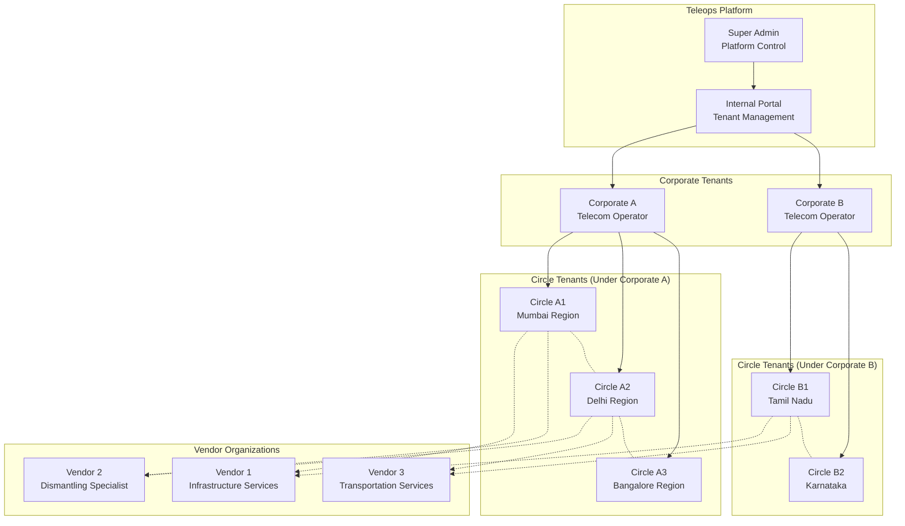
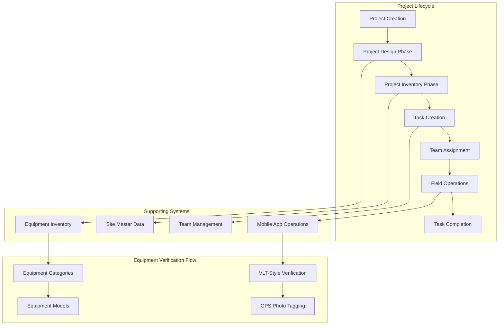

# Teleops Platform - Complete Feature Documentation

## Document Information

- **Version**: 2.0 - **MAJOR UPDATE: VLT-Style Verification Engine**
- **Date**: December 2024
- **Target Audience**: Product Team, Development Team, QA Team, Business Stakeholders
- **Status**: Core Feature Specification with VLT-Style Capabilities

---

## Executive Summary

This document provides comprehensive documentation of all features and functionalities in the **enhanced Teleops platform** featuring a **sophisticated VLT-style verification engine**. The platform now includes **7 complete business domains with 63 models** providing comprehensive field operations capabilities including GPS verification, equipment scanning, and mobile-ready workflows.

### **🎯 Major Platform Enhancements**

- **✅ VLT-Style Verification Engine** - GPS-mandatory equipment verification with mobile workflows
- **✅ Domain-Driven Architecture** - 7 business domains for enhanced maintainability
- **✅ Mobile-Ready Foundation** - Offline sync, GPS verification, and field operations
- **✅ Advanced RBAC System** - Hierarchical designations with permission management
- **✅ Category→Model Hierarchy** - Tenant-created equipment categorization system
- **✅ Complete Project Lifecycle** - Design → Inventory → Tasks → Teams workflow

---

## 🚀 **NEW: VLT-Style Verification Capabilities**

### **1. GPS-Mandatory Verification Workflows**

**Advanced location-based verification system:**

#### **GPS Verification Requirements**

- **Mandatory GPS check** for all field operations
- **Configurable accuracy requirements** (1m to 100m tolerance)
- **Site boundary verification** with geofencing alerts
- **Real-time location tracking** during task execution
- **Offline GPS caching** for areas with poor connectivity

#### **GPS Verification Process**

```
1. Field Engineer arrives at site
2. Mobile app automatically checks GPS location
3. System validates:
   - GPS accuracy meets requirements (e.g., ≤10m)
   - Location is within site boundaries
   - Engineer has authorization for this site
4. If validation passes → Unlock equipment verification
5. If validation fails → Block task execution with alert
```

#### **Geofencing & Site Boundaries**

- **Circular boundaries** - Simple radius-based zones
- **Rectangular boundaries** - GPS coordinate box definitions
- **Custom polygon boundaries** - Complex site shapes
- **Entry/exit notifications** - Automatic alerts for boundary crossings
- **Violation tracking** - Log and alert on unauthorized access attempts

### **2. Equipment Verification Engine**

**Sophisticated Category→Model hierarchy with verification workflows:**

#### **Tenant-Created Category System**

- **Dynamic category creation** - Tenants define their own equipment categories
- **Hierarchical structure** - Parent/child category relationships
- **Verification requirements per category** - GPS, photos, serial numbers
- **Business rules engine** - Custom validation rules per category
- **Compliance tracking** - Industry standards and safety requirements

#### **Equipment Model Management**

- **Model specifications** - Technical details, physical dimensions
- **Serial number patterns** - Regex validation for manufacturer formats
- **Verification complexity rating** - Simple, Standard, Complex, Critical
- **Photo requirements** - Specific angles and documentation needed
- **Installation instructions** - Step-by-step verification guides

#### **VLT-Style Equipment Verification Process**

```
1. Scan equipment QR code or barcode
2. System identifies:
   - Equipment category and model
   - Required verification steps
   - Serial number pattern validation
3. GPS verification (mandatory)
4. Photo documentation (required angles)
5. Serial number verification
6. Model-specific checklist completion
7. Quality score calculation (0-100)
8. Compliance verification
9. Digital signature and timestamp
```

### **3. Mobile Field Operations**

**Complete mobile-ready architecture for field teams:**

#### **Offline Operation Support**

- **Offline task execution** - Work without internet connectivity
- **Local data storage** - SQLite caching for critical data
- **Background sync** - Automatic upload when connectivity restored
- **Conflict resolution** - Handle data conflicts intelligently
- **Battery optimization** - Efficient GPS and camera usage

#### **Mobile App Features**

- **Field task management** - View, accept, and execute assigned tasks
- **Equipment scanning** - QR code, barcode, and RFID support
- **Photo verification** - Required angles with automatic validation
- **GPS tracking** - Real-time location with accuracy monitoring
- **Progress tracking** - Real-time updates to central system
- **Team coordination** - Communication and status sharing

#### **Sync & Data Management**

- **Incremental sync** - Only upload changed data
- **Data compression** - Optimize bandwidth usage
- **Photo optimization** - Automatic resize and quality adjustment
- **Priority queues** - Critical data synced first
- **Error recovery** - Robust handling of sync failures

### **4. Advanced Task Management**

**VLT-style task workflows with verification requirements:**

#### **Field Task Types**

- **Equipment Verification** - VLT-style verification workflows
- **Site Verification** - Location and access verification
- **Installation Tasks** - Equipment installation with verification
- **Dismantling Tasks** - Equipment removal with documentation
- **Maintenance Tasks** - Routine maintenance and inspection
- **Documentation Tasks** - Photo and record collection

#### **Task Execution Workflow**

```
1. Task Assignment
   - Automatic assignment based on skills and location
   - Team lead designation and member selection
   - Equipment and tool requirements specified

2. Pre-Task Verification
   - GPS location verification
   - Site access authorization check
   - Equipment availability confirmation
   - Safety briefing completion

3. Task Execution
   - Step-by-step verification workflows
   - Real-time progress tracking
   - Quality checkpoints
   - Issue and exception handling

4. Post-Task Verification
   - Completion verification
   - Quality score calculation
   - Approval workflow
   - Documentation submission
```

#### **Progress Tracking & Analytics**

- **Real-time progress updates** - Live task completion status
- **Performance metrics** - Time, quality, efficiency tracking
- **Issue tracking** - Problems and resolution documentation
- **Team performance analytics** - Individual and team metrics
- **Compliance reporting** - Regulatory and safety compliance

### **5. Quality Assurance & Compliance**

**Comprehensive quality management system:**

#### **Verification Scoring**

- **GPS accuracy score** - Based on location precision
- **Photo quality score** - Image clarity and angle compliance
- **Completeness score** - All required steps completed
- **Time efficiency score** - Task completion time vs. estimate
- **Overall verification score** - Weighted composite score (0-100)

#### **VLT Compliance Standards**

- **Minimum 85% verification score** for VLT compliance
- **GPS accuracy ≤10m** for critical equipment
- **Mandatory photo documentation** for all equipment
- **Serial number verification** for trackable items
- **Digital signature** with timestamp for audit trail

#### **Quality Control Process**

```
1. Automatic validation during task execution
2. Real-time quality score calculation
3. Immediate feedback to field engineer
4. Supervisor review for scores <85%
5. Corrective action workflows
6. Final approval and sign-off
```

---

## 📋 **Table of Contents**

1. [Platform Overview](#platform-overview)
2. [User Management & Authentication](#user-management--authentication)
3. [Equipment Inventory Management](#equipment-inventory-management)
4. [Site Management](#site-management)
5. [Project Management](#project-management)
6. [Project Design Phase](#project-design-phase)
7. [Project Inventory Management](#project-inventory-management)
8. [Task Management](#task-management)
9. [Dismantling Operations](#dismantling-operations)
10. [Warehouse Management](#warehouse-management)
11. [Transportation Management](#transportation-management)
12. [Reporting & Analytics](#reporting--analytics)
13. [Communication & Alerts](#communication--alerts)
14. [Mobile Application Features](#mobile-application-features)
15. [Complete API Reference](#complete-api-reference)
16. [Integration & API Features](#integration--api-features)
17. [Administrative Features](#administrative-features)

---

## Platform Overview

### Circle-Based Multi-Tenant Architecture



### Complete Dismantling Workflow Integration



### Core System Architecture

```mermaid
graph TB
    subgraph "User Interfaces"
        WEB[Web Dashboard]
        MOBILE[Mobile App]
        API[REST API]
        INTERNAL[Internal Portal]
    end

    subgraph "Core Business Modules"
        PROJECT[Project Management]
        DESIGN[Project Design]
        INVENTORY[Project Inventory]
        TASK[Task Management]
        DISMANTLE[Dismantling Operations]
    end

    subgraph "Master Data Modules"
        SITES[Site Management]
        EQUIPMENT[Equipment Inventory]
        TEAMS[Team Management]
    end

    subgraph "Tenant & Security Modules"
        TENANT_MGT[Tenant Management]
        USER_MGT[User Management]
        DESIGNATION[Designation Management]
        RBAC[Advanced RBAC System]
        ONBOARDING[Tenant Onboarding]
    end

    subgraph "Operational Modules"
        WAREHOUSE[Warehouse Management]
        TRANSPORT[Transportation]
        REPORTS[Reporting & Analytics]
        CAM[CAM File Generation]
    end

    subgraph "Supporting Systems"
        AUTH[Authentication & MFA]
        ALERTS[Notifications]
        STORAGE[File Storage]
        BILLING[Billing System]
        AUDIT[Audit & Logging]
        GPS[GPS Services]
        OFFLINE[Offline Sync]
    end

    %% User Interface Connections
    WEB --> PROJECT
    WEB --> DESIGN
    WEB --> INVENTORY
    WEB --> TASK
    WEB --> SITES
    WEB --> EQUIPMENT
    WEB --> DESIGNATION
    WEB --> RBAC
    WEB --> WAREHOUSE
    WEB --> TRANSPORT
    WEB --> REPORTS

    MOBILE --> TASK
    MOBILE --> DISMANTLE
    MOBILE --> GPS
    MOBILE --> OFFLINE

    INTERNAL --> TENANT_MGT
    INTERNAL --> ONBOARDING
    INTERNAL --> BILLING
    INTERNAL --> REPORTS

    API --> AUTH
    API --> ALERTS
    API --> STORAGE
    API --> AUDIT
    API --> RBAC

    %% Module Dependencies
    PROJECT --> SITES
    PROJECT --> EQUIPMENT
    DESIGN --> EQUIPMENT
    INVENTORY --> SITES
    INVENTORY --> EQUIPMENT
    TASK --> PROJECT
    TASK --> SITES
    TASK --> TEAMS
    DISMANTLE --> TASK
    DISMANTLE --> GPS
    USER_MGT --> DESIGNATION
    DESIGNATION --> RBAC
```



### Platform Objectives

- **Complete Dismantling Workflow**: End-to-end project management from design through execution with VLT-style verification
- **Circle-Based Operations**: Support for complex telecom circle hierarchies with independent operations and consolidated reporting
- **Equipment-Centric Management**: Category → Model equipment structure for systematic verification and inventory management
- **Flexible Multi-Tenancy**: Corporate/Circle/Vendor tenant hierarchies with quasi-independent operations
- **Advanced Permission Control**: Dual-level RBAC with designation-based permissions and individual user overrides
- **Real-time Field Operations**: GPS-enabled equipment verification with offline synchronization capabilities
- **Master Data Integration**: Comprehensive site management with reusable location data across projects and tasks
- **Tenant Autonomy**: Complete organizational structure freedom with only Super Admin predefined
- **Cross-Technology Support**: Equipment and processes that work across 2G, MW, 3G, and future technologies
- **Quality Assurance**: Built-in validation, approval workflows, and compliance tracking at every stage

---

## User Management & Authentication

### 🔐 **Authentication System**

#### Circle-Based Multi-Tenant Architecture

```yaml
Tenant Hierarchy:
  - Platform Admin (Teleops Internal)
  - Corporate Tenants (Parent Organizations)
  - Circle Tenants (Quasi-Independent Business Units)
  - Vendor Organizations (External Service Providers)

Authentication Methods:
  - JWT Token-based authentication
  - Multi-factor authentication (MFA)
  - Single Sign-On (SSO) support
  - API key authentication for integrations
  - Biometric authentication (mobile app)
```

#### User Registration & Onboarding

```yaml
Registration Flow: 1. Tenant creation (Corporate/Circle/Vendor)
  2. Tenant admin setup and configuration
  3. Custom designation structure creation
  4. User invitation and onboarding
  5. Designation assignment and permission setup
  6. Onboarding tutorial and training

Self-Registration:
  - Independent vendors can self-register
  - Email verification required
  - Tenant admin approval for operations
  - Custom designation assignment
```

### 🏢 **Tenant-Driven Designation Management**

#### Design Philosophy

```yaml
Core Principles:
  - Complete tenant autonomy in organizational structure
  - No predefined roles except Super Admin
  - Custom designation creation based on business needs
  - Flexible permission assignment per designation
  - Scalable hierarchy for any organization size

Benefits:
  - Eliminates rigid role constraints
  - Adapts to diverse business models
  - Supports unique organizational structures
  - Future-proof for expansion
  - Industry-agnostic approach
```

#### Super Admin (Platform Level)

```yaml
Designation: Super Admin (Only Predefined Role)

Permissions:
  - Complete platform administration
  - Tenant creation and management
  - Global system configuration
  - Billing and subscription oversight
  - Feature flag management
  - Cross-tenant analytics

Access Level: Unrestricted platform access
```

#### Tenant-Driven Custom Designations

```yaml
Designation Creation:
  - Tenant admins create custom designations
  - Define permission sets per designation
  - Set hierarchical relationships
  - Configure approval workflows
  - Establish reporting structures

Common Designation Examples:
  Corporate Tenants:
    - Chief Technology Officer
    - Regional Manager
    - Project Director
    - Operations Coordinator

  Circle Tenants:
    - Circle Head
    - Site Manager
    - Quality Lead
    - Field Coordinator

  Vendor Organizations:
    - Operations Director
    - Team Leader
    - Technical Specialist
    - Mobile Technician

Designation Configuration:
  - Custom permission combinations
  - Department/team assignments
  - Approval authorities
  - Reporting relationships
  - Access scopes and limitations
```

### 🔐 **Advanced Role-Based Access Control (RBAC)**

#### Dual-Level Permission System

```yaml
System Architecture:
  Level 1: Designation-Level Permissions (Base inheritance)
  Level 2: User-Level Overrides (Individual customization)

Permission Calculation Formula: Effective_Permissions = (Designation_Permissions + User_Additional_Permissions - User_Restricted_Permissions) filtered by Scope

Permission Types:
  - CREATE: Ability to create new resources
  - READ: Ability to view/access resources
  - UPDATE: Ability to modify existing resources
  - DELETE: Ability to remove resources
  - APPROVE: Ability to approve workflows
  - ASSIGN: Ability to assign tasks/resources
```

#### Permission Groups & Categories

```yaml
Core Permission Groups:
  1. User Management:
    - user.create, user.read, user.update, user.delete
    - user.invite, user.activate, user.deactivate
    - designation.assign, designation.remove

  2. Site Operations:
    - site.create, site.read, site.update, site.delete
    - site.assign, site.progress.update, site.complete
    - equipment.document, equipment.condition.assess

  3. Project Management:
    - project.create, project.read, project.update
    - project.assign.vendor, project.monitor
    - project.approve.milestones

  4. Quality Control:
    - quality.inspect, quality.approve, quality.reject
    - compliance.monitor, compliance.report
    - deviation.alert, deviation.resolve

  5. Financial Operations:
    - billing.view, billing.manage, billing.approve
    - costs.track, costs.analyze, costs.optimize
    - invoices.generate, invoices.approve

  6. Analytics & Reporting:
    - analytics.view.basic, analytics.view.advanced
    - reports.generate, reports.schedule, reports.export
    - dashboard.configure, dashboard.share
```

#### User-Level Permission Overrides

```yaml
Override Types:
  1. Additional Permissions:
    - Grant extra permissions beyond designation
    - Temporary elevated access
    - Special project requirements

  2. Restricted Permissions:
    - Remove specific permissions from designation
    - Compliance restrictions
    - Security limitations

  3. Modified Permissions:
    - Change permission scope (e.g., read-only vs full access)
    - Time-based restrictions
    - Resource-specific limitations

Override Examples:
  John Smith (Project Manager):
    Designation Permissions: [site.create, site.assign, project.monitor]
    Additional Permissions: [vendor.assign.tasks]
    Restricted Permissions: []

  Nancy Methew (Project Manager):
    Designation Permissions: [site.create, site.assign, project.monitor]
    Additional Permissions: []
    Restricted Permissions: [vendor.assign.tasks]
```

### 🎯 **Permission Scope & Data Isolation**

#### Multi-Level Data Access

```yaml
Scope Levels:
  1. Platform Level: Access across all tenants (Super Admin only)
  2. Corporate Level: Access across all circles within corporate
  3. Circle Level: Access within specific circle and its vendors
  4. Vendor Level: Access within vendor organization only
  5. Project Level: Access to specific projects only
  6. Site Level: Access to specific sites only

Data Isolation Rules:
  - Circle tenants cannot access other circles' data
  - Vendors can only access data from assigned clients
  - Users can only access data within their permission scope
  - Cross-circle access requires explicit permissions
```

#### Dynamic Permission Evaluation

```yaml
Permission Evaluation Process: 1. Identify user's tenant and designation
  2. Retrieve designation-level permissions
  3. Apply user-level overrides (additions/restrictions)
  4. Filter by user's scope (circle, vendor, project)
  5. Validate resource-specific permissions
  6. Log access attempt for audit trail

Real-time Evaluation:
  - Permissions evaluated on every request
  - Cache frequently accessed permissions
  - Invalidate cache on permission changes
  - Support for conditional permissions
```

### 📊 **Permission Analytics & Audit**

#### Access Monitoring

```yaml
Audit Trail Features:
  - All permission grants/revokes logged
  - User access patterns tracked
  - Failed access attempts recorded
  - Permission override usage monitored
  - Compliance violations flagged

Audit Reports:
  - User access summary reports
  - Permission usage analytics
  - Security violation reports
  - Compliance audit trails
  - Permission optimization recommendations
```

---

## Equipment Inventory Management

### 📦 **Category-Model Equipment Structure**

#### Equipment Organization Hierarchy

```yaml
Equipment Structure:
  Category Level:
    - Broad equipment classification (CABINET, CARDS, PSU, etc.)
    - Used for verification checklist organization
    - Determines verification workflow requirements

  Model Level:
    - Specific equipment models within category
    - Manufacturer-specific designations
    - Used for precise equipment identification
    - Links to technical specifications

  Example Hierarchy:
    Category: CABINET
      Models: [RBS-2964, RBS-2954, RBS-2204, RBS-2202, RBS-2106, RBS-2101]
    Category: CARDS
      Models: [EDRU 9P-03, EDRU 9P-01, DTRU, DRU-900]
    Category: DXU
      Models: [DXU-31, DXU-23, DXU-21]
```

#### Cross-Technology Equipment Categories

```yaml
Primary Equipment Categories:
  CABINET:
    description: Equipment cabinet housing
    unit: Unit
    requires_serial_number: true
    predefined_models: [RBS-2964, RBS-2954, RBS-2204, RBS-2202, RBS-2106, RBS-2101]

  CARDS:
    description: Electronic circuit cards/modules
    unit: Unit
    requires_serial_number: true
    predefined_models: [EDRU 9P-03, EDRU 9P-01, DTRU, DRU-900]

  DXU:
    description: Digital Cross-connect/Gateway Unit
    unit: Unit
    requires_serial_number: true
    predefined_models: [DXU-31, DXU-23, DXU-21]

  PSU:
    description: Power Supply Unit
    unit: Unit
    requires_serial_number: true
    predefined_models: [PSU-DC-32, PSU-AC-31]

  IDM:
    description: Indoor/Integrated Device Module
    unit: Unit
    requires_serial_number: true
    predefined_models: [IDM13, IDM15, IDM14, IDM12]

  FCU, DCCU, PAU, CXU, OTHER: Various supporting equipment categories
    Custom model addition capability
    Flexible verification requirements
```

### 🔧 **Equipment Management Features**

#### Multi-Tenant Equipment Support

```yaml
Equipment Access Patterns:
  Predefined Equipment:
    - System-wide equipment categories and models
    - Cross-tenant availability
    - Standard telecom equipment
    - Read-only for most users

  Custom Equipment:
    - Tenant-specific additions
    - Client-created categories/models
    - Private to creating tenant
    - Full modification rights

Equipment Selection Integration:
  - Project design equipment selection
  - Category-model combinations
  - Project-specific model additions
  - Design phase equipment inheritance
```

---

## Site Management

### 🏢 **Master Site Data**

#### Site Architecture

```yaml
Sites (Master Data):
  - Physical locations with fixed attributes
  - Tenant-specific master data entities
  - Reusable across multiple projects and tasks
  - No status or assignment tracking
  - Pure metadata containers

Site Data Structure:
  Required Fields:
    - site_id: string (Business identifier)
    - global_id: string (Globally unique identifier)
    - site_name: string (Human-readable site name)
    - town: string (City/town location)
    - cluster: string (Operational grouping/region)
    - latitude: decimal (Geographic coordinate)
    - longitude: decimal (Geographic coordinate)

  Optional Site Details:
    - site_type: string (bts|tower|office|warehouse|data_center)
    - access_instructions: text
    - safety_requirements: text
    - contact_person: string
    - contact_phone: string
    - landmark_description: text
```

#### Site Creation & Management

```yaml
Site Creation Methods:
  1. Single Site Creation:
    - Manual form-based creation
    - Geographic coordinate validation
    - Unique ID verification within tenant

  2. Bulk Site Upload:
    - Excel template-based upload
    - Validation and error reporting
    - Duplicate detection and handling

  3. Automatic Site Creation:
    - Created during task creation if missing
    - Confirmation workflow for new sites
    - Master data integration
```

---

## Project Management

### 📋 **Project Architecture**

#### Project Types & Workflow

```yaml
Project Types:
  Dismantle:
    - Triggers automatic design phase
    - Equipment category/model selection workflow
    - Inventory management with quantities
    - Task creation with equipment inheritance

  Other:
    - Standard project workflow
    - Site management only
    - Traditional project operations
    - Direct task creation capability

Project Structure:
  Required Fields:
    - project_name: string (descriptive project name)
    - project_type: enum (Dismantle, Other)
    - client: integer (foreign key to clients table)
    - customer: integer (foreign key to customers table)
    - circle: string (telecom circle/region)
    - activity: string (description of work to be performed)
```

#### Project-Site Integration

```yaml
Project-Site Relationships:
  - Projects contain multiple sites
  - Sites must exist in master data first
  - Many-to-many relationship (sites can be in multiple projects)
  - Same tenant isolation (project sites from same tenant)

Site Association Methods:
  - Manual site selection from tenant sites
  - Bulk site upload to project
  - Automatic site creation during task creation
  - Site validation and duplicate handling
```

---

## Project Design Phase

### 🎨 **Equipment Design Workflow**

#### Design Phase Scope

```yaml
Design Process Flow:
  Step 1: Project Creation (with type = "Dismantle")
  Step 2: Automatic Design Phase Activation
  Step 3: Equipment Category Selection (WHAT categories needed)
  Step 4: Equipment Model Selection (WHICH models within categories)
  Step 5: Equipment Specifications and Requirements Definition
  Step 6: Design Ready for Inventory Management Phase

Note: Quantities and Site Allocation handled separately:
  - Equipment quantities determined during inventory management
  - Site-specific allocation done when adding sites to project
  - Design phase focuses on categories and models, not amounts
```

#### Equipment Category & Model Selection

```yaml
Equipment Selection Interface:
  Category Discovery:
    - Browse all available equipment categories
    - No technology category restrictions
    - Cross-technology equipment usage
    - Universal equipment category access

  Model Selection within Categories:
    - Specific models required within each category
    - Model-based technical specifications
    - Manufacturer-specific requirements
    - Custom model additions as needed

  Design Validation:
    - Equipment category selection completeness
    - Model specifications within categories
    - Required equipment coverage
    - Technical feasibility assessment
```

---

## Project Inventory Management

### 📊 **Quantity Allocation & Site Distribution**

#### Inventory Management Scope

```yaml
Inventory Phase Responsibilities:
  - Determine HOW MUCH equipment per site
  - Assign specific serial numbers
  - Validate against planned dismantling scope
  - Create site-specific equipment lists
  - Support bulk equipment allocation via Excel upload

Integration with Design Phase:
  Design Phase Output (Input to Inventory):
    - Approved equipment categories list
    - Equipment model selections
    - Equipment specifications and requirements
    - Technical handling requirements
```

#### Site-Specific Equipment Allocation

```yaml
Equipment Allocation Structure:
  Project Site Inventory Model:
    - project_id: bigint (reference to project)
    - site_id: bigint (reference to site)
    - equipment_id: bigint (reference to equipment inventory)
    - planned_quantity: integer (how many units)
    - allocated_serial_numbers: array (specific equipment serials)

  Cross-Technology Support:
    - Any equipment category in any project
    - Equipment usage across all technology types
    - Site-specific variations and custom combinations
    - Technology-specific serial number patterns
```

#### Bulk Inventory Processing

```yaml
Excel Upload Features:
  Template Structure:
    - Site_ID: string (must match existing project sites)
    - Site_Name: string (verification field)
    - Equipment_Type: string (equipment category name)
    - Equipment_Name: string (specific equipment model)
    - Serial_Number: string (unique identifier)
    - Planned_Quantity: integer (quantity for this site)

  Validation & Processing:
    - Business rule validation
    - Serial number uniqueness checking
    - Conflict resolution workflows
    - Success/warning/error reporting
```

---

## Task Management

### 🎯 **Work Assignment & Execution**

#### Task Architecture

```yaml
Task Definition:
  - Work unit containing one or more sites for dismantling
  - Created manually by Client/Independent Vendor from projects
  - Assigned to teams for execution
  - Tracked through status workflow until completion

Multi-Site Support:
  MW Projects:
    - Task contains 2 sites: Far-end (Site A) + Near-end (Site B)
    - Coordinated dismantling across both locations
    - Single task progress tracking for entire work unit

  2G/3G Projects:
    - Task contains 1 site: Single location dismantling
    - Standard workflow and progress tracking
```

#### Task Status Workflow

```yaml
Task Lifecycle:
  ALLOCATED:
    - Task manually created by Client/Independent Vendor from project
    - Contains all site details and planned inventory
    - No team assigned yet (assigned_team_id = NULL)

  ASSIGNING:
    - Vendor has assigned task to a team
    - Team notified and can view all task details
    - Team can accept or request reassignment

  ASSIGNED:
    - Team has accepted the task assignment
    - Team can view all task details and begin work

  WIP (Work In Progress):
    - Team has started field operations
    - Equipment verification in progress
    - Real-time progress updates

  DONE:
    - All required work completed
    - Equipment verification completed
    - Task ready for closure

  Additional States:
    - PARTIALLY_DONE: Some work completed
    - IN_ISSUE: Problems requiring attention
    - DEALLOCATED: Task unassigned
```

#### Equipment Integration

```yaml
Task Equipment Inheritance:
  - Equipment requirements inherited from project site inventory
  - Site-specific equipment allocations provide work context
  - Serial number tracking and verification at task level
  - Category-organized equipment checklists for mobile app
```

---

## Dismantling Operations

### 🔧 **VLT-Style Equipment Verification**

#### Equipment Verification Workflow

```yaml
Equipment Verification Process:
  Step 1: Site Arrival and Setup
    - GPS location verification
    - Site safety assessment
    - Equipment verification checklist review
    - Mobile app initialization

  Step 2: Equipment Discovery and Verification
    - Category-by-category equipment verification
    - Found/Not Found determination
    - Serial number verification (if equipment found)
    - Condition assessment and documentation
    - GPS-tagged photo documentation

  Step 3: Equipment Verification States
    Found Equipment:
      - Mark as Found (is_found = true)
      - Enter actual serial number (if visible)
      - Validate serial number match (planned vs actual)
      - Assess equipment condition
      - Take GPS-tagged equipment photos
      - Add verification notes

    Not Found Equipment:
      - Mark as Not Found (is_found = false)
      - Select reason from predefined list:
        * "Not Found" - Equipment completely missing
        * "Used by BSS" - Equipment in use by base station
        * "Engaged with other Technology" - Equipment repurposed
        * "Post RFI" - Equipment status pending RFI response
        * "Others" - Custom reason with additional details
      - Take GPS-tagged photos of search area
      - Add detailed notes about search efforts
```

#### GPS Photo Tagging Requirements

```yaml
Mandatory GPS Requirements:
  - All equipment verification photos must include GPS coordinates
  - GPS accuracy must meet minimum threshold (typically 5-10 meters)
  - GPS coordinates captured at time of photo
  - GPS metadata embedded in photo file

Photo Types with GPS:
  - Equipment Found Photos: Show equipment with GPS location
  - Equipment Condition Photos: Document equipment condition with GPS
  - Site Overview Photos: General site context with GPS
  - Not Found Area Photos: Show search area with GPS location

GPS Data Capture:
  - Latitude/Longitude in decimal degrees
  - GPS accuracy in meters
  - Timestamp (UTC) of GPS capture
  - Altitude (optional)
  - GPS signal strength validation

GPS Validation Rules:
  - Minimum GPS accuracy threshold
  - GPS coordinates within expected site boundary
  - GPS signal strength above minimum threshold
  - Location consistency across photos from same site
  - GPS metadata integrity verification
```

### 📱 **Field Operations**

#### Equipment Documentation

```yaml
Equipment Types:
  - Passive Equipment: Antennas, feeders, filters, cables
  - Active Equipment: RRUs, BBUs, power systems, batteries
  - Infrastructure: Cabinets, towers, shelters, grounding
  - Support Equipment: Tools, test equipment, temporary items

Documentation Requirements:
  - Equipment identification (serial numbers, models)
  - Physical condition assessment
  - Photo documentation (multiple angles)
  - Quantity verification
  - Location and installation details
  - Removal methodology and timeline

Condition Assessment:
  - Excellent: Like new, fully functional
  - Good: Minor wear, fully functional
  - Fair: Moderate wear, functional with minor issues
  - Poor: Significant wear, limited functionality
  - Scrap: Non-functional, suitable only for recycling
```

#### Photo Documentation System

```yaml
Photo Categories:
  - Site Overview: General site condition and layout
  - Equipment Close-ups: Individual equipment items
  - Installation Details: Mounting, connections, configurations
  - Condition Evidence: Damage, wear, functionality issues
  - Progress Updates: Before/during/after shots
  - Safety Documentation: Safety measures and compliance

Photo Requirements:
  - Minimum resolution: 2MP (mobile), 5MP (preferred)
  - GPS coordinates embedded
  - Timestamp automatic
  - Equipment tags visible
  - Multiple angles for critical equipment

Photo Management:
  - Automatic cloud upload
  - Offline capability with sync
  - Duplicate detection
  - Compression and optimization
  - Secure storage with access controls
```

#### Progress Tracking & Milestones

```yaml
Progress Metrics:
  - Overall Site Completion %
  - Equipment Categories Completed
  - Timeline Adherence
  - Quality Score
  - Safety Incidents
  - Client Satisfaction

Milestone Types:
  - Site Survey Completed
  - Dismantling Started
  - 25% Equipment Removed
  - 50% Equipment Removed
  - 75% Equipment Removed
  - Site Cleanup Completed
  - Client Handover

Real-time Updates:
  - Progress percentage by category
  - Equipment counts and status
  - Team status and location
  - Issues and blockers
  - Timeline adjustments
```

### 🔍 **Quality Control & Compliance**

#### Quality Control Processes

```yaml
QC Checkpoints:
  - Pre-work Site Inspection
  - 25% Progress Review
  - 50% Progress Review
  - 75% Progress Review
  - Final Inspection
  - Client Handover Review

Quality Metrics:
  - Equipment Documentation Accuracy
  - Photo Quality and Completeness
  - Timeline Adherence
  - Safety Compliance
  - Client Requirements Compliance

QC Tools:
  - Digital checklists
  - Photo comparison tools
  - Equipment verification
  - Progress validation
  - Deviation tracking
```

#### Compliance Management

```yaml
Regulatory Compliance:
  - Environmental regulations
  - Safety standards (OSHA, local)
  - Waste disposal requirements
  - Equipment handling protocols
  - Documentation requirements

Client Compliance:
  - Specific client requirements
  - Custom documentation needs
  - Reporting formats
  - Timeline requirements
  - Quality standards

Compliance Tracking:
  - Automated compliance checks
  - Deviation alerts
  - Corrective action tracking
  - Compliance reporting
  - Audit trail maintenance
```

### 📄 **CAM (Customer Asset Management) System**

#### CAM File Generation

```yaml
CAM File Components:
  - Site Information Summary
  - Equipment Inventory Listing
  - Condition Assessment Reports
  - Photo Documentation
  - Removal Documentation
  - Disposition Recommendations

Automated Generation:
  - Template-based file creation
  - Data aggregation from field inputs
  - Photo compilation and organization
  - Quality validation before generation
  - Client-specific formatting

CAM File Formats:
  - PDF reports
  - Excel spreadsheets
  - XML data files
  - JSON for API integration
  - Custom client formats
```

#### Asset Tracking & Disposition

```yaml
Asset Categories:
  - Recoverable Equipment (reusable)
  - Refurbishable Equipment (repair needed)
  - Scrap Material (recycling only)
  - Hazardous Materials (special handling)
  - Client-retained Assets

Disposition Options:
  - Return to Client
  - Vendor Purchase
  - Third-party Sale
  - Recycling
  - Proper Disposal

Tracking Features:
  - Unique asset identifiers
  - Chain of custody documentation
  - Location tracking
  - Status updates
  - Value assessment
```

---

## Warehouse Management

### 📦 **Inventory Management System**

#### Inventory Organization

```yaml
Storage Structure:
  - Warehouses: Physical locations
  - Zones: Functional areas within warehouse
  - Aisles: Organizational sections
  - Bins: Specific storage locations
  - Positions: Exact item placement

Item Classification:
  - Equipment Type: Passive, Active, Infrastructure
  - Condition: New, Good, Fair, Poor, Scrap
  - Value: High, Medium, Low
  - Size: Large, Medium, Small, Bulk
  - Special Handling: Fragile, Hazardous, Temperature-sensitive

Location Management:
  - Bin-level location tracking
  - Optimized storage allocation
  - Item accessibility optimization
  - Space utilization tracking
  - Location history maintenance
```

#### Inventory Tracking Features

```yaml
Real-time Tracking:
  - Live inventory counts
  - Location updates
  - Movement history
  - Status changes
  - Availability tracking

Barcode/QR Code Integration:
  - Item labeling system
  - Mobile scanning capability
  - Batch scanning support
  - Error reduction
  - Speed optimization

RFID Support (Future):
  - Passive RFID tags
  - Real-time location updates
  - Bulk reading capability
  - Enhanced accuracy
  - Automated tracking
```

### 📥 **Receiving Operations**

#### Receiving Process

```yaml
Receiving Workflow: 1. Advance Shipment Notice (ASN)
  2. Vehicle arrival and check-in
  3. Documentation verification
  4. Physical inspection and counting
  5. Condition assessment
  6. Location assignment
  7. System updates
  8. Exception handling

Documentation Requirements:
  - Delivery receipts
  - Packing lists
  - Quality inspection reports
  - Photo documentation
  - Discrepancy reports

Quality Control:
  - Visual inspection protocols
  - Functionality testing (when applicable)
  - Damage assessment
  - Quantity verification
  - Documentation accuracy
```

#### Exception Management

```yaml
Exception Types:
  - Quantity discrepancies
  - Quality issues
  - Documentation problems
  - Delivery delays
  - Damage during transit

Exception Handling:
  - Immediate flagging
  - Photo documentation
  - Stakeholder notification
  - Resolution tracking
  - Process improvement feedback
```

### 📤 **Dispatch Operations**

#### Order Management

```yaml
Order Types:
  - Client returns
  - Third-party sales
  - Internal transfers
  - Recycling shipments
  - Emergency dispatches

Order Processing: 1. Order creation and validation
  2. Inventory allocation
  3. Picking optimization
  4. Packing and preparation
  5. Shipping documentation
  6. Transportation coordination
  7. Delivery tracking

Picking Optimization:
  - Route optimization within warehouse
  - Batch picking support
  - Pick list generation
  - Verification checkpoints
  - Error prevention measures
```

#### Shipping & Documentation

```yaml
Shipping Documentation:
  - Packing lists
  - Bills of lading
  - Commercial invoices
  - Shipping labels
  - Insurance documentation

Carrier Integration:
  - Multiple carrier support
  - Rate comparison
  - Label printing
  - Tracking integration
  - Delivery confirmation
```

### 📊 **Warehouse Analytics**

#### Performance Metrics

```yaml
Operational Metrics:
  - Receiving efficiency
  - Dispatch accuracy
  - Space utilization
  - Labor productivity
  - Cost per transaction

Inventory Metrics:
  - Turnover rates
  - Aging analysis
  - Shrinkage tracking
  - Accuracy rates
  - Carrying costs

Quality Metrics:
  - Damage rates
  - Error rates
  - Customer satisfaction
  - Process compliance
  - Safety incidents
```

---

## Transportation Management

### 🚛 **Fleet Management**

#### Vehicle Management

```yaml
Vehicle Information:
  - Basic Details: Make, model, year, capacity
  - Technical Specs: Dimensions, weight limits, special features
  - Operational Data: Registration, insurance, maintenance
  - Performance Metrics: Fuel efficiency, utilization rates
  - Cost Information: Operating costs, maintenance costs

Vehicle Types:
  - Small Trucks (urban deliveries)
  - Medium Trucks (regional transport)
  - Large Trucks (long-distance transport)
  - Specialized Vehicles (crane trucks, flatbeds)
  - Support Vehicles (service, emergency)

Fleet Tracking:
  - Real-time GPS location
  - Vehicle status monitoring
  - Maintenance scheduling
  - Utilization optimization
  - Cost tracking
```

#### Driver Management

```yaml
Driver Information:
  - Personal Details: Name, contact, emergency contact
  - Licensing: License types, expiration dates, endorsements
  - Certifications: Safety training, specialized equipment
  - Performance: Safety record, efficiency ratings
  - Availability: Schedule, time-off, assignments

Driver Features:
  - Mobile app integration
  - Route navigation
  - Delivery confirmations
  - Communication tools
  - Performance tracking
```

### 🗺️ **Route Planning & Optimization**

#### Route Optimization

```yaml
Optimization Factors:
  - Distance minimization
  - Time optimization
  - Fuel efficiency
  - Vehicle capacity utilization
  - Driver skill matching
  - Traffic conditions
  - Delivery time windows

Route Types:
  - Point-to-point delivery
  - Multi-stop routes
  - Round-trip circuits
  - Emergency routes
  - Optimized daily routes

Real-time Adjustments:
  - Traffic condition updates
  - Delivery changes
  - Vehicle breakdowns
  - Weather conditions
  - Customer requests
```

#### GPS Tracking & Monitoring

```yaml
Tracking Features:
  - Real-time location updates
  - Route adherence monitoring
  - Speed monitoring
  - Idle time tracking
  - Geofence alerts

Data Collection:
  - Location history
  - Speed profiles
  - Stop duration
  - Route efficiency
  - Fuel consumption patterns

Driver Safety:
  - Speed limit enforcement
  - Hard braking detection
  - Rapid acceleration alerts
  - Fatigue monitoring
  - Emergency assistance
```

### 📋 **Delivery Management**

#### Delivery Process

```yaml
Delivery Workflow: 1. Route assignment and optimization
  2. Pre-delivery preparation
  3. Departure confirmation
  4. En-route tracking
  5. Delivery execution
  6. Proof of delivery (POD)
  7. Return journey tracking
  8. Trip completion

Proof of Delivery:
  - Digital signatures
  - Photo documentation
  - GPS coordinates
  - Timestamp verification
  - Recipient identification
```

#### Exception Handling

```yaml
Delivery Exceptions:
  - Customer not available
  - Address issues
  - Access problems
  - Damage during transport
  - Partial deliveries

Exception Resolution:
  - Immediate notification
  - Alternative arrangements
  - Rescheduling options
  - Escalation procedures
  - Customer communication
```

### ⛽ **Fuel & Cost Management**

#### Fuel Tracking

```yaml
Fuel Management:
  - Fuel consumption monitoring
  - Efficiency calculations
  - Cost tracking
  - Fuel card integration
  - Usage optimization

Cost Analytics:
  - Per-mile costs
  - Per-delivery costs
  - Vehicle comparison
  - Route efficiency
  - Driver performance impact
```

---

## Reporting & Analytics

### 📊 **Dashboard System**

#### Executive Dashboard

```yaml
Key Metrics:
  - Overall operational efficiency
  - Revenue and cost summaries
  - Client satisfaction scores
  - Resource utilization rates
  - Safety and compliance metrics

Visual Components:
  - KPI summary cards
  - Trend charts and graphs
  - Geographic heat maps
  - Progress indicators
  - Alert notifications

Real-time Updates:
  - Live data feeds
  - Automatic refresh
  - Drill-down capabilities
  - Interactive filters
  - Export options
```

#### Operational Dashboards

```yaml
Site Operations Dashboard:
  - Active site status
  - Progress tracking
  - Team performance
  - Quality metrics
  - Issue tracking

Warehouse Dashboard:
  - Inventory levels
  - Receiving/dispatch activity
  - Space utilization
  - Performance metrics
  - Exception tracking

Transportation Dashboard:
  - Fleet status and location
  - Route efficiency
  - Delivery performance
  - Cost metrics
  - Driver performance
```

### 📈 **Analytics & Insights**

#### Performance Analytics

```yaml
Operational Performance:
  - Site completion rates
  - Timeline adherence
  - Quality scores
  - Resource efficiency
  - Cost optimization

Trend Analysis:
  - Historical performance trends
  - Seasonal variations
  - Improvement tracking
  - Benchmark comparisons
  - Predictive insights

Comparative Analytics:
  - Team performance comparison
  - Site type analysis
  - Vendor performance ranking
  - Client satisfaction trends
  - Cost efficiency analysis
```

#### Custom Report Builder

```yaml
Report Types:
  - Operational reports
  - Financial reports
  - Compliance reports
  - Performance reports
  - Custom analytics

Report Features:
  - Drag-and-drop builder
  - Multiple data sources
  - Custom calculations
  - Automated scheduling
  - Multiple output formats

Data Visualization:
  - Charts and graphs
  - Tables and matrices
  - Geographic maps
  - Infographics
  - Interactive dashboards
```

### 📋 **Standard Reports**

#### Operational Reports

```yaml
Site Progress Reports:
  - Individual site status
  - Progress summaries
  - Timeline analysis
  - Issue tracking
  - Photo documentation

Team Performance Reports:
  - Individual performance
  - Team comparisons
  - Productivity metrics
  - Quality scores
  - Training needs

Resource Utilization Reports:
  - Equipment usage
  - Vehicle utilization
  - Labor efficiency
  - Cost analysis
  - Optimization opportunities
```

#### Compliance Reports

```yaml
Regulatory Compliance:
  - Safety compliance status
  - Environmental compliance
  - Documentation completeness
  - Training compliance
  - Audit readiness

Client Compliance:
  - Client requirement adherence
  - Custom reporting formats
  - SLA performance
  - Quality standards
  - Delivery performance
```

### 📤 **Data Export & Integration**

#### Export Capabilities

```yaml
Export Formats:
  - PDF reports
  - Excel spreadsheets
  - CSV data files
  - JSON for APIs
  - XML for integrations

Export Options:
  - On-demand exports
  - Scheduled exports
  - Automated delivery
  - Custom formatting
  - Data filtering
```

#### API Integration

```yaml
Data Access APIs:
  - Real-time data feeds
  - Historical data access
  - Custom queries
  - Batch exports
  - Webhook notifications

Integration Support:
  - ERP systems
  - CRM platforms
  - Billing systems
  - Business intelligence tools
  - Third-party analytics
```

---

## Communication & Alerts

### 📧 **Notification System**

#### Notification Types

```yaml
System Notifications:
  - Site assignment updates
  - Progress milestones
  - Quality issues
  - Compliance violations
  - System maintenance

Operational Alerts:
  - Delivery delays
  - Equipment issues
  - Safety incidents
  - Weather warnings
  - Emergency situations

Business Notifications:
  - Performance metrics
  - Cost alerts
  - Client satisfaction
  - Revenue updates
  - Strategic insights
```

#### Delivery Channels

```yaml
Email Notifications:
  - HTML formatted emails
  - Attachment support
  - Template customization
  - Scheduled delivery
  - Delivery tracking

SMS Alerts:
  - Critical alerts only
  - Character optimization
  - Delivery confirmation
  - Cost management
  - Emergency notifications

Push Notifications:
  - Mobile app notifications
  - Real-time delivery
  - Action buttons
  - Rich content support
  - Silent updates

In-app Notifications:
  - Dashboard alerts
  - Status indicators
  - Interactive notifications
  - History tracking
  - Read receipts
```

### 🚨 **Alert Management**

#### Alert Configuration

```yaml
Alert Rules:
  - Condition-based triggers
  - Threshold settings
  - Time-based rules
  - Escalation paths
  - Override options

Alert Priorities:
  - Critical: Immediate action required
  - High: Action needed within hours
  - Medium: Action needed within day
  - Low: Informational only

Alert Categories:
  - Safety and security
  - Operational efficiency
  - Quality and compliance
  - Financial and cost
  - Customer satisfaction
```

#### Escalation Workflows

```yaml
Escalation Levels: 1. Initial notification to assigned person
  2. Reminder after specified time
  3. Escalation to supervisor
  4. Manager notification
  5. Executive escalation

Escalation Rules:
  - Time-based escalation
  - Acknowledgment requirements
  - Skip levels for critical issues
  - Multiple notification channels
  - Automatic resolution detection
```

### 💬 **Communication Tools**

#### Internal Communication

```yaml
Team Messaging:
  - Site-specific chat groups
  - Project communication channels
  - Direct messaging
  - File sharing
  - Message history

Announcement System:
  - Company-wide announcements
  - Department-specific updates
  - Project announcements
  - Training notifications
  - Policy updates
```

#### Client Communication

```yaml
Client Portal:
  - Project status updates
  - Progress reports
  - Photo sharing
  - Document exchange
  - Feedback collection

Automated Updates:
  - Progress notifications
  - Milestone completions
  - Issue notifications
  - Report delivery
  - Invoice notifications
```

---

## Mobile Application Features

### 📱 **Core Mobile Functionality**

#### VLT-Style Equipment Verification Interface

```yaml
Category-Based Interface:
  - Equipment organized by category (CABINET, CARDS, etc.)
  - Model selection within categories
  - Category-specific verification workflows
  - Progress tracking per category

Verification Workflow Interface:
  - Found/Not Found selection with visual indicators
  - Serial number entry with validation
  - GPS-tagged photo capture
  - Equipment condition assessment
  - Verification notes and comments

Equipment Verification Features:
  - Category-organized equipment checklists
  - Model-specific verification requirements
  - Serial number verification workflow
  - GPS-mandatory photo tagging
  - Real-time progress synchronization
```

#### GPS Integration & Requirements

```yaml
Mandatory GPS Features:
  - High-accuracy positioning for all photos
  - GPS accuracy validation (5-10m threshold)
  - Automatic GPS coordinate capture
  - GPS metadata embedded in photos
  - Location boundary validation

GPS-Enhanced Verification:
  - Equipment photos with GPS coordinates
  - Site boundary validation
  - Location consistency checking
  - GPS signal strength monitoring
  - Coordinate accuracy display
```

#### Offline Capability & Synchronization

```yaml
Offline Equipment Verification:
  - Local equipment verification data storage
  - GPS coordinates and photos stored locally
  - Verification progress tracking offline
  - Equipment verification states maintained offline

Offline Data Management:
  - SQLite local database for verification data
  - Encrypted local photo storage
  - GPS metadata preservation offline
  - Smart synchronization queue management

Synchronization Features:
  - Automatic sync when connectivity restored
  - Conflict resolution based on latest timestamp
  - Progress updates and notifications
  - Photo upload with GPS metadata preservation
  - Real-time status synchronization
```

### 📸 **Photo & Media Management**

#### Camera Integration

```yaml
Camera Features:
  - High-resolution capture
  - Auto-focus and exposure
  - Flash control
  - Grid lines and guidelines
  - Batch photo capture

Photo Enhancement:
  - Auto-enhancement
  - Manual adjustments
  - Crop and rotate
  - Annotation tools
  - Quality compression
```

#### Media Storage & Sync

```yaml
Local Storage:
  - Offline photo storage
  - Intelligent caching
  - Storage optimization
  - Cleanup automation
  - Space monitoring

Cloud Synchronization:
  - Automatic upload
  - Retry mechanisms
  - Progress tracking
  - Conflict resolution
  - Bandwidth optimization
```

### 🗺️ **GPS & Location Services**

#### Location Tracking

```yaml
GPS Features:
  - High-accuracy positioning
  - Background tracking
  - Location history
  - Geofencing
  - Speed monitoring

Map Integration:
  - Interactive maps
  - Satellite imagery
  - Street view
  - Route display
  - Offline maps
```

#### Location-based Features

```yaml
Site Location:
  - Automatic site detection
  - Location verification
  - Distance calculations
  - Arrival/departure tracking
  - Time spent on site

Navigation:
  - Turn-by-turn directions
  - Traffic-aware routing
  - Multiple route options
  - Voice navigation
  - Lane guidance
```

### 📱 **Offline Capabilities**

#### Offline Data Management

```yaml
Offline Storage:
  - SQLite local database
  - Encrypted data storage
  - Smart synchronization
  - Conflict resolution
  - Data compression

Sync Strategy:
  - Differential synchronization
  - Priority-based sync
  - Background sync
  - Manual sync trigger
  - Sync status indicator
```

#### Offline Functionality

```yaml
Available Offline:
  - Site data viewing
  - Photo capture and storage
  - Progress updates
  - Equipment documentation
  - Basic reporting

Sync Requirements:
  - Photo uploads
  - Data submission
  - Real-time updates
  - Report generation
  - Communication features
```

### 🔔 **Mobile Notifications**

#### Push Notifications

```yaml
Notification Types:
  - Task assignments
  - Progress updates
  - Alert notifications
  - System updates
  - Emergency alerts

Notification Features:
  - Rich notifications
  - Action buttons
  - Silent updates
  - Notification history
  - Custom sounds
```

### ⚙️ **Mobile Settings & Configuration**

#### App Configuration

```yaml
User Preferences:
  - Theme selection
  - Notification settings
  - Language preferences
  - Units and formats
  - Privacy settings

Performance Settings:
  - Photo quality settings
  - Sync frequency
  - Battery optimization
  - Data usage control
  - Cache management
```

---

## Complete API Reference

### 🔌 **Tenant Management APIs**

```yaml
# Tenant Onboarding & Management
POST   /api/public/corporate/register/          # Corporate registration (creates corporate + circles)
GET    /api/public/corporate/verify-subdomain/  # Check corporate subdomain availability
GET    /api/public/vendors/invitation/{token}/  # Get circle-vendor invitation details
POST   /api/public/vendors/register/            # Complete vendor registration for circle
POST   /api/public/vendors/verify-email/        # Email verification (automated)

# Circle Management
GET    /api/circles/                           # List all telecom circles
GET    /api/circles/{circle_code}/             # Get circle details
GET    /api/circles/{circle_code}/vendors/     # List circle's vendors
POST   /api/circles/{circle_code}/vendors/invite/ # Invite vendor to circle
PUT    /api/circles/{circle_code}/vendors/{vendor_id}/permissions/ # Update vendor permissions

# Corporate Operations
GET    /api/corporate/{corp_id}/circles/       # List corporate's circle tenants
POST   /api/corporate/{corp_id}/circles/create/ # Create new circle tenant
GET    /api/corporate/{corp_id}/billing/consolidated/ # Consolidated billing across circles
```

### 👥 **User & Designation Management APIs**

```yaml
# User Management
GET    /api/users/                            # List tenant users
POST   /api/users/                            # Create user (admin)
POST   /api/users/invite/                     # Admin invites user
GET    /api/users/{id}/                       # Get user details
PUT    /api/users/{id}/                       # Update user
POST   /api/users/{id}/activate/              # Activate user
POST   /api/users/{id}/change-password/       # Change password

# Designation Management (Tenant-Driven)
GET    /api/designations/                     # List tenant designations
POST   /api/designations/                     # Create new designation
GET    /api/designations/hierarchy/           # Get designation hierarchy tree
POST   /api/designations/{id}/add-subordinate/ # Add subordinate designation
GET    /api/designations/{id}/permissions/    # Get designation permissions
POST   /api/designations/{id}/permissions/    # Assign permissions to designation

# User Designation Assignment
GET    /api/users/{id}/designations/          # Get user designation assignments
POST   /api/users/{id}/designations/          # Assign designation to user
DELETE /api/users/{id}/designations/{assignment_id}/ # Remove designation assignment

# RBAC Permission Management
GET    /api/users/{id}/permission-overrides/  # Get user permission overrides
POST   /api/users/{id}/permission-overrides/  # Add user permission override
POST   /api/permissions/evaluate/             # Evaluate user permissions
GET    /api/users/{id}/effective-permissions/ # Get effective permissions for user
```

### 📦 **Equipment Inventory APIs**

```yaml
# Equipment Categories
GET    /api/equipment/categories/             # List equipment categories
POST   /api/equipment/categories/             # Create new category
GET    /api/equipment/categories/{id}/        # Get category details
PUT    /api/equipment/categories/{id}/        # Update category
DELETE /api/equipment/categories/{id}/        # Delete category

# Equipment Models
GET    /api/equipment/categories/{id}/models/ # List models in category
POST   /api/equipment/categories/{id}/models/ # Add model to category
GET    /api/equipment/models/{id}/            # Get model details
PUT    /api/equipment/models/{id}/            # Update model
DELETE /api/equipment/models/{id}/            # Delete model

# Equipment Search & Discovery
GET    /api/equipment/search/                 # Search equipment
GET    /api/equipment/categories/predefined/  # Get predefined categories
GET    /api/equipment/not-found-reasons/      # Get not found reasons
GET    /api/equipment/verification-config/    # Get verification settings
```

### 🏢 **Site Management APIs**

```yaml
# Site Master Data
GET    /api/sites/                           # List tenant sites
POST   /api/sites/                           # Create new site
GET    /api/sites/{id}/                      # Get site details
PUT    /api/sites/{id}/                      # Update site
DELETE /api/sites/{id}/                      # Delete site

# Bulk Site Operations
POST   /api/sites/bulk-upload/               # Bulk upload sites via Excel
GET    /api/sites/upload-template/           # Download bulk upload template
POST   /api/sites/validate-bulk/             # Validate bulk upload data

# Site Search & Filtering
GET    /api/sites/search/                    # Search sites
GET    /api/sites/by-cluster/{cluster}/      # Get sites by cluster
GET    /api/sites/by-town/{town}/            # Get sites by town
GET    /api/sites/by-coordinates/            # Get sites by geographic area
```

### 📋 **Project Management APIs**

```yaml
# Project CRUD
GET    /api/projects/                        # List tenant projects
POST   /api/projects/                        # Create new project
GET    /api/projects/{id}/                   # Get project details
PUT    /api/projects/{id}/                   # Update project
DELETE /api/projects/{id}/                   # Delete project

# Project-Site Association
GET    /api/projects/{id}/sites/             # Get project sites
POST   /api/projects/{id}/sites/             # Add sites to project
DELETE /api/projects/{id}/sites/{site_id}/  # Remove site from project
POST   /api/projects/{id}/sites/bulk-upload/ # Bulk add sites via Excel

# Project Design Phase (Dismantle Projects)
GET    /api/projects/{id}/design/            # Get project design details
POST   /api/projects/{id}/design/            # Create/initialize project design
POST   /api/projects/{id}/design/categories/ # Add equipment category to design
POST   /api/projects/{id}/design/models/     # Add equipment model to design
POST   /api/projects/{id}/design/validate/   # Validate design
POST   /api/projects/{id}/design/approve/    # Approve design
```

### 📊 **Project Inventory APIs**

```yaml
# Project Inventory Management
GET    /api/projects/{id}/inventory/          # Get complete project inventory
POST   /api/projects/{id}/inventory/upload/   # Bulk upload inventory via Excel
DELETE /api/projects/{id}/inventory/clear/    # Clear all project inventory

# Site-Specific Inventory
GET    /api/projects/{id}/sites/{site_id}/inventory/     # Get site inventory
POST   /api/projects/{id}/sites/{site_id}/inventory/     # Add equipment to site
PUT    /api/projects/{id}/sites/{site_id}/inventory/{allocation_id}/ # Update allocation

# Equipment Serial Management
GET    /api/projects/{id}/inventory/serials/  # List all serial numbers
POST   /api/projects/{id}/inventory/serials/validate/ # Validate serial uniqueness
GET    /api/projects/{id}/inventory/summary/  # Inventory summary report
GET    /api/projects/{id}/inventory/template/ # Download inventory template
```

### 🎯 **Task Management APIs**

```yaml
# Task CRUD Operations
GET    /api/tasks/                           # List tenant tasks
POST   /api/tasks/                           # Create new task
GET    /api/tasks/{id}/                      # Get task details
PUT    /api/tasks/{id}/                      # Update task
DELETE /api/tasks/{id}/                      # Delete task

# Task Status Management
POST   /api/tasks/{id}/assign/               # Assign task to team
POST   /api/tasks/{id}/accept/               # Team accepts task
POST   /api/tasks/{id}/start/                # Start task work
POST   /api/tasks/{id}/complete/             # Mark task complete
POST   /api/tasks/{id}/status/               # Update task status

# Task-Site Relationships
GET    /api/tasks/{id}/sites/                # Get task sites
POST   /api/tasks/{id}/sites/                # Add sites to task
GET    /api/tasks/{id}/equipment/            # Get task equipment requirements

# Task Assignment & Team Management
GET    /api/tasks/assigned-to-me/            # Get tasks assigned to current user's team
GET    /api/tasks/by-status/{status}/        # Get tasks by status
POST   /api/tasks/{id}/transfer/             # Transfer task to different team
```

### 🔧 **Dismantling Operations APIs**

```yaml
# Equipment Verification
GET    /api/tasks/{id}/verification/         # Get equipment verification data
POST   /api/tasks/{id}/verification/         # Create equipment verification record
PUT    /api/tasks/{id}/verification/{verification_id}/ # Update verification
POST   /api/tasks/{id}/verification/bulk/    # Bulk verification updates

# GPS Photo Management
POST   /api/tasks/{id}/photos/               # Upload GPS-tagged photos
GET    /api/tasks/{id}/photos/               # Get task photos
DELETE /api/tasks/{id}/photos/{photo_id}/    # Delete photo
POST   /api/tasks/{id}/photos/sync/          # Sync offline photos

# Progress Tracking
GET    /api/tasks/{id}/progress/             # Get task progress
POST   /api/tasks/{id}/progress/update/      # Update task progress
GET    /api/tasks/{id}/verification-status/  # Get verification completion status

# Mobile App Support
GET    /api/mobile/tasks/assigned/           # Get mobile app task list
POST   /api/mobile/verification/offline-sync/ # Sync offline verification data
GET    /api/mobile/equipment-config/         # Get equipment verification config
```

### 📈 **Reporting & Analytics APIs**

```yaml
# Dashboard APIs
GET    /api/analytics/dashboard/             # Get dashboard data
GET    /api/analytics/performance/           # Get performance metrics
GET    /api/analytics/trends/                # Get trend analysis

# Report Generation
GET    /api/reports/                         # List available reports
POST   /api/reports/generate/                # Generate custom report
GET    /api/reports/{id}/                    # Get report details
GET    /api/reports/{id}/download/           # Download report

# Project Reports
GET    /api/projects/{id}/reports/summary/   # Project summary report
GET    /api/projects/{id}/reports/equipment/ # Equipment verification report
GET    /api/projects/{id}/reports/progress/  # Project progress report

# CAM File Generation
POST   /api/projects/{id}/cam/generate/      # Generate CAM file
GET    /api/projects/{id}/cam/status/        # Get CAM generation status
GET    /api/projects/{id}/cam/download/      # Download CAM file
```

### 🔐 **Authentication & Security APIs**

```yaml
# Authentication
POST   /api/auth/login/                      # User login
POST   /api/auth/logout/                     # User logout
POST   /api/auth/refresh/                    # Refresh JWT token
POST   /api/auth/forgot-password/            # Forgot password
POST   /api/auth/mfa/verify/                 # Verify MFA token
POST   /api/auth/mfa/setup/                  # Setup MFA

# Session Management
GET    /api/auth/me/                         # Get current user info
POST   /api/auth/change-password/            # Change password
GET    /api/auth/sessions/                   # List active sessions
DELETE /api/auth/sessions/{session_id}/      # Revoke session

# API Key Management
GET    /api/auth/api-keys/                   # List API keys
POST   /api/auth/api-keys/                   # Create API key
DELETE /api/auth/api-keys/{key_id}/          # Revoke API key
```

---

## Integration & API Features

### 🔌 **REST API Architecture**

#### API Design Principles

```yaml
RESTful Design:
  - Resource-based URLs
  - HTTP methods (GET, POST, PUT, DELETE)
  - Stateless communication
  - JSON data format
  - Standard HTTP status codes

Versioning Strategy:
  - URL path versioning (/api/v1/)
  - Backward compatibility
  - Deprecation notices
  - Migration guides
  - Version documentation
```

#### Authentication & Security

```yaml
API Security:
  - JWT token authentication
  - API key management
  - Rate limiting
  - IP whitelisting
  - Request encryption

Authorization:
  - Role-based access control
  - Resource-level permissions
  - Scope-based access
  - Audit logging
  - Session management
```

### 📡 **Core API Endpoints**

#### Authentication APIs

```yaml
Authentication: POST /api/v1/auth/login
  POST /api/v1/auth/logout
  POST /api/v1/auth/refresh
  POST /api/v1/auth/forgot-password
  POST /api/v1/auth/mfa/verify
  POST /api/v1/auth/mfa/setup

User Management: GET /api/v1/users
  POST /api/v1/users
  GET /api/v1/users/{id}
  PUT /api/v1/users/{id}
  DELETE /api/v1/users/{id}
  POST /api/v1/users/{id}/activate
  POST /api/v1/users/{id}/deactivate
```

#### Tenant Management APIs

```yaml
Tenants: GET /api/v1/tenants
  POST /api/v1/tenants
  GET /api/v1/tenants/{id}
  PUT /api/v1/tenants/{id}
  DELETE /api/v1/tenants/{id}

Tenant Hierarchy: GET /api/v1/tenants/{id}/children
  POST /api/v1/tenants/{id}/children
  GET /api/v1/tenants/{id}/parent
  PUT /api/v1/tenants/{id}/parent

Circle Management: GET /api/v1/circles
  POST /api/v1/circles
  GET /api/v1/circles/{id}
  PUT /api/v1/circles/{id}
  DELETE /api/v1/circles/{id}
  GET /api/v1/circles/{id}/vendors
  POST /api/v1/circles/{id}/vendors/{vendor_id}
```

#### Designation Management APIs

```yaml
Designations: GET /api/v1/designations
  POST /api/v1/designations
  GET /api/v1/designations/{id}
  PUT /api/v1/designations/{id}
  DELETE /api/v1/designations/{id}

Designation Hierarchy: GET /api/v1/designations/{id}/children
  POST /api/v1/designations/{id}/children
  GET /api/v1/designations/{id}/parent
  PUT /api/v1/designations/{id}/parent

Designation Permissions: GET /api/v1/designations/{id}/permissions
  PUT /api/v1/designations/{id}/permissions
  POST /api/v1/designations/{id}/permissions
  DELETE /api/v1/designations/{id}/permissions/{permission_id}

User Designation Assignment: GET /api/v1/users/{id}/designations
  POST /api/v1/users/{id}/designations
  DELETE /api/v1/users/{id}/designations/{designation_id}
```

#### RBAC Permission APIs

```yaml
Permission Registry: GET /api/v1/permissions
  GET /api/v1/permissions/groups
  GET /api/v1/permissions/{id}

User Permission Overrides: GET /api/v1/users/{id}/permission-overrides
  POST /api/v1/users/{id}/permission-overrides
  PUT /api/v1/users/{id}/permission-overrides/{override_id}
  DELETE /api/v1/users/{id}/permission-overrides/{override_id}

Permission Evaluation: POST /api/v1/permissions/evaluate
  GET /api/v1/users/{id}/effective-permissions
  POST /api/v1/users/{id}/check-permission

Permission Audit: GET /api/v1/audit/permissions
  GET /api/v1/audit/access-logs
  GET /api/v1/audit/users/{id}/activity
```

#### Site Management APIs

```yaml
Sites: GET /api/v1/sites
  POST /api/v1/sites
  GET /api/v1/sites/{id}
  PUT /api/v1/sites/{id}
  DELETE /api/v1/sites/{id}

Site Operations: POST /api/v1/sites/{id}/assign
  PUT /api/v1/sites/{id}/progress
  GET /api/v1/sites/{id}/photos
  POST /api/v1/sites/{id}/photos
```

#### Equipment Management APIs

```yaml
Equipment: GET /api/v1/equipment
  POST /api/v1/equipment
  GET /api/v1/equipment/{id}
  PUT /api/v1/equipment/{id}

Equipment Operations: POST /api/v1/equipment/{id}/condition
  GET /api/v1/equipment/{id}/history
  POST /api/v1/equipment/{id}/photos
```

#### Reporting APIs

```yaml
Reports: GET /api/v1/reports
  POST /api/v1/reports/generate
  GET /api/v1/reports/{id}
  GET /api/v1/reports/{id}/download

Analytics: GET /api/v1/analytics/dashboard
  GET /api/v1/analytics/performance
  GET /api/v1/analytics/trends
```

### 🔗 **Third-party Integrations**

#### ERP System Integration

```yaml
Supported ERPs:
  - SAP
  - Oracle
  - Microsoft Dynamics
  - NetSuite
  - Custom ERPs

Integration Features:
  - Real-time data sync
  - Batch processing
  - Error handling
  - Mapping configuration
  - Audit trails
```

#### CRM Integration

```yaml
Supported CRMs:
  - Salesforce
  - HubSpot
  - Microsoft Dynamics CRM
  - Pipedrive
  - Custom CRMs

Data Synchronization:
  - Customer information
  - Project status
  - Communication logs
  - Performance metrics
  - Billing information
```

#### Accounting & Billing Integration

```yaml
Accounting Systems:
  - QuickBooks
  - Xero
  - SAP Finance
  - Oracle Financials
  - Custom systems

Financial Data:
  - Invoice generation
  - Expense tracking
  - Revenue recognition
  - Cost allocation
  - Financial reporting
```

### 📨 **Webhook Support**

#### Webhook Events

```yaml
Site Events:
  - Site created
  - Site assigned
  - Progress updated
  - Site completed
  - Issues reported

Equipment Events:
  - Equipment documented
  - Condition updated
  - Photos uploaded
  - Equipment transferred
  - Quality issues

User Events:
  - User login
  - Task completed
  - Performance milestones
  - Training completed
  - Certification updates
```

#### Webhook Configuration

```yaml
Setup Features:
  - Event subscription
  - URL configuration
  - Secret key validation
  - Retry mechanisms
  - Delivery tracking

Security:
  - HTTPS required
  - Signature verification
  - Rate limiting
  - IP restrictions
  - Audit logging
```

---

## Administrative Features

### 🏢 **Teleops Internal Portal**

#### Circle-Based Platform Operations

```yaml
Tenant Hierarchy Management:
  Corporate Tenant Operations:
    - Corporate registration approval/rejection
    - Automatic circle tenant creation
    - Corporate-circle relationship oversight
    - Consolidated billing across circles (₹5.3L+ vs ₹2L single tenant)

  Circle Tenant Operations:
    - Independent circle administration
    - Circle-specific vendor invitations
    - Circle billing management (₹1.5L-2L/month per circle)
    - Circle performance analytics and reporting

  Enhanced Vendor Relationship Management (NEW):
    - Multi-level vendor hierarchies (Primary → Sub-contractor → Sub-sub-contractor)
    - Cross-tenant vendor networks (Corporate-to-Corporate relationships)
    - Any-to-any tenant relationship support (Circle→Circle, Vendor→Vendor)
    - Revenue sharing models for sub-contracting scenarios
    - Multi-client vendor dashboard and unified management

  Vendor Tenant Operations:
    - Multi-circle vendor relationship management
    - Circle-specific contract oversight
    - Cross-circle vendor performance tracking
    - Circle-vendor billing coordination

Platform Revenue Optimization:
  - Circle-based subscription billing multiplies revenue 2.6x
  - Independent circle operations increase platform value
  - Multi-circle vendor relationships expand service reach
  - Corporate consolidated reporting provides strategic oversight
```

#### Advanced Tenant Lifecycle Management

```yaml
Corporate Onboarding:
  - Corporate entity registration with business verification
  - Operating circles selection (Mumbai, Delhi, Bangalore, etc.)
  - Automatic circle tenant creation and configuration
  - Corporate admin assignment across circles
  - Consolidated billing setup (Corporate + per-circle)

Circle Operations:
  - Independent circle tenant management
  - Circle-specific vendor invitation workflow
  - Circle billing isolation and P&L tracking
  - Circle performance monitoring and analytics
  - Cross-circle coordination when needed

Vendor Ecosystem:
  - Circle-vendor relationship approval workflow
  - Multi-circle vendor coordination
  - Circle-specific vendor performance tracking
  - Cross-circle resource sharing capabilities
  - Vendor revenue multiplication through multiple circles
```

#### Internal Portal Roles & Capabilities

```yaml
Super Admin (Platform Control):
  - Complete circle-based tenant hierarchy management
  - System configuration across all tenant types
  - Master data management and circle configuration
  - Advanced security oversight and RBAC configuration
  - Strategic analytics across corporate/circle/vendor ecosystem

Operations Manager (Business Operations):
  - Corporate registration approval and circle creation
  - Circle-vendor relationship management and coordination
  - Multi-circle subscription operations and billing oversight
  - Cross-circle vendor performance tracking
  - Circle independence monitoring and support

Support Staff (Customer Success):
  - Circle-specific tenant support and training
  - Vendor onboarding assistance across circles
  - Multi-circle relationship troubleshooting
  - Circle-specific documentation and training materials
  - First-level technical support for circle operations

Business Intelligence Analyst (Data & Insights):
  - Corporate consolidated reporting across circles
  - Circle performance analytics and benchmarking
  - Multi-circle vendor performance analysis
  - Revenue optimization recommendations
  - Circle independence vs coordination balance insights
```

### ⚙️ **System Administration**

#### Platform Configuration

```yaml
System Settings:
  - Global configuration
  - Feature toggles
  - Performance tuning
  - Security settings
  - Backup configuration

Advanced Tenant Management:
  - Circle-based hierarchy configuration
  - Custom designation framework setup
  - RBAC system configuration
  - Data isolation rules
  - Cross-tenant analytics
```

#### Enhanced User Administration

```yaml
Designation Management:
  - Tenant-driven designation creation
  - Permission template management
  - Hierarchy configuration
  - User-level override management
  - Designation analytics

RBAC Administration:
  - Permission registry management
  - Override policy configuration
  - Access pattern monitoring
  - Permission audit trails
  - Compliance reporting
```

### 📊 **Monitoring & Maintenance**

#### System Monitoring

```yaml
Performance Monitoring:
  - Response time tracking
  - Error rate monitoring
  - Resource utilization
  - User activity tracking
  - API usage analytics

Health Checks:
  - Service availability
  - Database connectivity
  - External integrations
  - Storage systems
  - Background jobs
```

#### Maintenance Features

```yaml
System Maintenance:
  - Scheduled maintenance windows
  - Database optimization
  - Log file management
  - Cache management
  - Performance tuning

Backup & Recovery:
  - Automated backups
  - Point-in-time recovery
  - Disaster recovery
  - Data archival
  - Compliance retention
```

### 🔒 **Security & Compliance**

#### Security Features

```yaml
Data Protection:
  - Encryption at rest
  - Encryption in transit
  - Key management
  - Access logging
  - Data masking

Compliance Support:
  - GDPR compliance
  - SOC 2 certification
  - ISO 27001 alignment
  - Audit trails
  - Data retention policies
```

#### Audit & Logging

```yaml
Audit Features:
  - User activity logging
  - Data change tracking
  - System access logs
  - API usage logs
  - Security event logging

Compliance Reporting:
  - Audit reports
  - Compliance dashboards
  - Violation tracking
  - Remediation tracking
  - Certification support
```

---

## Feature Implementation Roadmap

### Phase 1: Foundation (Months 1-3)

```yaml
Core Features:
  - User authentication and management
  - Basic site management
  - Equipment documentation
  - Photo upload and storage
  - Mobile app basic functionality

Infrastructure:
  - Database setup and configuration
  - API framework implementation
  - Cloud storage integration
  - Basic security implementation
  - CI/CD pipeline setup
```

### Phase 2: Core Operations (Months 4-6)

```yaml
Operational Features:
  - Complete dismantling workflow
  - Progress tracking and reporting
  - Quality control processes
  - Basic warehouse management
  - Transportation tracking

Enhanced Features:
  - Real-time notifications
  - Basic analytics dashboard
  - CAM file generation
  - Mobile app enhanced features
  - API endpoint completion
```

### Phase 3: Advanced Features (Months 7-9)

```yaml
Advanced Operations:
  - Advanced warehouse management
  - Route optimization
  - Advanced analytics
  - Custom reporting
  - Integration capabilities

Business Features:
  - Billing system implementation
  - Multi-tenant architecture
  - Advanced security features
  - Compliance management
  - Performance optimization
```

### Phase 4: Enhancement & Scale (Months 10-12)

```yaml
Enhancement Features:
  - AI/ML integration
  - Predictive analytics
  - Advanced mobile features
  - Third-party integrations
  - Performance optimization

Scaling Features:
  - Multi-region support
  - Enterprise features
  - Advanced security
  - Compliance certifications
  - Market expansion features
```

---

## Enhanced Vendor Relationship Management

### 🔗 **Multi-Level Vendor Hierarchies** _(NEW)_

#### Hierarchy Support

```yaml
Relationship Levels:
  Level 1: Primary Vendor (Direct client-vendor relationship)
    - Vodafone MPCG → vedag (Primary Vendor)
    - Direct contract and billing
    - Full platform access and permissions

  Level 2: Sub-contractor (Vendor hires another vendor)
    - vedag → Verveland (Subcontractor)
    - Parent-child relationship tracking
    - Revenue sharing configuration
    - Inherited permissions with restrictions

  Level 3+: Sub-sub-contractor (Unlimited hierarchy depth)
    - Verveland → LocalCrew (Sub-subcontractor)
    - Multi-level revenue calculations
    - Hierarchical permission inheritance
    - Complex approval workflows

Hierarchy Features:
  - Automatic hierarchy level calculation
  - Parent-child relationship validation
  - Circular relationship prevention
  - Hierarchy path visualization
  - Multi-level performance tracking
```

#### Revenue Sharing Models

```yaml
Sub-contracting Revenue:
  Configuration Options:
    - Percentage-based sharing (e.g., 25% to sub-vendor)
    - Fixed fee per project/site
    - Hybrid models (base fee + percentage)
    - Time-based sharing adjustments

  Automatic Calculations:
    - Parent vendor revenue calculation
    - Sub-vendor revenue distribution
    - Platform fee calculations (5% of revenue share)
    - Multi-level cascade calculations

  Financial Transparency:
    - Real-time revenue tracking
    - Parent-child revenue visibility
    - Performance-based adjustments
    - Automatic payment reconciliation
```

### 🏢 **Cross-Tenant Vendor Networks** _(NEW)_

#### Corporate-to-Corporate Relationships

```yaml
Service Provider Models:
  Ericsson MPCG → Vodafone MPCG:
    - Relationship Type: Service_Provider
    - Service Categories: Equipment Installation, 5G Deployment
    - Premium Billing: ₹200,000/project
    - Cross-corporate analytics and reporting

  Ericsson UPW → Vodafone UPW:
    - Independent circle-to-circle relationships
    - Circle-specific service agreements
    - Regional expertise sharing
    - Performance benchmarking across corporates

Corporate Service Features:
  - Corporate-level service agreements
  - Circle-specific service delivery
  - Cross-corporate performance metrics
  - Enterprise-grade security and compliance
  - Strategic partnership management
```

#### Multi-Client Vendor Operations

```yaml
Verveland Multi-Client Management:
  Simultaneous Relationships:
    - Vodafone MPCG: Vendor Code "VOD-MPCG-VERV-001"
    - Ericsson Gujarat: Vendor Code "ERI-GJ-VERVELAND-2024"
    - vedag (as subcontractor): Vendor Code "VEDAG-SUB-001"

  Unified Vendor Dashboard:
    - All client relationships in single interface
    - Client-specific performance tracking
    - Consolidated revenue analytics
    - Cross-client resource optimization

  Client-Specific Operations:
    - Independent billing per client
    - Client-specific compliance requirements
    - Customized reporting per relationship
    - Client-specific communication channels
```

### 🏢 **Dual-Mode Vendor Operations** _(NEW CRITICAL FEATURE)_

#### Independent Client Management

**Business Context**: Vendors working with mixed client portfolios - some clients use Teleops (integrated), others don't (non-integrated). Vendors cannot lose business based on clients' technology adoption status.

#### Client Association & Management Rules

```yaml
Vendor Onboarding Process:
  Standard Registration: ✅ Vendor registers normally (circle invitation OR independent registration)
    ✅ No mention of client associations during onboarding
    ✅ Standard vendor setup process unchanged
    ✅ Post-onboarding: dual-mode client management activated

Association Detection Rules:
  Auto-Populated Clients:
    ✅ Any entries in vendor_relationships table → Auto-populate
    ✅ System-managed, read-only client relationships
    ✅ Cannot be duplicated or manually managed by vendor
    ✅ Includes all formal platform relationships

  Independent Client Creation:
    ✅ Vendor can manually add new clients not in vendor_relationships
    ✅ Full CRUD operations available for vendor-created clients
    ✅ Exact name matching prevents duplication of associated clients
    ✅ Same corporate family but different circles allowed (e.g., Vodafone MPCG vs Vodafone UPE)

Vendor Portal UI Structure:
  📌 Associated Clients (Auto-populated, Read-only):
    - Vodafone MPCG (from vendor_relationships)
    - Jio Gujarat (from vendor_relationships)
    - [System managed, cannot be edited by vendor]

  ➕ Independent Clients (Vendor-managed, Full CRUD):
    - Airtel UP East (vendor-created)
    - BSNL Bihar (vendor-created)
    - Vodafone UPE (allowed - different circle from associated Vodafone MPCG)
    - [Vendor can add/edit/manage completely]

Business Logic Validation:
  Client Addition Checks:
    ✅ Exact name match validation against associated clients
    ✅ Duplicate prevention within independent clients
    ✅ Allow same corporate family if different circle/entity
    ✅ Block creation if exact name already exists in vendor_relationships

  Multi-Circle Vendor Scenarios:
    Verveland associated with: "Vodafone MPCG"
    ✅ Can add "Vodafone UPE" independently (different circle)
    ✅ Can add "Vodafone Gujarat" independently (different circle)
    ❌ Cannot add "Vodafone MPCG" independently (exact match blocked)
```

#### Vendor-Created Client Management Features

```yaml
Independent Client Creation: ✅ Vendor creates client organizations (Airtel, BSNL, Idea)
  ✅ Client-specific branding and business configurations
  ✅ Professional client presentation capabilities
  ✅ Client contact directory and relationship management
  ✅ Client-specific document templates and branding

Site Management for Non-Integrated Clients: ✅ Manual site addition with GPS coordinates and mapping
  ✅ Bulk site import from external sources (Excel, CSV, API)
  ✅ Site categorization, equipment tracking, and documentation
  ✅ Location-based organization and geographical search
  ✅ Site photo management and historical documentation
  ✅ Site status tracking and maintenance scheduling

Independent Project & Task Management: ✅ Create dismantling/maintenance/installation projects
  ✅ Task creation and assignment to vendor teams
  ✅ Project timeline management and milestone tracking
  ✅ Progress tracking with photo documentation
  ✅ Client-specific workflow and approval processes
  ✅ Resource allocation and equipment assignment

Professional Client Communication: ✅ Branded reports and presentations for client meetings
  ✅ Client-specific dashboards and progress updates
  ✅ Professional documentation and compliance tracking
  ✅ Issue escalation and resolution workflows
  ✅ Meeting preparation tools and data export capabilities
  ✅ Client-specific communication templates and branding

Future Enhancement (Planned):
  Independent → Associated Conversion: ⏳ Convert independent client to associated when client adopts platform
    ⏳ Requires client approval and proper conflict resolution
    ⏳ Data merge functionality for seamless transition
    ⏳ Complex workflow for later implementation
```

#### Dual-Mode Operational Benefits

```yaml
Operational Standardization:
  Unified Workflows: ✅ Consistent processes across all clients (integrated + independent)
    ✅ Standardized quality controls and procedures
    ✅ Cross-client performance benchmarking and optimization
    ✅ Centralized resource and team management
    ✅ Unified equipment tracking across client portfolio

  Professional Competitive Advantage: ✅ Advanced technology capabilities demonstration to all clients
    ✅ Real-time progress tracking and transparency
    ✅ Professional project documentation and reporting
    ✅ Consistent service quality across client relationships
    ✅ Technology leadership positioning in market

  Business Growth Opportunities: ✅ Showcase platform capabilities to non-integrated clients
    ✅ Encourage client adoption through demonstrated operational excellence
    ✅ Win new business through superior operational capabilities
    ✅ Higher client retention through professional service delivery
    ✅ Pathway for client conversion to platform adoption
```

#### Revenue Model for Independent Client Management

```yaml
Vendor Investment Structure:
  Base Multi-Client Access: ₹25K/month (vendor subscription)

  Independent Client Management Fees:
    Regional Client (e.g., Airtel UP East): ₹8K/month
    Medium Client (e.g., Idea Maharashtra): ₹7K/month
    Smaller Client (e.g., BSNL Bihar): ₹6K/month
    Large Client (e.g., Vodafone Idea): ₹10K/month

  Value Return on Investment:
    Operational Efficiency: 40% time savings through standardization
    Professional Presentation: Enhanced client relationship quality
    Competitive Advantage: Superior operational capabilities
    Business Growth: Client conversion opportunities
    Portfolio Diversification: Reduced dependency on single clients

Client Conversion Pathway:
  Step 1: Vendor demonstrates operational excellence with platform
  Step 2: Non-integrated client observes superior capabilities and efficiency
  Step 3: Client evaluates platform for internal adoption
  Step 4: Platform gains new corporate client through vendor advocacy
  Success Rate: 30% conversion within 18 months
```

### 📊 **Enhanced Vendor Analytics** _(NEW)_

#### Multi-Level Performance Tracking

```yaml
Hierarchy Performance:
  Parent Vendor Metrics:
    - Direct performance rating
    - Sub-contractor management effectiveness
    - Overall hierarchy performance score
    - Resource utilization across levels

  Sub-contractor Metrics:
    - Individual performance tracking
    - Contribution to parent vendor success
    - Independent capability assessment
    - Growth potential indicators

  Hierarchy Health Indicators:
    - Communication effectiveness
    - Revenue distribution balance
    - Performance consistency across levels
    - Conflict resolution efficiency
```

#### Cross-Client Analytics

```yaml
Multi-Client Vendor Insights:
  Performance Comparison:
    - Client-specific performance ratings
    - Service quality across different clients
    - Efficiency metrics per client relationship
    - Client satisfaction benchmarking

  Revenue Optimization:
    - Cross-client revenue analysis
    - Profitability per client relationship
    - Resource allocation optimization
    - Growth opportunity identification

  Risk Management:
    - Client concentration risk assessment
    - Performance consistency monitoring
    - Relationship health indicators
    - Early warning systems for issues
```

### 🔧 **Advanced Vendor Management Tools** _(NEW)_

#### Relationship Configuration

```yaml
Flexible Relationship Types:
  Primary_Vendor: Direct client-vendor relationships
  Subcontractor: Vendor-to-vendor sub-contracting
  Partnership: Equal partnership arrangements
  Service_Provider: Corporate-to-corporate services
  Preferred_Vendor: Strategic vendor partnerships
  Backup_Vendor: Secondary/emergency vendors

Service Scope Options:
  Circle_Wide: Full circle operations
  Regional: Specific regions within circle
  District_Specific: Targeted district coverage
  Project_Based: Individual project assignments
  Task_Specific: Specialized task execution
  On_Demand: Flexible as-needed services
```

#### Advanced Workflow Management

```yaml
Multi-Level Approval Workflows:
  Primary Vendor Approval:
    - Circle admin approval
    - Corporate oversight (if required)
    - Performance verification
    - Contract finalization

  Sub-contractor Approval:
    - Parent vendor recommendation
    - Circle admin review
    - Multi-level validation
    - Capability assessment

  Cross-Corporate Approval:
    - Executive-level approvals
    - Corporate security clearance
    - Strategic partnership validation
    - Legal compliance verification
```

### 💼 **Vendor Business Intelligence** _(NEW)_

#### Revenue Stream Analysis

```yaml
Platform Revenue Streams:
  Traditional Model (per relationship): ₹1,500/month
  Enhanced Multi-Level Model:
    - Level 1 (Primary): ₹1,500/month
    - Level 2+ (Sub-contractors): ₹500/month each
    - Cross-corporate: ₹5,000/month
    - Multi-client premium: ₹6,500/month
    - Revenue sharing fees: 5% of revenue share amount

Revenue Multiplication Examples:
  Single Vendor Chain (3 levels): ₹2,500/month
  Cross-Corporate Relationship: ₹8,500/month
  Multi-Client Vendor (3 clients): ₹19,500/month
  Complex Network (50 relationships): ₹125,000/month
```

#### Predictive Analytics

```yaml
Relationship Health Prediction:
  - Performance trend analysis
  - Communication pattern monitoring
  - Revenue stability indicators
  - Growth potential assessment

Market Expansion Insights:
  - Vendor network mapping
  - Service gap identification
  - Growth opportunity analysis
  - Competitive landscape monitoring
```

---

## Success Metrics & KPIs

### User Experience Metrics

```yaml
Usability:
  - Time to complete tasks
  - Error rates
  - User satisfaction scores
  - Feature adoption rates
  - Support ticket volume

Performance:
  - Page load times
  - Mobile app responsiveness
  - System availability
  - Data accuracy
  - Search effectiveness
```

### Business Metrics

```yaml
Operational Efficiency:
  - Site completion times
  - Documentation accuracy
  - Resource utilization
  - Cost per operation
  - Quality scores

Financial Performance:
  - Revenue per customer
  - Customer acquisition cost
  - Customer lifetime value
  - Subscription renewal rates
  - Feature monetization
```

### Technical Metrics

```yaml
System Performance:
  - API response times
  - Database query performance
  - Storage utilization
  - Network performance
  - Error rates

Security & Compliance:
  - Security incident count
  - Compliance score
  - Audit findings
  - Data breach incidents
  - Recovery time objectives
```

---

**Document Version**: 2.0  
**Last Updated**: December 2024  
**Next Review**: Monthly feature review  
**Related Documents**: PRD_Backend.md, PRD_Frontend.md, API_Documentation_Template.md
