# Teleops Circle-Based Multi-Tenant SaaS Business Model

## Document Information

- **Version**: 3.0 (Updated for Circle-Based Architecture)
- **Date**: December 2024
- **Target Audience**: Business Team, Product Team, Development Team
- **Status**: Strategic Foundation Document - Circle-Based Platform

---

## Executive Summary

Teleops operates a **Circle-Based Multi-Tenant SaaS platform** serving the Indian telecom infrastructure ecosystem. Our enhanced model recognizes that telecom circles operate as quasi-independent business entities (e.g., Vodafone MPCG, Vodafone UPE) and creates value through both mandated vendor relationships and independent vendor adoption, generating multiple revenue streams across the Corporate → Circle → Vendor hierarchy.

---

## Circle-Based Architecture Overview

```mermaid
graph TB
    subgraph "Scenario 1: Teleops Platform"
        PLATFORM[Platform Administration]
        BILLING[Circle-Based Billing]
        ANALYTICS[Cross-Circle Analytics]
        SUPPORT[Tenant Support]
    end

    subgraph "Scenario 2: Corporate Tenants"
        CORP_HQ[Corporate HQ<br/>Vodafone India]
        CORP_BILLING[Corporate Oversight<br/>₹5.3L/month total]
        CORP_ANALYTICS[Consolidated Reporting]
    end

    subgraph "Scenario 3: Circle Tenants"
        CIRCLE1[Circle Tenant<br/>Vodafone MPCG<br/>₹1.5L/month]
        CIRCLE2[Circle Tenant<br/>Vodafone UPE<br/>₹2L/month]
        CIRCLE3[Circle Tenant<br/>Vodafone Gujarat<br/>₹1.8L/month]
    end

    subgraph "Scenario 4A: Mandated Vendors"
        MANDATED_FREE[Free Core Features<br/>Circle Compliance]
        MANDATED_PREMIUM[Premium Features<br/>₹50-₹200/site/month]
        MANDATE_FLOW[Circle-Specific Mandates]
    end

    subgraph "Scenario 4B: Independent Vendors"
        INDEPENDENT_BASE[Multi-Circle Access<br/>₹15K-₹35K/month]
        INDEPENDENT_USAGE[Circle-Specific Billing<br/>₹30-₹100/site/circle]
        INDEPENDENT_CHOICE[Voluntary Adoption]
    end

    %% Circle Hierarchy
    PLATFORM --> CORP_HQ
    CORP_HQ --> CIRCLE1
    CORP_HQ --> CIRCLE2
    CORP_HQ --> CIRCLE3

    %% Circle-Vendor Relationships
    CIRCLE1 --> MANDATED_FREE
    CIRCLE2 --> MANDATED_FREE
    CIRCLE3 --> MANDATED_FREE
    MANDATED_FREE --> MANDATED_PREMIUM

    %% Independent Vendor Access
    PLATFORM --> INDEPENDENT_BASE
    INDEPENDENT_BASE --> CIRCLE1
    INDEPENDENT_BASE --> CIRCLE2
    INDEPENDENT_BASE --> CIRCLE3

    %% Revenue Flows
    CORP_BILLING --> BILLING
    CIRCLE1 --> BILLING
    CIRCLE2 --> BILLING
    CIRCLE3 --> BILLING
    MANDATED_PREMIUM --> BILLING
    INDEPENDENT_BASE --> BILLING
    INDEPENDENT_USAGE --> BILLING
```



---

## Scenario 1: Teleops Platform (Circle-Based Operations)

### Role & Responsibilities

- **Circle-Based Multi-Tenant Platform Owner**
- **Corporate/Circle/Vendor Hierarchy Management**
- **Circle-Specific Revenue Collection**
- **Cross-Circle Analytics and Insights**

### Circle-Based Revenue Streams

```yaml
1. Corporate Tenant Subscriptions:
  - Corporate oversight and governance: ₹50K-₹100K/month
  - Consolidated cross-circle reporting and analytics
  - Corporate-level vendor relationship management

2. Circle Tenant Subscriptions:
  - Independent circle operations: ₹150K-₹200K/month per circle
  - Circle-specific vendor management
  - Circle-specific billing and performance tracking

3. Circle-Mandated Vendor Premium:
  - Circle-specific premium features: ₹50-₹200/site/month
  - Circle-vendor relationship driven revenue

4. Independent Multi-Circle Vendor Subscriptions:
  - Multi-circle vendor access: ₹15K-₹35K/month
  - Circle-specific usage billing: ₹30-₹100/site/month per circle

5. Professional Services:
  - Circle onboarding and setup
  - Corporate-circle hierarchy configuration
  - Multi-circle vendor integration
```

### Circle Independence Architecture

```yaml
Corporate Level Benefits:
  - Consolidated oversight across all circles
  - Cross-circle performance benchmarking
  - Unified vendor relationship management
  - Strategic analytics and insights

Circle Level Benefits:
  - Independent operational control
  - Circle-specific vendor management
  - Circle-specific billing and P&L
  - Circle-specific performance tracking

Vendor Level Benefits:
  - Multi-circle relationship opportunities
  - Circle-specific performance tracking
  - Independent billing per circle relationship
  - Unified vendor dashboard across circles
```

---

## Scenario 2: Corporate Tenants (Telecom Corporate HQ)

### Examples & Circle Structure

```yaml
Vodafone India (Corporate):
  - Vodafone MPCG (Circle): ₹1.5L/month
  - Vodafone UPE (Circle): ₹2L/month
  - Vodafone Gujarat (Circle): ₹1.8L/month
  Total: ₹5.3L/month (265% revenue increase vs single tenant)

Bharti Airtel (Corporate):
  - Airtel Karnataka (Circle): ₹1.6L/month
  - Airtel Tamil Nadu (Circle): ₹1.9L/month
  - Airtel Mumbai (Circle): ₹2.2L/month
  Total: ₹5.7L/month

Revenue Multiplication Factor: 2.5x-3x per corporate vs single tenant
```

### Corporate-Level Features

```yaml
Corporate Dashboard:
  - Consolidated view across all circles
  - Cross-circle performance benchmarking
  - Corporate-level vendor performance analytics
  - Strategic decision-making insights

Circle Management:
  - Create and configure circle tenants
  - Circle-specific governance policies
  - Cross-circle resource coordination
  - Circle performance monitoring

Vendor Oversight:
  - Vendor performance across multiple circles
  - Cross-circle vendor coordination
  - Unified vendor relationship management
  - Corporate-level vendor policies

Financial Management:
  - Consolidated billing across circles
  - Circle-specific P&L tracking
  - Cross-circle cost analysis
  - ROI tracking per circle
```

### Value Proposition for Corporate Tenants

```yaml
Benefits: ✅ Circle independence with corporate oversight
  ✅ Consolidated reporting across circle portfolio
  ✅ Cross-circle vendor performance benchmarking
  ✅ Strategic insights from multiple circle operations
  ✅ Unified vendor relationship management
  ✅ Circle-specific P&L and performance tracking

ROI Drivers:
  - 2.5x-3x revenue potential vs single tenant model
  - 30% improvement in cross-circle coordination
  - 25% reduction in corporate oversight costs
  - 40% better vendor performance through competition
```

---

## Scenario 3: Circle Tenants (Independent Business Units)

### Circle Business Model

```yaml
Circle Independence Principles:
  - Each circle operates as separate business entity
  - Independent vendor management per circle
  - Circle-specific billing and revenue tracking
  - Autonomous operational decisions

Circle-Specific Pricing:
  MPCG Circle: ₹1.5L/month (150K population base)
  UPE Circle: ₹2L/month (200K population base)
  Gujarat Circle: ₹1.8L/month (180K population base)
  Mumbai Circle: ₹2.2L/month (220K population base)

Pricing Factors:
  - Circle population and infrastructure density
  - Number of active projects per circle
  - Circle-specific vendor count
  - Circle operational complexity
```

### Circle-Specific Features

```yaml
Circle Operations Dashboard:
  - Circle-specific project management
  - Circle vendor performance tracking
  - Circle-specific billing and P&L
  - Circle operational metrics

Independent Vendor Management:
  - Circle-specific vendor invitations
  - Circle vendor relationship management
  - Circle-specific vendor performance
  - Circle vendor compliance tracking

Circle-Specific Analytics:
  - Circle performance metrics
  - Circle vendor analytics
  - Circle operational insights
  - Circle-specific reporting

Financial Independence:
  - Circle-specific billing and revenue
  - Circle P&L tracking
  - Circle cost management
  - Circle ROI analysis
```

---

## Scenario 4A: Circle-Mandated Vendors (Freemium Model)

### When This Applies

- Vendor is **required** by specific circle to use Teleops
- Circle has active subscription and mandates vendor usage
- Vendor must comply to maintain circle business relationship

### Circle-Specific Mandated Vendor Pricing

```yaml
Free Tier (Circle Compliance): ✅ Basic dismantling operations for circle
  ✅ Circle-specific reporting
  ✅ Mobile app access
  ✅ Circle mandate compliance
  ✅ Up to 5 photos per site
  ✅ Standard circle documentation

Circle Premium Features (Optional):
  Advanced Analytics: ₹100/site/month per circle
  CAM File Generation: ₹75/site/month per circle
  Deviation Alerts: ₹50/site/month per circle
  Custom Reports: ₹60/site/month per circle
  API Access: ₹40/site/month per circle
  Route Optimization: ₹35/site/month per circle
```

### Multi-Circle Mandated Vendor Example

```yaml
ABC Infrastructure Services (Multi-Client Vendor):
  Client Relationships with Different Vendor Codes:
    Vodafone MPCG Circle:
      - Vendor Code: "VOD-MPCG-ABC-001" (client-generated)
      - Revenue: 50 sites × ₹150/site = ₹7.5L/month

    Airtel UPE Circle:
      - Vendor Code: "AIR-UPE-INFRA-2024" (client-generated)
      - Revenue: 30 sites × ₹150/site = ₹4.5L/month

    Jio Gujarat Circle:
      - Vendor Code: "JIO-GJ-ABC-042" (client-generated)
      - Revenue: 40 sites × ₹150/site = ₹6L/month

  Total Revenue from ABC Vendor: ₹18L/month

Revenue per Circle Relationship:
  - Each circle relationship has independent vendor code (client-generated)
  - Circle-specific billing and performance tracking
  - Vendor benefits from multiple circle relationships
  - Same vendor, different codes per client relationship
```

---

## Scenario 4B: Independent Multi-Circle Vendors

### Multi-Circle Vendor Business Model

```yaml
Independent Vendor Access Levels:
  Single Circle Access: ₹15K/month + usage
  Multi-Circle Access (3-5): ₹25K/month + usage
  Enterprise Multi-Circle (5+): ₹35K/month + usage

Circle-Specific Usage Billing:
  Per Circle Operations: ₹30-₹100/site/month per circle
  Cross-Circle Coordination: ₹20/site/month
  Multi-Circle Analytics: ₹50/month per circle
  Multi-Circle Reporting: ₹40/month per circle
```

## Scenario 4C: Dual-Mode Vendor Operations (NEW CRITICAL FEATURE)

### When This Applies

Vendors working with **mixed client portfolios** - some clients use Teleops (integrated), others don't (non-integrated).

**Key Business Reality**: Not all telecom operators adopt Teleops simultaneously. Vendors cannot lose business relationships based on their clients' technology adoption status.

### Dual-Mode Operation Examples

```yaml
Verveland Infrastructure Services Portfolio:

  Vendor Onboarding:
    ✅ Standard vendor registration (no client associations mentioned)
    ✅ Post-onboarding: Access to dual-mode client management
    ✅ System auto-populates associated clients from vendor_relationships
    ✅ Vendor can independently add non-associated clients

  📌 Associated Clients (Auto-populated, Read-only):
    Vodafone MPCG:
      - Source: vendor_relationships table (formal platform relationship)
      - Vendor Access: Receives project assignments from Vodafone
      - Revenue Model: Free core access + premium features ₹50-200/site
      - Operations: Works within Vodafone's project structure
      - Management: System-managed, vendor cannot edit

    Jio Gujarat:
      - Source: vendor_relationships table (formal platform relationship)
      - Vendor Access: Integrated project and task management
      - Revenue Model: Free core access + premium features
      - Operations: Follows Jio's workflow and approval processes
      - Management: System-managed, vendor cannot edit

  ➕ Independent Clients (Vendor-managed, Full CRUD):
    Airtel UP East:
      - Source: vendor_created_clients table (vendor-created)
      - Validation: ✅ Allowed (not in vendor_relationships)
      - Revenue Model: Verveland pays ₹8K/month for client management
      - Operations: Verveland adds sites, creates projects and tasks
      - Management: Full CRUD operations by vendor

    BSNL Bihar:
      - Source: vendor_created_clients table (vendor-created)
      - Validation: ✅ Allowed (not in vendor_relationships)
      - Revenue Model: Verveland pays ₹6K/month for client management
      - Operations: Complete project lifecycle management by Verveland
      - Management: Full CRUD operations by vendor

    Vodafone UPE:
      - Source: vendor_created_clients table (vendor-created)
      - Validation: ✅ Allowed (different circle from associated Vodafone MPCG)
      - Revenue Model: Verveland pays ₹8K/month for client management
      - Operations: Independent management despite Vodafone corporate family
      - Management: Full CRUD operations by vendor

Business Logic Validation:
  ❌ Cannot create "Vodafone MPCG" independently (exact match with associated)
  ✅ Can create "Vodafone UPE" independently (different circle allowed)
  ✅ Can create "Airtel UP East" independently (not associated)
  ✅ Can create "BSNL Bihar" independently (not associated)
```

### Dual-Mode Feature Capabilities

```yaml
Independent Client Management (Vendor-Created Clients):
  Client Entity Creation: ✅ Vendor creates client organizations (Airtel, BSNL, Idea)
    ✅ Client-specific branding and configurations
    ✅ Independent billing and project tracking per client
    ✅ Client contact directory management
    ✅ Professional client presentation capabilities

  Site Management for Non-Integrated Clients: ✅ Manual site addition and GPS mapping
    ✅ Site data import from external sources (Excel, CSV)
    ✅ Site categorization and equipment tracking
    ✅ Location-based site organization and search
    ✅ Site documentation and photo management

  Independent Project/Task Management: ✅ Create dismantling/maintenance projects for client
    ✅ Task creation and assignment to vendor teams
    ✅ Progress tracking and photo documentation
    ✅ Timeline management and milestone tracking
    ✅ Client-specific reporting and documentation

  Professional Client Communication: ✅ Branded reports and presentations for clients
    ✅ Client-specific progress updates and dashboards
    ✅ Professional documentation and compliance tracking
    ✅ Issue escalation and resolution workflows
    ✅ Client meeting preparation and data export

  Operational Standardization: ✅ Unified workflows across all clients (integrated + independent)
    ✅ Consistent quality standards and processes
    ✅ Cross-client performance benchmarking
    ✅ Resource optimization across client portfolio
    ✅ Centralized team and equipment management
```

### Revenue Model for Dual-Mode Operations

```yaml
Verveland's Complete Platform Costs:
  Multi-Client Vendor Access: ₹25K/month (base subscription)

  Independent Client Management Fees:
    Airtel UP East: ₹8K/month (regional client)
    BSNL Bihar: ₹6K/month (smaller client)
    Idea Maharashtra: ₹7K/month (medium client)

  Total Platform Investment: ₹46K/month

Verveland's Business Value Returns:
  Operational Efficiency:
    - 40% time savings through standardized processes
    - Unified reporting across all clients (5 total)
    - Professional presentation capabilities
    - Reduced administrative overhead

  Competitive Advantages:
    - Advanced technology capabilities demonstration
    - Consistent quality across all client relationships
    - Real-time progress tracking and transparency
    - Professional project documentation and reporting

  Business Growth Opportunities:
    - Showcase platform capabilities to non-integrated clients
    - Encourage client adoption through demonstrated value
    - Win new business through operational excellence
    - Higher client retention through superior service delivery
```

### Client Acquisition Through Vendor Advocacy

```yaml
Vendor-Driven Client Conversion Pathway:
  Step 1: Vendor demonstrates operational excellence
    - Advanced reporting and real-time tracking
    - Professional project documentation
    - Consistent quality and efficiency improvements
    - Cost savings through optimized operations

  Step 2: Client recognizes competitive advantages
    - Sees vendor's superior operational capabilities
    - Observes cost efficiencies and quality improvements
    - Recognizes value of real-time project visibility
    - Notices professional presentation and documentation

  Step 3: Client considers platform adoption
    - Requests information about vendor's systems
    - Evaluates platform capabilities for internal use
    - Considers integrating with vendor operations
    - Assesses ROI for own organization

  Step 4: Platform conversion opportunity
    - Vendor becomes advocate for platform adoption
    - Client adopts Teleops for internal operations
    - Existing vendor relationship becomes integrated
    - Platform gains new corporate client at zero acquisition cost

Success Metrics:
  - 30% of independent clients convert to platform within 18 months
  - Vendor advocacy reduces client acquisition cost by 60%
  - Higher client retention through vendor network effects
  - Premium pricing justified through operational excellence
```

### Multi-Circle Vendor Dashboard

```yaml
Unified Vendor Interface:
  - All circle relationships in single dashboard
  - Circle-specific performance metrics
  - Consolidated revenue tracking across circles
  - Circle-specific communication management

Circle-Specific Operations:
  - Independent billing per circle relationship
  - Circle-specific project and task access
  - Circle-specific performance tracking
  - Circle-specific vendor ratings

Cross-Circle Capabilities:
  - Resource sharing between circles
  - Unified vendor profile across circles
  - Cross-circle performance benchmarking
  - Multi-circle project coordination
```

### Value Proposition for Multi-Circle Vendors

```yaml
Benefits: ✅ Multiple revenue streams from different circles
  ✅ Independent relationships with each circle
  ✅ Circle-specific performance tracking
  ✅ Unified vendor dashboard across circles
  ✅ Better pricing than mandated premium features
  ✅ Competitive advantage in multiple markets
  ✅ Different vendor codes per client relationship

Real-World Vendor Code Example:
  Verveland Infrastructure Services:
    - Vodafone MPCG: Vendor Code "VOD-MPCG-VERV-001"
    - Ericsson Gujarat: Vendor Code "ERI-GJ-VERVELAND-2024"
    - Vedang UP East: Vendor Code "VED-UPE-INFRA-042"

  Each client generates their own vendor code in their vendor management system
  Platform stores and uses client-provided codes for all communications

ROI Example:
  Single Circle Vendor: ₹15K base + ₹75/site = ₹15K + ₹37.5K = ₹52.5K/month
  Multi-Circle Vendor (3 circles): ₹25K base + (₹75×3) = ₹25K + ₹112.5K = ₹137.5K/month
  Revenue Multiplication: 2.6x increase for multi-circle access
```

---

## Circle-Based Revenue Model

### Revenue Multiplication Through Circle Architecture + Dual-Mode Operations

```yaml
Traditional Single Tenant Model:
  Vodafone Single Tenant: ₹2L/month
  Total Revenue: ₹2L/month

Enhanced Circle-Based + Dual-Mode Model:
  Integrated Clients (Platform Revenue):
    Vodafone Corporate: ₹50K/month (oversight)
    Vodafone MPCG: ₹1.5L/month
    Vodafone UPE: ₹2L/month
    Vodafone Gujarat: ₹1.8L/month
    Jio Maharashtra: ₹1.7L/month
    Subtotal: ₹7L/month

  Dual-Mode Vendor Operations (NEW REVENUE STREAM):
    Verveland (managing 3 non-integrated clients): ₹46K/month
    ABC Infrastructure (managing 2 non-integrated clients): ₹31K/month
    LocalCorp (managing 1 non-integrated client): ₹21K/month
    TechVendor (managing 4 non-integrated clients): ₹54K/month
    InfraCorp (managing 2 non-integrated clients): ₹33K/month
    Subtotal: ₹185K/month

  Total Enhanced Revenue: ₹8.85L/month (443% increase vs traditional)

Vendor Revenue Multiplication Examples:
  Single Circle Mandated Vendor: ₹150/site (50 sites) = ₹7.5L/month
  Multi-Circle Mandated Vendor: ₹150/site × 3 circles (120 sites) = ₹18L/month
  Dual-Mode Vendor (2 integrated + 3 independent):
    - Integrated revenue: ₹18L/month (from client payments)
    - Vendor investment: ₹46K/month (for independent clients)
    - Net benefit: Operational standardization + 5-client portfolio
  Independent Multi-Circle Vendor: ₹35K base + ₹100/site × 3 circles = ₹35K + ₹12L = ₹12.35L/month
```

### Dual-Mode Revenue Impact Analysis

```yaml
Platform Revenue Sources:

  Traditional Revenue (Integrated Clients Only):
    Corporate + Circle Subscriptions: ₹7L/month

  Enhanced Revenue (Dual-Mode Operations):
    Corporate + Circle Subscriptions: ₹7L/month
    Vendor Independent Client Management: ₹185K/month
    Total: ₹8.85L/month (26% additional revenue)

Vendor Business Case:

  Traditional Vendor (Single Client - Vodafone):
    Platform Cost: ₹0 (mandated free access)
    Operational Limitation: Single client dependency
    Growth Constraint: Client adoption required for expansion

  Dual-Mode Vendor (5 Clients: 2 Integrated + 3 Independent):
    Platform Investment: ₹46K/month
    Business Value:
      - Diversified client portfolio (reduced risk)
      - Operational standardization across all clients
      - Professional competitive advantage
      - Client conversion opportunities (₹5.3L potential)
      - Technology leadership positioning

Strategic Platform Benefits:

  Market Penetration:
    - Revenue from vendors even when clients don't pay
    - Data collection from non-customer client operations
    - Market intelligence from competitor client relationships
    - Vendor-driven organic client acquisition

  Competitive Moats:
    - Vendor operational dependency on platform
    - Network effects through vendor standardization
    - Switching costs increase with client portfolio size
    - First-mover advantage in dual-mode operations

  Scalability:
    - Zero marginal cost for additional vendor-managed clients
    - Revenue scales with vendor business growth
    - Platform value increases with vendor success
    - Ecosystem growth creates network effects
```

### Year 1-3 Circle-Based Projections

#### **Year 1 Projections**

```yaml
Corporate Subscriptions: 3 Corporates × ₹50K/month = ₹18L/year

Circle Subscriptions: 10 Circles × ₹175K/month avg = ₹21L/year

Mandated Vendor Premium: 2,000 premium sites × ₹150/month = ₹36L/year

Independent Multi-Circle Vendors: 50 Vendors × ₹25K/month = ₹1.5L/year

Independent Vendor Usage: 5,000 sites × ₹75/month = ₹45L/year

Total Year 1: ₹121.5L/year (₹12.15 Cr)
```

#### **Year 2 Projections**

```yaml
Corporate Subscriptions: 8 Corporates × ₹50K/month = ₹48L/year

Circle Subscriptions: 30 Circles × ₹175K/month avg = ₹63L/year

Mandated Vendor Premium: 8,000 premium sites × ₹150/month = ₹1.44Cr/year

Independent Multi-Circle Vendors: 200 Vendors × ₹25K/month = ₹6L/year

Independent Vendor Usage: 20,000 sites × ₹75/month = ₹1.8Cr/year

Total Year 2: ₹3.41Cr/year
```

#### **Year 3 Projections**

```yaml
Corporate Subscriptions: 20 Corporates × ₹50K/month = ₹1.2Cr/year

Circle Subscriptions: 80 Circles × ₹175K/month avg = ₹1.68Cr/year

Mandated Vendor Premium: 25,000 premium sites × ₹150/month = ₹4.5Cr/year

Independent Multi-Circle Vendors: 500 Vendors × ₹25K/month = ₹15L/year

Independent Vendor Usage: 60,000 sites × ₹75/month = ₹5.4Cr/year

Total Year 3: ₹12.93Cr/year
```

---

## Circle-Based Technical Architecture

### Enhanced Multi-Tenant Schema

```sql
-- Circle-Based Tenant Structure
CREATE TABLE tenants (
    id UUID PRIMARY KEY,
    tenant_type VARCHAR(30), -- 'Corporate', 'Circle', 'Vendor'
    parent_tenant_id UUID REFERENCES tenants(id),
    organization_name VARCHAR(255),
    circle_code VARCHAR(20), -- For circle tenants
    operates_independently BOOLEAN DEFAULT TRUE,
    created_at TIMESTAMP DEFAULT NOW()
);

-- Corporate-Circle Relationships
CREATE TABLE corporate_circle_relationships (
    id BIGSERIAL PRIMARY KEY,
    corporate_tenant_id UUID REFERENCES tenants(id),
    circle_tenant_id UUID REFERENCES tenants(id),
    separate_billing BOOLEAN DEFAULT TRUE,
    independent_vendor_management BOOLEAN DEFAULT TRUE,
    created_at TIMESTAMP DEFAULT NOW()
);

-- Circle-Vendor Relationships (Legacy)
CREATE TABLE circle_vendor_relationships (
    id BIGSERIAL PRIMARY KEY,
    circle_tenant_id UUID REFERENCES tenants(id),
    vendor_tenant_id UUID REFERENCES tenants(id),
    vendor_code VARCHAR(100), -- Client-generated vendor code (from client's existing vendor management system)
    relationship_status VARCHAR(50), -- 'Active', 'Suspended', 'Terminated'
    billing_rate DECIMAL(10,2),
    created_at TIMESTAMP DEFAULT NOW()
);

-- Enhanced Multi-Level Vendor Relationships (NEW)
CREATE TABLE vendor_relationships (
    id UUID PRIMARY KEY,
    client_tenant_id UUID REFERENCES tenants(id),
    vendor_tenant_id UUID REFERENCES tenants(id),
    vendor_code VARCHAR(100), -- Client-generated vendor code
    relationship_type VARCHAR(50), -- Primary_Vendor, Subcontractor, Service_Provider
    relationship_status VARCHAR(50), -- Active, Suspended, Terminated
    parent_relationship_id UUID REFERENCES vendor_relationships(id), -- Multi-level hierarchy
    hierarchy_level INTEGER DEFAULT 1, -- 1=Direct, 2=Sub-vendor, 3=Sub-sub-vendor
    billing_rate DECIMAL(12,2),
    revenue_share_percentage DECIMAL(5,2), -- For sub-contracting scenarios
    created_at TIMESTAMP DEFAULT NOW()
);

-- Circle Billing Records
CREATE TABLE circle_billing_records (
    id BIGSERIAL PRIMARY KEY,
    circle_tenant_id UUID REFERENCES tenants(id),
    billing_period DATE,
    subscription_revenue DECIMAL(15,2),
    vendor_fees_revenue DECIMAL(15,2),
    gross_revenue DECIMAL(15,2),
    created_at TIMESTAMP DEFAULT NOW()
);
```

### Circle-Based Billing Logic

```python
class CircleBasedBillingManager:

    @staticmethod
    def calculate_corporate_bill(corporate_tenant, month, year):
        """Calculate corporate oversight billing"""
        base_corporate_fee = 50000  # ₹50K corporate oversight

        # Get all circle tenants under corporate
        circle_relationships = CorporateCircleRelationship.objects.filter(
            corporate_tenant=corporate_tenant,
            is_active=True
        )

        # Corporate pays base oversight fee
        total_bill = base_corporate_fee

        return total_bill

    @staticmethod
    def calculate_circle_bill(circle_tenant, month, year):
        """Calculate independent circle billing"""
        # Circle-specific subscription based on circle characteristics
        circle_base_fee = get_circle_subscription_fee(circle_tenant)

        # Circle-specific vendor relationship fees
        vendor_revenue = calculate_circle_vendor_revenue(circle_tenant, month, year)

        return circle_base_fee

    @staticmethod
    def calculate_multi_circle_vendor_bill(vendor_tenant, month, year):
        """Calculate multi-circle vendor billing"""
        # Base multi-circle access fee
        circle_relationships = CircleVendorRelationship.objects.filter(
            vendor_tenant=vendor_tenant,
            is_active=True
        )

        circle_count = circle_relationships.count()

        if circle_count <= 1:
            base_fee = 15000  # Single circle
        elif circle_count <= 5:
            base_fee = 25000  # Multi-circle
        else:
            base_fee = 35000  # Enterprise multi-circle

        # Usage billing per circle
        total_usage = 0
        for relationship in circle_relationships:
            circle_usage = calculate_circle_specific_usage(
                vendor_tenant, relationship.circle_tenant, month, year
            )
            total_usage += circle_usage

        return base_fee + total_usage

    @staticmethod
    def calculate_enhanced_vendor_network_revenue(month, year):
        """Calculate revenue from enhanced multi-level vendor relationships (NEW)"""

        # Multi-level vendor hierarchy revenue
        hierarchy_revenue = 0

        # Level 1: Primary vendor relationships (existing model)
        primary_relationships = VendorRelationship.objects.filter(
            hierarchy_level=1,
            relationship_status='Active'
        )
        hierarchy_revenue += primary_relationships.count() * 1500  # Base revenue per primary relationship

        # Level 2+: Sub-contractor relationships (NEW REVENUE STREAM)
        sub_relationships = VendorRelationship.objects.filter(
            hierarchy_level__gt=1,
            relationship_status='Active'
        )
        # Platform fee: ₹500 per sub-contractor relationship per month
        hierarchy_revenue += sub_relationships.count() * 500

        # Cross-tenant vendor fees (NEW REVENUE STREAM)
        cross_tenant_revenue = 0
        cross_relationships = VendorRelationship.objects.filter(
            relationship_type='Service_Provider',  # Corporate-to-Corporate relationships
            relationship_status='Active'
        )
        # Premium fee for corporate-to-corporate relationships: ₹5000/month
        cross_tenant_revenue += cross_relationships.count() * 5000

        # Revenue sharing from sub-contractor fees (NEW REVENUE STREAM)
        revenue_sharing_fee = 0
        for sub_rel in sub_relationships:
            if sub_rel.revenue_share_percentage:
                # Platform takes 5% of the revenue share amount
                project_revenue = sub_rel.billing_rate or 0
                revenue_share_amount = project_revenue * (sub_rel.revenue_share_percentage / 100)
                platform_cut = revenue_share_amount * 0.05
                revenue_sharing_fee += platform_cut

        total_enhanced_revenue = hierarchy_revenue + cross_tenant_revenue + revenue_sharing_fee
        return total_enhanced_revenue
```

### Enhanced Vendor Relationship Revenue Examples

```yaml
Multi-Level Hierarchy Revenue Example:
  Vodafone MPCG → vedag → Verveland → LocalCrew

  Revenue Structure:
    - Level 1 (Vodafone→vedag): ₹1,500/month (base)
    - Level 2 (vedag→Verveland): ₹500/month (sub-contractor fee)
    - Level 3 (Verveland→LocalCrew): ₹500/month (sub-contractor fee)
    - Platform Revenue: ₹2,500/month from single vendor chain

  Scale Impact:
    - 100 vendor chains × ₹2,500 = ₹2.5L/month additional revenue
    - Zero additional client acquisition cost
    - Vendors pay for access to sub-contractor networks

Cross-Corporate Service Revenue:
  Ericsson MPCG → Vodafone MPCG (Equipment Installation)

  Revenue Structure:
    - Corporate-to-Corporate Service Fee: ₹5,000/month
    - Premium vendor verification: ₹2,000/month
    - Cross-tenant analytics: ₹1,500/month
    - Total per Corporate Service Relationship: ₹8,500/month

  Scale Impact:
    - 20 corporate relationships × ₹8,500 = ₹1.7L/month
    - High-value enterprise relationships
    - Premium service fees justified by complexity

Multi-Client Vendor Premium:
  Verveland works for Vodafone, Ericsson, vedag simultaneously

  Revenue Structure:
    - Multi-client vendor dashboard: ₹3,000/month
    - Cross-client performance analytics: ₹2,000/month
    - Unified vendor profile management: ₹1,500/month
    - Total Multi-Client Premium: ₹6,500/month per vendor

  Scale Impact:
    - 50 multi-client vendors × ₹6,500 = ₹3.25L/month
    - Vendor pays premium for multi-client efficiency
    - Higher vendor retention and satisfaction
```

---

## Circle-Based Go-to-Market Strategy

### Phase 1: Circle Foundation (Months 1-6)

```yaml
Target: 3 Corporate + 10 Circle Tenants
Strategy:
  - Target major telecom corporates with multiple circles
  - Prove circle independence value proposition
  - Onboard 20-30 vendors per circle
  - Demonstrate circle-specific ROI

Success Metrics:
  - 100% circle operational independence
  - 90% circle tenant satisfaction
  - 40% mandated vendor premium adoption per circle
  - 2.5x revenue increase vs single tenant model
```

### Phase 2: Circle Scale (Months 7-18)

```yaml
Target: 8 Corporate + 30 Circle Tenants
Strategy:
  - Expand to regional telecom operators
  - Multi-circle vendor program launch
  - Circle-specific vendor marketplaces
  - Cross-circle analytics and insights

Success Metrics:
  - 60% multi-circle vendor adoption
  - 85% circle tenant retention
  - 50% premium feature adoption per circle
  - 3x revenue increase vs traditional model
```

### Phase 3: Circle Optimization (Months 19-36)

```yaml
Target: 20 Corporate + 80 Circle Tenants
Strategy:
  - Pan-India circle coverage
  - International telecom expansion
  - Advanced cross-circle analytics
  - Circle-specific AI and automation

Success Metrics:
  - 80% circle market penetration
  - 95% circle tenant retention
  - 70% premium adoption per circle
  - 4x revenue vs single tenant model
```

---

## Circle-Based Success Metrics

### Corporate Tenant Success

```yaml
- Corporate tenant retention >95%
- Circle creation rate >3 circles per corporate
- Cross-circle coordination improvement >30%
- Corporate oversight cost reduction >25%
```

### Circle Tenant Success

```yaml
- Circle independence satisfaction >90%
- Circle-specific vendor compliance >95%
- Circle operational efficiency improvement >35%
- Circle P&L improvement >25%
```

### Multi-Circle Vendor Success

```yaml
- Multi-circle relationship growth >50% annually
- Cross-circle revenue increase >2.5x
- Circle-specific performance improvement >30%
- Vendor retention across circles >85%
```

### Platform Success (Circle-Based)

```yaml
- Circle-based MRR growth >25% monthly
- Corporate acquisition cost <₹2L
- Circle lifetime value >₹50L
- Multi-circle vendor NPS >70
- Revenue multiplication factor >3x vs single tenant
```

---

**Document Version**: 3.0 (Circle-Based Architecture)  
**Last Updated**: December 2024  
**Supersedes**: Three_Tier_Business_Model.md  
**Next Review**: Quarterly circle performance review
