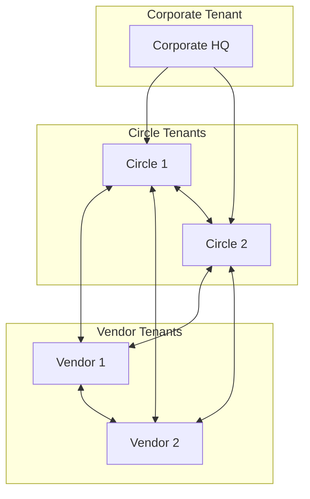

# Teleops Tenant Onboarding Specification

## Overview

The Teleops platform supports a flexible, multi-level, circle-based multi-tenant architecture with three distinct tenant types: **Corporate**, **Circle**, and **Vendor**. Each tenant type has specific onboarding workflows, relationship management, and operational capabilities.

---

## Tenant Types and Capabilities (Updated)

### 1. Corporate Tenant

- **Role:** Parent/oversight only. Cannot manage projects, tasks, sites, or operational data.
- **Capabilities:**
  - Invite and manage circles (child tenants) **after onboarding**
  - Consolidated reporting, analytics, and governance
  - Vendor oversight at a strategic level
  - No access to operational modules (project, task, site, equipment, etc.)

---

## Onboarding Flows (Updated)

### Corporate Onboarding (Current Process)

- Registers as a parent entity (Corporate tenant) via a streamlined onboarding form.
- **Does not select or create circles during registration.**
- Gains immediate access to the admin portal upon successful onboarding (no manual approval required).
- Receives a confirmation email upon successful registration.
- Can invite circles post-onboarding by sending invitation emails to circle admins (providing name, email, expiry, etc.).
- Invited circles onboard via a secure invitation link; corporate admin can accept or reject their submission.
- No operational setup (no projects, tasks, sites, etc.) for corporate tenants.
- Gains access to consolidated dashboards, analytics, and governance tools.
- The invitation link expires after successful onboarding.

---

## Corporate Registration Workflow (Current)

```yaml
Corporate Registration Process:
  Step 1: Corporate Entity Registration
    Organization Details:
      - Corporate Name: string (e.g., "Vodafone India")
      - Tenant Type: "Corporate" (fixed)
      - Business Registration Number: string (optional)
      - Industry Sector: "Telecommunications" (default)
      - Country: string (required, default: India)
      - Corporate Headquarters Address: text (required)
      - Website: string (optional)

    Contact Information:
      - Corporate Contact Name: string (CTO/Corporate Head)
      - Corporate Contact Email: email (unique across platform)
      - Corporate Contact Phone: string (required)
      - Secondary Contact: optional backup contact
      - Administrative Contact: for billing and admin

    Platform Configuration:
      - Corporate Subdomain: string (e.g., vodafone-corporate-teleops)

  Step 2: Immediate Activation
    - Corporate tenant is activated immediately after successful registration.
    - Confirmation email is sent to the primary contact.

  Step 3: Circle Invitation (Post-Onboarding)
    - Corporate admin can invite circles by providing name, email, and expiry.
    - Circle admins receive an invitation link via email.
    - Circle onboarding is completed via the invitation link.
    - Corporate admin can accept or reject circle submissions.

  Step 4: Circle Management Structure
    - Circles operate as independent tenants under the corporate.
    - Corporate can manage, monitor, and govern circles via the admin portal.
```

---

## API Endpoints (Relevant to Corporate Onboarding)

```yaml
# Corporate Registration APIs
POST   /api/public/corporate/register/         # Corporate registration (creates corporate tenant only)
GET    /api/public/corporate/verify-subdomain/ # Check corporate subdomain availability

# Circle Invitation APIs
POST   /api/corporate/{corp_id}/circles/invite/ # Invite a new circle (send invitation email)
GET    /api/corporate/{corp_id}/circles/invitations/ # List sent invitations
POST   /api/corporate/{corp_id}/circles/{invitation_id}/accept/ # Accept circle onboarding
POST   /api/corporate/{corp_id}/circles/{invitation_id}/reject/ # Reject circle onboarding
```

---

## Implementation Notes (Current)

- The onboarding form for corporate tenants does **not** include a "Select Circles" step.
- The backend does **not** require circles for corporate onboarding.
- The onboarding flow is streamlined and modern, with clear error handling and support options.
- Corporate tenants are active immediately after onboarding; no admin approval is required.
- A confirmation email is sent to the corporate admin upon successful onboarding.
- The invitation link expires after successful onboarding.

---

## Summary Table: Tenant Capabilities (Corporate)

| Capability             | Corporate | Circle | Vendor |
| ---------------------- | --------- | ------ | ------ |
| Invite/manage circles  | Yes       | No     | No     |
| Manage users           | No        | Yes    | Yes    |
| Manage projects/tasks  | No        | Yes    | Yes    |
| Manage sites/equipment | No        | Yes    | Yes    |
| Onboard clients        | No        | Yes    | Yes    |
| Onboard vendors        | No        | Yes    | Yes    |
| Act as client          | No        | Yes    | Yes    |
| Act as vendor          | No        | Yes    | Yes    |
| Consolidated reporting | Yes       | No     | No     |
| Governance/oversight   | Yes       | No     | No     |

---

## Updated Diagrams



---

## Industry-Standard Vendor Code Management

### Business Context

The Teleops platform integrates with existing telecom industry practices for vendor management. Telecom operators (clients) maintain their own vendor management systems and generate unique vendor codes for their service providers. The platform recognizes and respects this established business practice.

### Key Principles

1. **Client-Generated Vendor Codes**: All vendor codes are created and managed by clients in their existing vendor management systems, not by the Teleops platform.

2. **Multi-Client Vendor Support**: A single vendor organization can work with multiple telecom clients and will have different vendor codes for each client relationship.

3. **No Platform Code Generation**: The Teleops platform does NOT generate vendor codes. It acts as an integration layer that stores and uses client-provided codes.

### Example Business Scenario

```yaml
Verveland Infrastructure Services (Vendor):
  Client Relationships:
    - Vodafone MPCG: Vendor Code "VOD-MPCG-VERV-001"
    - Ericsson Gujarat: Vendor Code "ERI-GJ-VERVELAND-2024"
    - Vedang UP East: Vendor Code "VED-UPE-INFRA-042"

Business Process: 1. Client maintains vendor codes in their existing vendor management system
  2. When inviting vendor to Teleops, client provides their internal vendor code
  3. Teleops stores this client-generated code for all platform communications
  4. Vendor receives invitation with client's vendor code for reference
  5. All project assignments and communications use the client's vendor code
```

### Platform Integration

- **Vendor Invitation**: Clients enter their pre-existing vendor code when inviting vendors
- **Data Storage**: Platform stores client-provided codes without modification
- **Communication**: All vendor communications reference the client's vendor code
- **Reporting**: Analytics and reports use client-generated vendor codes for consistency

---

## Circle-Based Tenant Registration Process

### 1. Corporate Organization Registration

#### Corporate Registration Workflow

```yaml
Corporate Registration Process:
  Step 1: Corporate Entity Registration
    Organization Details:
      - Corporate Name: string (e.g., "Vodafone India")
      - Tenant Type: "Corporate" (fixed)
      - Business Registration Number: string (required)
      - Industry Sector: "Telecommunications" (default)
      - Country: string (required, default: India)
      - Corporate Headquarters Address: text (required)
      - Website: string (optional)

    Contact Information:
      - Corporate Contact Name: string (CTO/Corporate Head)
      - Corporate Contact Email: email (unique across platform)
      - Corporate Contact Phone: string (required)
      - Secondary Contact: optional backup contact
      - Administrative Contact: for billing and admin

    Platform Configuration:
      - Corporate Subdomain: string (e.g., vodafone-corporate-teleops)
      - Operating Circles: multi-select (required - creates circle tenants)
        Available Options:
          - Andhra Pradesh (AP)
          - Assam (AS)
          - Bihar (BH)
          - Chennai (CH)
          - Gujarat (GJ)
          - Haryana (HR)
          - Himachal Pradesh (HP)
          - Jammu & Kashmir (JK)
          - Karnataka (KA)
          - Kerala (KL)
          - Kolkata (KO)
          - Maharashtra & Goa (MH)
          - Madhya Pradesh & Chhattisgarh (MPCG)
          - Mumbai (MU)
          - North East (NE)
          - Odisha (OR)
          - Punjab (PB)
          - Rajasthan (RJ)
          - Tamil Nadu (TN)
          - UP (East) (UPE)
          - UP (West) (UPW)
          - West Bengal (WB)
          - Mumbai Corporate (MC)

    Corporate Admin Setup:
      - Corporate Admin First Name, Last Name: string (required)
      - Corporate Admin Email: email (must match primary contact)
      - Corporate Admin Designation: "Chief Technology Officer" (default)
      - Corporate Admin Phone: string (required)

  Step 2: Automatic Circle Tenant Creation
    For Each Selected Circle:
      - Create independent circle tenant (e.g., "Vodafone MPCG")
      - Generate circle subdomain (e.g., vodafone-mpcg-teleops)
      - Setup circle-specific billing configuration
      - Initialize circle operational environment
      - Assign corporate user as initial circle admin

  Step 3: Circle Management Structure
    Circle Configuration:
      - Circle Head Assignment: per circle
      - Circle Operational Permissions: independent
      - Circle Billing Setup: separate P&L per circle
      - Circle Vendor Management: independent per circle

  Corporate Approval Workflow:
    Step 1: Corporate Registration Submission
      - Form validation and duplicate checking
      - Business registration verification
      - Corporate subdomain availability confirmation
      - Circle subdomain pre-validation

    Step 2: Teleops Admin Review
      - Manual review for telecom corporate entities
      - Business verification and compliance check
      - Circle operation authorization review
      - Subscription plan determination (Corporate + per-circle)
      - Approval/rejection decision with reasoning

    Step 3: Corporate and Circle Activation
      - Corporate admin email verification
      - Corporate tenant environment provisioning
      - Automatic circle tenant creation and activation
      - Circle-specific admin assignment
      - Welcome package with corporate and circle onboarding guides
      - Circle-specific vendor invitation capabilities enabled
```

### 2. Circle-Vendor Registration

#### Circle-Based Vendor Onboarding Workflow

```yaml
Circle-Vendor Registration:
  Circle Invitation Process (Circle-Specific):
    Circle Admin Entry:
      - Vendor Name: string (required)
      - Vendor Code: string (client-generated vendor code from their existing vendor management system, required)
      - Vendor Email: email (required)
      - Service Areas: multi-select (districts/regions within circle)
      - Service Capabilities: multi-select (Dismantling, Installation, Maintenance, Survey)
      - Contact Access Level: select (Basic, Full, Restricted)
      - Contract Terms: text (circle-specific terms)
      - Expected Volume: integer (monthly projects estimate)
      - Notes: text (optional)

    System Actions:
      - Generate unique circle-vendor invitation token
      - Create pending circle-vendor relationship record
      - Send circle-specific invitation email to vendor
      - Set relationship status to "Circle_Invitation_Sent"

  Vendor Registration Form (Circle-Specific):
    Organization Details (First-time vendors only):
      - Organization Name: string (pre-filled from circle invitation)
      - Tenant Type: "Vendor" (fixed)
      - Business Registration Number: string (required)
      - Business Address: text (required)
      - Website: string (optional)
      - Phone Number: string (required)

    Circle-Specific Information:
      - Circle Name: string (readonly, e.g., "Vodafone MPCG")
      - Service Areas in Circle: multi-select (pre-selected, editable)
      - Service Capabilities: multi-select (pre-selected, editable)
      - Local Office Address: text (office in circle region)
      - Circle Contact Person: string (circle-specific contact)

    Admin User Setup (First-time vendors only):
      - Admin First Name: string (required)
      - Admin Last Name: string (required)
      - Admin Phone: string (required)
      - Password: string (required)
      - Confirm Password: string (required)

    Platform Access:
      - Vendor Subdomain: string (auto-generated: companyname-teleops, editable)
      - Terms and Conditions: boolean (required)

  Circle-Vendor Activation Process:
    Step 1: Vendor Completes Circle Registration
      - Fill circle-specific service details
      - Confirm service areas and capabilities
      - Accept circle-specific terms

    Step 2: Automatic Circle Relationship Activation
      - Email verification (automated)
      - Circle-vendor relationship activated immediately
      - Circle-specific permissions applied
      - Access to circle contact directory enabled

    Step 3: Multi-Circle Vendor Support
      - If vendor already exists: add new circle relationship
      - Independent billing per circle relationship
      - Circle-specific performance tracking
      - Separate vendor dashboard per circle

Circle-Vendor Registration Benefits:
  - Circle has already vetted the vendor through existing business relationships
  - Immediate circle-specific platform access after registration
  - Independent relationships with multiple circles supported
  - Circle-specific billing and performance tracking
  - Focus on operational setup rather than business verification
  - Multi-circle vendor capabilities for larger service providers
```

### 3. Dual-Mode Vendor Operations _(NEW CRITICAL FEATURE)_

#### Independent Client Management for Vendors

**Business Context**: Vendors often work with mixed client portfolios where some clients use Teleops (integrated) while others don't (non-integrated). Vendors cannot lose business relationships based on their clients' technology adoption status.

```yaml
Dual-Mode Vendor Registration Process:
  Vendor Registration (Standard):
    - Vendor registers through circle invitation OR independent registration
    - Receives access to platform with multi-client capabilities
    - Can operate in both integrated and independent modes simultaneously

  Mode 1: Integrated Client Operations (Traditional):
    Client Uses Teleops:
      - Vendor receives project assignments from client (e.g., Vodafone MPCG)
      - Works within client's project structure and workflows
      - Uses client-managed sites, projects, and approval processes
      - Reports progress through client's platform instance
      - Revenue Model: Free core access + premium features ₹50-200/site

  Mode 2: Independent Client Management (NEW):
    Client Doesn't Use Teleops:
      - Vendor creates "client entity" within their tenant (e.g., "Airtel UP East")
      - Manually imports/adds client sites to platform
      - Creates and manages all projects and tasks independently
      - Uses platform for operational standardization across all clients
      - Revenue Model: Vendor pays ₹6K-10K/month per independent client

Post-Onboarding Client Management Workflow:

  Vendor Portal UI Structure:
    📌 Associated Clients Section (Auto-populated, Read-only):
      - System automatically populates from vendor_relationships table
      - Displays all formal platform relationships
      - Vendor cannot edit or manage these clients
      - Shows: Client name, vendor code, relationship status

    ➕ Independent Clients Section (Vendor-managed, Full CRUD):
      - Vendor can add new clients not in vendor_relationships
      - Full create, read, update, delete operations available
      - Subject to business validation rules
      - Shows: Client name, client code, management controls

Business Validation Rules:
  Client Addition Validation:
    ✅ Exact name matching prevents duplication of associated clients
    ✅ Same corporate family but different circles allowed
    ✅ System blocks creation if exact name exists in vendor_relationships
    ✅ Duplicate prevention within independent clients

  Example Validation Scenarios:
    Verveland associated with: "Vodafone MPCG"
    ✅ Can add "Vodafone UPE" independently (different circle)
    ✅ Can add "Vodafone Gujarat" independently (different circle)
    ❌ Cannot add "Vodafone MPCG" independently (exact match blocked)
    ✅ Can add "Airtel UP East" independently (not associated)

Independent Client Creation Workflow:
  Step 1: Vendor Accesses Independent Client Management
    - Navigate to "Independent Clients" section in vendor portal
    - Click "Add New Client" (only shows if not already associated)
    - System validates client name against associated clients list

  Step 2: Client Information Setup with Validation
    Organization Details:
      - Client Name: string (e.g., "Airtel UP East")
        * Real-time validation against associated clients
        * Warning if similar name exists (different circle allowed)
        * Error if exact match found in vendor_relationships
      - Client Code: string (vendor's internal reference)
      - Industry: "Telecommunications" (default)
      - Business Registration: string (optional)
      - Contact Information: Primary and secondary contacts

    Client Configuration:
      - Service Scope: text (e.g., "Dismantling operations in UP East")
      - Relationship Type: "Service_Provider" (default)
      - Billing Model: "Project_Based" (default)
      - Contract Reference: string (vendor's contract reference)

    Platform Branding (Optional):
      - Client Logo: file upload for professional presentation
      - Primary Color: hex color for client-specific branding
      - Secondary Color: hex color for reports and presentations

  Step 3: Site Data Import and Management
    Bulk Import Options:
      - Excel/CSV Upload: Import client sites from existing data
      - Manual Entry: Add individual sites with GPS coordinates
      - API Integration: Connect to client's existing systems (future)

    Site Information Required:
      - Site Name/Code: string (client's site identification)
      - Location: GPS coordinates, address, city, state
      - Site Type: "BTS", "BSC", "MSC", etc.
      - Equipment Details: Existing equipment inventory
      - Access Information: Site access protocols and contacts

  Step 4: Project and Task Setup
    Project Creation:
      - Create dismantling/maintenance projects for client
      - Define project scope, timeline, and deliverables
      - Assign vendor teams and resources
      - Set up progress tracking and reporting schedules

    Task Management:
      - Create specific tasks within projects
      - Assign tasks to vendor field teams
      - Set up photo documentation requirements
      - Configure progress reporting workflows

  Step 5: Client Communication Setup
    Professional Presentation:
      - Generate client-specific dashboards and reports
      - Set up automated progress updates for client
      - Configure client meeting preparation tools
      - Establish communication templates and workflows

Operational Benefits for Vendors:
  Standardization Across All Clients:
    ✅ Unified workflows for both integrated and independent clients
    ✅ Consistent quality standards and operational procedures
    ✅ Cross-client performance benchmarking and optimization
    ✅ Centralized team and resource management
    ✅ Professional presentation capabilities for all clients

  Business Growth Opportunities:
    ✅ Maintain relationships regardless of client technology adoption
    ✅ Demonstrate advanced capabilities to non-integrated clients
    ✅ Encourage client adoption through operational excellence
    ✅ Win new business through superior service delivery
    ✅ Pathway for client conversion to platform adoption

  Competitive Advantages:
    ✅ Technology leadership positioning in market
    ✅ Advanced reporting and analytics capabilities
    ✅ Real-time project tracking and transparency
    ✅ Professional documentation and compliance tracking
    ✅ Operational efficiency gains across client portfolio

Revenue Model for Independent Client Management:
  Vendor Investment:
    Base Multi-Client Access: ₹25K/month
    Independent Client Management Fees:
      - Regional Client: ₹8K/month (e.g., Airtel UP East)
      - Medium Client: ₹7K/month (e.g., Idea Maharashtra)
      - Smaller Client: ₹6K/month (e.g., BSNL Bihar)
      - Large Client: ₹10K/month (e.g., Vodafone Idea)

  Value Return:
    - 40% operational efficiency improvement through standardization
    - Professional competitive advantage in all client relationships
    - Client conversion opportunities (30% conversion rate within 18 months)
    - Portfolio diversification reducing business risk
    - Technology leadership positioning for new business development

Client Conversion Pathway:
  Vendor-Driven Platform Adoption:
    Step 1: Vendor demonstrates operational excellence using platform
    Step 2: Non-integrated client observes superior capabilities
    Step 3: Client evaluates platform for internal adoption
    Step 4: Vendor advocates for platform adoption to client
    Step 5: Platform gains new corporate client through vendor relationship

  Success Metrics:
    - 30% of vendor-managed clients convert to platform within 18 months
    - Vendor advocacy reduces client acquisition cost by 60%
    - Higher client retention through vendor network effects
    - Premium pricing justified through operational excellence
```

---

## Enhanced Multi-Level Vendor Management _(UPDATED)_

### Advanced Vendor Relationship Capabilities

```yaml
Enhanced Multi-Level Vendor Support:
  Traditional Circle-Vendor Relationships (Legacy):
    - Single vendor tenant (e.g., "ABC Infrastructure")
    - Multiple circle relationships (MPCG, UPE, Gujarat)
    - Independent billing per circle relationship
    - Circle-specific performance tracking

  Multi-Level Vendor Hierarchies (NEW):
    Primary Vendor Relationships:
      - Direct client-vendor relationships (Level 1)
      - Vodafone MPCG → vedag (Primary Vendor)
      - Full platform access and permissions
      - Direct contract and billing terms

    Sub-contractor Relationships:
      - Vendor hires another vendor (Level 2+)
      - vedag → Verveland (Subcontractor)
      - Parent-child relationship tracking
      - Revenue sharing configuration (e.g., 25% to sub-vendor)
      - Inherited permissions with restrictions

    Unlimited Hierarchy Depth:
      - Verveland → LocalCrew (Sub-subcontractor, Level 3)
      - No limit on hierarchy levels
      - Automatic hierarchy level calculation
      - Multi-level revenue distribution

  Cross-Tenant Vendor Networks (NEW):
    Corporate-to-Corporate Relationships:
      - Ericsson MPCG → Vodafone MPCG (Service Provider)
      - Premium billing (₹200,000/project)
      - Cross-corporate analytics and reporting
      - Enterprise-grade security and compliance

    Multi-Client Vendor Operations:
      - Verveland works for Vodafone, Ericsson, vedag simultaneously
      - Different vendor codes per client relationship
      - Unified vendor dashboard across all clients
      - Independent billing and performance per client

Enhanced Vendor Dashboard Features:
  Multi-Level Hierarchy Management:
    - Visual hierarchy display (Primary → Sub → Sub-sub)
    - Revenue sharing tracking across levels
    - Performance aggregation up hierarchy
    - Sub-contractor management interface

  Cross-Client Operations:
    - All client relationships in single interface
    - Client-specific performance tracking
    - Consolidated revenue analytics across clients
    - Cross-client resource optimization

  Revenue Optimization:
    - Multi-level revenue sharing calculations
    - Cross-client profitability analysis
    - Resource allocation across relationships
    - Growth opportunity identification

Database Schema for Enhanced Vendor Management:
  vendor_relationships (Enhanced Model):
    - id (UUID), client_tenant_id, vendor_tenant_id
    - vendor_code, relationship_type, relationship_status
    - parent_relationship_id (for hierarchy), hierarchy_level
    - service_scope, service_areas, service_capabilities
    - billing_rate, revenue_share_percentage
    - verification_status, performance_rating
    - contract_terms, auto_renewal, notice_period_days

  circle_vendor_relationships (Legacy - Maintained):
    - id, circle_tenant_id, vendor_tenant_id
    - vendor_code, service_areas, capabilities
    - relationship_status, contract_terms
    - billing_rate, payment_terms
    - performance_metrics (jsonb)

  Enhanced Communication Features:
    - Hierarchy-aware communication flows
    - Cross-client communication management
    - Multi-level approval workflows
    - Revenue sharing notifications
```

---

## Database Schema Updates

### Circle-Based Tenant Hierarchy Tables

```sql
-- Circle-Based Tenants Table
CREATE TABLE tenants (
    id UUID PRIMARY KEY DEFAULT gen_random_uuid(),

    -- Tenant Hierarchy
    tenant_type VARCHAR(30) NOT NULL, -- 'Corporate', 'Circle', 'Vendor'
    parent_tenant_id UUID REFERENCES tenants(id), -- Corporate parent for circles

    -- Organization Information
    organization_name VARCHAR(255) NOT NULL,
    organization_code VARCHAR(50) UNIQUE, -- e.g., 'VOD_MPCG', 'VOD_UPE'
    business_registration_number VARCHAR(100),
    industry_sector VARCHAR(100) DEFAULT 'Telecommunications',
    country VARCHAR(100) NOT NULL DEFAULT 'India',
    primary_business_address TEXT NOT NULL,
    website VARCHAR(255),

    -- Circle Information (for Circle tenants)
    circle_code VARCHAR(20), -- 'MPCG', 'UPE', 'GJ', etc.
    circle_name VARCHAR(100), -- 'Madhya Pradesh & Chhattisgarh'

    -- Platform Configuration
    subdomain VARCHAR(100) UNIQUE NOT NULL,
    subscription_plan VARCHAR(50) NOT NULL DEFAULT 'Professional',

    -- Contact Information
    primary_contact_name VARCHAR(255) NOT NULL,
    primary_contact_email VARCHAR(255) NOT NULL UNIQUE,
    primary_contact_phone VARCHAR(20) NOT NULL,
    secondary_contact_name VARCHAR(255),
    secondary_contact_email VARCHAR(255),
    secondary_contact_phone VARCHAR(20),
    administrative_contact_email VARCHAR(255),

    -- Business Details (for vendors)
    vendor_license_number VARCHAR(100),
    specialization TEXT[], -- array of specializations
    coverage_areas TEXT[], -- array of regions/states
    service_capabilities TEXT[], -- array of service types
    years_in_business INTEGER,
    employee_count INTEGER,
    equipment_capabilities TEXT,
    certifications TEXT[],

    -- Business Operational Settings
    operates_independently BOOLEAN DEFAULT TRUE, -- Circle independence flag
    shared_vendor_pool BOOLEAN DEFAULT FALSE, -- Can share vendors with parent
    cross_circle_reporting BOOLEAN DEFAULT TRUE, -- Allow parent reporting

    -- Tenant Status
    registration_status VARCHAR(50) NOT NULL DEFAULT 'Pending',
    activation_status VARCHAR(50) NOT NULL DEFAULT 'Inactive',
    is_active BOOLEAN DEFAULT FALSE,

    -- Approval Information
    approved_by INTEGER REFERENCES auth_user(id),
    approved_at TIMESTAMP WITH TIME ZONE,
    rejection_reason TEXT,

    -- Subscription Configuration
    subscription_features JSONB DEFAULT '{}',
    resource_limits JSONB DEFAULT '{}',

    -- Timestamps
    registered_at TIMESTAMP WITH TIME ZONE DEFAULT NOW(),
    activated_at TIMESTAMP WITH TIME ZONE,
    deactivated_at TIMESTAMP WITH TIME ZONE,
    created_at TIMESTAMP WITH TIME ZONE DEFAULT NOW(),
    updated_at TIMESTAMP WITH TIME ZONE DEFAULT NOW(),

    -- Constraints
    CHECK (tenant_type IN ('Corporate', 'Circle', 'Vendor')),
    CHECK (
        (tenant_type = 'Circle' AND parent_tenant_id IS NOT NULL AND circle_code IS NOT NULL) OR
        (tenant_type = 'Corporate' AND parent_tenant_id IS NULL) OR
        (tenant_type = 'Vendor')
    ),
    CHECK (subscription_plan IN ('Basic', 'Professional', 'Enterprise', 'Custom')),
    CHECK (registration_status IN ('Pending', 'Approved', 'Rejected', 'Expired')),
    CHECK (activation_status IN ('Inactive', 'Active', 'Suspended', 'Terminated'))
);

-- Corporate-Circle Relationships
CREATE TABLE corporate_circle_relationships (
    id BIGSERIAL PRIMARY KEY,
    corporate_tenant_id UUID NOT NULL REFERENCES tenants(id) ON DELETE CASCADE,
    circle_tenant_id UUID NOT NULL REFERENCES tenants(id) ON DELETE CASCADE,

    -- Relationship Configuration
    relationship_type VARCHAR(30) DEFAULT 'Parent_Circle',
    governance_level VARCHAR(30) DEFAULT 'Autonomous', -- Autonomous, Managed, Controlled

    -- Financial Configuration
    separate_billing BOOLEAN DEFAULT TRUE,
    cost_center_code VARCHAR(50),
    budget_authority_level DECIMAL(15,2),

    -- Operational Configuration
    independent_vendor_management BOOLEAN DEFAULT TRUE,
    independent_employee_management BOOLEAN DEFAULT TRUE,
    shared_technology_access BOOLEAN DEFAULT TRUE,

    -- Reporting Configuration
    reports_to_corporate BOOLEAN DEFAULT TRUE,
    data_sharing_level VARCHAR(30) DEFAULT 'Aggregated', -- None, Aggregated, Full

    -- Status
    is_active BOOLEAN DEFAULT TRUE,
    effective_from DATE DEFAULT CURRENT_DATE,
    effective_to DATE,

    created_at TIMESTAMP WITH TIME ZONE DEFAULT NOW(),
    updated_at TIMESTAMP WITH TIME ZONE DEFAULT NOW(),

    UNIQUE(corporate_tenant_id, circle_tenant_id),
    CHECK (governance_level IN ('Autonomous', 'Managed', 'Controlled')),
    CHECK (data_sharing_level IN ('None', 'Aggregated', 'Full'))
);

-- Enhanced Multi-Level Vendor Relationships (NEW)
CREATE TABLE vendor_relationships (
    id UUID PRIMARY KEY DEFAULT gen_random_uuid(),

    -- Core Relationship
    client_tenant_id UUID NOT NULL REFERENCES tenants(id) ON DELETE CASCADE,
    vendor_tenant_id UUID REFERENCES tenants(id) ON DELETE CASCADE,

    -- Vendor Information (for invitation/pre-registration)
    vendor_name VARCHAR(255), -- Vendor name before registration
    vendor_code VARCHAR(100) NOT NULL, -- Client-generated vendor code (unique within client)
    vendor_email VARCHAR(255), -- Vendor email for invitation

    -- Relationship Types & Hierarchy
    relationship_type VARCHAR(50) NOT NULL DEFAULT 'Primary_Vendor',
    relationship_status VARCHAR(50) NOT NULL DEFAULT 'Invitation_Sent',
    verification_status VARCHAR(50) NOT NULL DEFAULT 'Independent',

    -- Multi-Level Hierarchy Support
    parent_relationship_id UUID REFERENCES vendor_relationships(id) ON DELETE CASCADE,
    hierarchy_level INTEGER DEFAULT 1, -- 1=Direct, 2=Sub-vendor, 3=Sub-sub-vendor

    -- Service Configuration
    service_scope VARCHAR(50) DEFAULT 'Circle_Wide',
    service_areas JSONB DEFAULT '[]', -- Geographic areas
    service_capabilities JSONB DEFAULT '[]', -- Service types

    -- Performance Tracking
    performance_rating DECIMAL(3,2),
    quality_score DECIMAL(3,2),
    delivery_score DECIMAL(3,2),

    -- Financial Terms
    billing_rate DECIMAL(12,2),
    billing_unit VARCHAR(50) DEFAULT 'Per_Project',
    payment_terms VARCHAR(100),
    currency VARCHAR(10) DEFAULT 'INR',
    billing_frequency VARCHAR(20) DEFAULT 'Monthly',
    revenue_share_percentage DECIMAL(5,2), -- For sub-contracting

    -- Access & Permissions
    vendor_permissions JSONB DEFAULT '{}',
    data_access_level VARCHAR(50) DEFAULT 'Basic',
    communication_allowed BOOLEAN DEFAULT TRUE,

    -- Contract Management
    contract_start_date DATE,
    contract_end_date DATE,
    auto_renewal BOOLEAN DEFAULT FALSE,
    notice_period_days INTEGER DEFAULT 30,

    -- Invitation Management
    invitation_token VARCHAR(255),
    invitation_sent_at TIMESTAMP WITH TIME ZONE,
    invitation_expires_at TIMESTAMP WITH TIME ZONE,

    -- Approval Workflow
    created_by INTEGER REFERENCES auth_user(id),
    approved_by INTEGER REFERENCES auth_user(id),
    approved_at TIMESTAMP WITH TIME ZONE,

    -- Status & Metadata
    notes TEXT,
    internal_notes TEXT,
    is_active BOOLEAN DEFAULT TRUE,
    is_preferred BOOLEAN DEFAULT FALSE,
    is_critical BOOLEAN DEFAULT FALSE,

    -- Timestamps
    created_at TIMESTAMP WITH TIME ZONE DEFAULT NOW(),
    updated_at TIMESTAMP WITH TIME ZONE DEFAULT NOW(),
    last_activity_at TIMESTAMP WITH TIME ZONE,

    -- Constraints
    UNIQUE(client_tenant_id, vendor_code), -- Client-specific vendor codes
    UNIQUE(client_tenant_id, vendor_tenant_id, relationship_type), -- Prevent duplicate relationships
    CHECK (relationship_type IN ('Primary_Vendor', 'Subcontractor', 'Partnership', 'Service_Provider', 'Preferred_Vendor', 'Backup_Vendor')),
    CHECK (relationship_status IN ('Invitation_Sent', 'Pending_Approval', 'Active', 'Suspended', 'Terminated', 'Expired', 'Under_Review')),
    CHECK (verification_status IN ('Independent', 'Pending_Verification', 'Verified', 'Verification_Rejected', 'Requires_Update')),
    CHECK (service_scope IN ('Circle_Wide', 'Regional', 'District_Specific', 'Project_Based', 'Task_Specific', 'On_Demand')),
    CHECK (data_access_level IN ('None', 'Basic', 'Project_Specific', 'Circle_Data', 'Full_Access')),
    CHECK (hierarchy_level > 0),
    CHECK (revenue_share_percentage IS NULL OR (revenue_share_percentage >= 0 AND revenue_share_percentage <= 100))
);

-- Circle-Vendor Relationships (Legacy - Maintained for Backward Compatibility)
CREATE TABLE circle_vendor_relationships (
    id BIGSERIAL PRIMARY KEY,
    circle_tenant_id UUID NOT NULL REFERENCES tenants(id) ON DELETE CASCADE,
    vendor_tenant_id UUID REFERENCES tenants(id) ON DELETE CASCADE,

    -- Vendor Information (for invitation process)
    vendor_name VARCHAR(255), -- Vendor name before registration
    vendor_code VARCHAR(100), -- Client-generated vendor code (from client's existing vendor management system)
    vendor_email VARCHAR(255), -- Vendor email for invitation

    -- Circle-Specific Service Details
    service_areas TEXT[], -- Districts/regions within circle
    service_capabilities TEXT[], -- Dismantling, Installation, Maintenance, Survey
    performance_rating DECIMAL(3,2),

    -- Relationship Details
    relationship_type VARCHAR(50) NOT NULL DEFAULT 'Circle_Vendor',
    relationship_status VARCHAR(50) NOT NULL DEFAULT 'Circle_Invitation_Sent',
    vendor_verification_status VARCHAR(50) NOT NULL DEFAULT 'Independent', -- 'Independent', 'Verified', 'Pending_Verification'

    -- Financial Terms (Circle-specific)
    billing_rate DECIMAL(10,2),
    payment_terms VARCHAR(100),
    currency VARCHAR(10) DEFAULT 'INR',
    billing_frequency VARCHAR(20) DEFAULT 'Monthly',

    -- Permissions and Access
    vendor_permissions JSONB DEFAULT '{}', -- permissions vendor has for circle data
    communication_allowed BOOLEAN DEFAULT TRUE,
    contact_access_level VARCHAR(50) DEFAULT 'Basic', -- Basic, Full, Restricted

    -- Invitation Management
    invitation_token VARCHAR(255),
    invitation_sent_at TIMESTAMP WITH TIME ZONE,
    invitation_expires_at TIMESTAMP WITH TIME ZONE,

    -- Relationship Management
    invited_by INTEGER REFERENCES auth_user(id),
    approved_by INTEGER REFERENCES auth_user(id),
    approved_at TIMESTAMP WITH TIME ZONE,
    contract_start_date DATE,
    contract_end_date DATE,

    -- Verification Management
    verified_by INTEGER REFERENCES auth_user(id),
    verified_at TIMESTAMP WITH TIME ZONE,
    verification_notes TEXT,
    verification_documents JSONB DEFAULT '{}', -- Contract documents, certifications, etc.

    -- Status and Notes
    notes TEXT,
    is_active BOOLEAN DEFAULT TRUE,

    -- Audit Fields
    created_at TIMESTAMP WITH TIME ZONE DEFAULT NOW(),
    updated_at TIMESTAMP WITH TIME ZONE DEFAULT NOW(),

    -- Constraints
    UNIQUE(circle_tenant_id, vendor_code), -- Circle-specific vendor codes
    UNIQUE(circle_tenant_id, vendor_tenant_id), -- One relationship per circle-vendor pair
    CHECK (relationship_type IN ('Circle_Vendor', 'Partnership', 'Subcontractor')),
    CHECK (relationship_status IN ('Circle_Invitation_Sent', 'Active', 'Suspended', 'Terminated', 'Expired')),
    CHECK (vendor_verification_status IN ('Independent', 'Pending_Verification', 'Verified', 'Verification_Rejected')),
    CHECK (contact_access_level IN ('Basic', 'Full', 'Restricted', 'None'))
);

-- Circle Billing Records
CREATE TABLE circle_billing_records (
    id BIGSERIAL PRIMARY KEY,

    -- Circle and Period
    circle_tenant_id UUID NOT NULL REFERENCES tenants(id),
    billing_period DATE NOT NULL, -- First day of billing month

    -- Revenue Components
    subscription_revenue DECIMAL(15,2) DEFAULT 0,
    usage_revenue DECIMAL(15,2) DEFAULT 0,
    premium_features_revenue DECIMAL(15,2) DEFAULT 0,
    vendor_fees_revenue DECIMAL(15,2) DEFAULT 0,

    -- Cost Components
    platform_costs DECIMAL(15,2) DEFAULT 0,
    support_costs DECIMAL(15,2) DEFAULT 0,
    infrastructure_costs DECIMAL(15,2) DEFAULT 0,

    -- Calculated Fields
    gross_revenue DECIMAL(15,2) GENERATED ALWAYS AS (
        subscription_revenue + usage_revenue + premium_features_revenue + vendor_fees_revenue
    ) STORED,
    total_costs DECIMAL(15,2) GENERATED ALWAYS AS (
        platform_costs + support_costs + infrastructure_costs
    ) STORED,
    net_revenue DECIMAL(15,2) GENERATED ALWAYS AS (
        (subscription_revenue + usage_revenue + premium_features_revenue + vendor_fees_revenue) -
        (platform_costs + support_costs + infrastructure_costs)
    ) STORED,

    -- Status
    billing_status VARCHAR(30) DEFAULT 'Draft',
    generated_at TIMESTAMP WITH TIME ZONE DEFAULT NOW(),
    approved_at TIMESTAMP WITH TIME ZONE,

    UNIQUE(circle_tenant_id, billing_period),
    CHECK (billing_status IN ('Draft', 'Generated', 'Approved', 'Invoiced', 'Paid'))
);

-- Indexes for Circle-Based Architecture
CREATE INDEX idx_tenants_type ON tenants(tenant_type);
CREATE INDEX idx_tenants_parent ON tenants(parent_tenant_id);
CREATE INDEX idx_tenants_circle_code ON tenants(circle_code);
CREATE INDEX idx_tenants_status ON tenants(registration_status, activation_status);
CREATE INDEX idx_tenants_subdomain ON tenants(subdomain);

CREATE INDEX idx_corporate_circle_corp ON corporate_circle_relationships(corporate_tenant_id);
CREATE INDEX idx_corporate_circle_circle ON corporate_circle_relationships(circle_tenant_id);
CREATE INDEX idx_corporate_circle_active ON corporate_circle_relationships(is_active);

-- Indexes for Enhanced Vendor Relationships
CREATE INDEX idx_vendor_relationships_client ON vendor_relationships(client_tenant_id, relationship_status);
CREATE INDEX idx_vendor_relationships_vendor ON vendor_relationships(vendor_tenant_id, relationship_status);
CREATE INDEX idx_vendor_relationships_code ON vendor_relationships(vendor_code);
CREATE INDEX idx_vendor_relationships_type ON vendor_relationships(relationship_type, is_active);
CREATE INDEX idx_vendor_relationships_hierarchy ON vendor_relationships(hierarchy_level);
CREATE INDEX idx_vendor_relationships_parent ON vendor_relationships(parent_relationship_id);
CREATE INDEX idx_vendor_relationships_verification ON vendor_relationships(verification_status);
CREATE INDEX idx_vendor_relationships_created ON vendor_relationships(created_at);

CREATE INDEX idx_circle_vendor_circle ON circle_vendor_relationships(circle_tenant_id);
CREATE INDEX idx_circle_vendor_vendor ON circle_vendor_relationships(vendor_tenant_id);
CREATE INDEX idx_circle_vendor_code ON circle_vendor_relationships(vendor_code);
CREATE INDEX idx_circle_vendor_status ON circle_vendor_relationships(relationship_status);
CREATE INDEX idx_circle_vendor_active ON circle_vendor_relationships(is_active);

CREATE INDEX idx_circle_billing_circle ON circle_billing_records(circle_tenant_id);
CREATE INDEX idx_circle_billing_period ON circle_billing_records(billing_period);
CREATE INDEX idx_circle_billing_status ON circle_billing_records(billing_status);

-- Telecom Circles Master Data
CREATE TABLE telecom_circles (
    id SERIAL PRIMARY KEY,
    circle_code VARCHAR(20) UNIQUE NOT NULL,
    circle_name VARCHAR(100) NOT NULL,
    region VARCHAR(50), -- North, South, East, West, etc.
    state_coverage TEXT[], -- states covered by this circle
    is_active BOOLEAN DEFAULT TRUE,
    created_at TIMESTAMP WITH TIME ZONE DEFAULT NOW(),
    updated_at TIMESTAMP WITH TIME ZONE DEFAULT NOW()
);

-- Insert standard telecom circles
INSERT INTO telecom_circles (circle_code, circle_name, region, state_coverage) VALUES
('AP', 'Andhra Pradesh', 'South', ARRAY['Andhra Pradesh']),
('AS', 'Assam', 'North East', ARRAY['Assam']),
('BH', 'Bihar', 'East', ARRAY['Bihar']),
('CH', 'Chennai', 'South', ARRAY['Tamil Nadu']),
('GJ', 'Gujarat', 'West', ARRAY['Gujarat']),
('HR', 'Haryana', 'North', ARRAY['Haryana']),
('HP', 'Himachal Pradesh', 'North', ARRAY['Himachal Pradesh']),
('JK', 'Jammu & Kashmir', 'North', ARRAY['Jammu & Kashmir']),
('KA', 'Karnataka', 'South', ARRAY['Karnataka']),
('KL', 'Kerala', 'South', ARRAY['Kerala']),
('KO', 'Kolkata', 'East', ARRAY['West Bengal']),
('MH', 'Maharashtra & Goa', 'West', ARRAY['Maharashtra', 'Goa']),
('MP', 'Madhya Pradesh & Chhattisgarh', 'Central', ARRAY['Madhya Pradesh', 'Chhattisgarh']),
('MU', 'Mumbai', 'West', ARRAY['Maharashtra']),
('NE', 'North East', 'North East', ARRAY['Arunachal Pradesh', 'Manipur', 'Meghalaya', 'Mizoram', 'Nagaland', 'Tripura']),
('OR', 'Odisha', 'East', ARRAY['Odisha']),
('PB', 'Punjab', 'North', ARRAY['Punjab']),
('RJ', 'Rajasthan', 'North', ARRAY['Rajasthan']),
('TN', 'Tamil Nadu', 'South', ARRAY['Tamil Nadu']),
('UPE', 'UP (East)', 'North', ARRAY['Uttar Pradesh']),
('UPW', 'UP (West)', 'North', ARRAY['Uttar Pradesh']),
('WB', 'West Bengal', 'East', ARRAY['West Bengal']),
('MC', 'Mumbai Corporate', 'West', ARRAY['Maharashtra']);

-- Tenant Circle Operations
CREATE TABLE tenant_circle_operations (
    id BIGSERIAL PRIMARY KEY,
    tenant_id UUID NOT NULL REFERENCES tenants(id) ON DELETE CASCADE,
    circle_code VARCHAR(20) NOT NULL REFERENCES telecom_circles(circle_code) ON DELETE CASCADE,

    -- Operation Details
    is_active BOOLEAN DEFAULT TRUE,
    operation_type VARCHAR(50) NOT NULL DEFAULT 'Full', -- Full, Limited, Support_Only
    start_date DATE DEFAULT CURRENT_DATE,
    end_date DATE,

    -- Circle-Specific Configuration
    circle_head_user_id INTEGER REFERENCES auth_user(id),
    circle_permissions JSONB DEFAULT '{}',
    circle_settings JSONB DEFAULT '{}',

    -- Audit Fields
    created_at TIMESTAMP WITH TIME ZONE DEFAULT NOW(),
    updated_at TIMESTAMP WITH TIME ZONE DEFAULT NOW(),

    UNIQUE(tenant_id, circle_code),
    CHECK (operation_type IN ('Full', 'Limited', 'Support_Only', 'Inactive'))
);

-- Circle-specific indexes
CREATE INDEX idx_tenant_circles_tenant ON tenant_circle_operations(tenant_id);
CREATE INDEX idx_tenant_circles_circle ON tenant_circle_operations(circle_code);
CREATE INDEX idx_tenant_circles_active ON tenant_circle_operations(is_active);
CREATE INDEX idx_tenant_circles_head ON tenant_circle_operations(circle_head_user_id);
```

---

## API Endpoints

### Teleops Admin Portal APIs

```yaml
# Teleops Admin Portal APIs
GET    /api/admin/tenants/                     # List all tenants
POST   /api/admin/tenants/{id}/approve/        # Approve tenant registration
POST   /api/admin/tenants/{id}/reject/         # Reject tenant registration
POST   /api/admin/tenants/{id}/activate/       # Activate tenant
POST   /api/admin/tenants/{id}/suspend/        # Suspend tenant
GET    /api/admin/tenants/pending/             # Get pending registrations
GET    /api/admin/tenants/statistics/          # Platform statistics

# Tenant Relationship Management APIs
GET    /api/admin/relationships/               # List all tenant relationships
POST   /api/admin/relationships/approve/       # Approve vendor relationship
GET    /api/admin/relationships/pending/       # Pending relationship approvals
DELETE /api/admin/relationships/{id}/          # Terminate relationship

# Platform Administration APIs
GET    /api/admin/platform/health/            # Platform health status
GET    /api/admin/platform/usage/             # Usage statistics
POST   /api/admin/platform/maintenance/       # Maintenance operations
GET    /api/admin/audit-logs/                 # Platform audit logs

# Circle Management APIs
GET    /api/admin/circles/                    # List all telecom circles
POST   /api/admin/circles/                    # Create new circle
PUT    /api/admin/circles/{code}/             # Update circle details
GET    /api/admin/circles/{code}/tenants/     # Get tenants operating in circle
```

### Public Registration APIs

```yaml
# Corporate Registration APIs
POST   /api/public/corporate/register/         # Corporate registration (creates corporate tenant only)
GET    /api/public/corporate/verify-subdomain/ # Check corporate subdomain availability

# Circle Invitation APIs
POST   /api/corporate/{corp_id}/circles/invite/ # Invite a new circle (send invitation email)
GET    /api/corporate/{corp_id}/circles/invitations/ # List sent invitations
POST   /api/corporate/{corp_id}/circles/{invitation_id}/accept/ # Accept circle onboarding
POST   /api/corporate/{corp_id}/circles/{invitation_id}/reject/ # Reject circle onboarding

# Circle Information APIs (Public)
GET    /api/public/circles/                   # Get available telecom circles
GET    /api/public/circles/{code}/           # Get circle details
GET    /api/public/circles/{code}/coverage/   # Get circle coverage areas
```

### Circle-Based Tenant APIs

```yaml
# Corporate Management APIs
GET    /api/corporate/{corp_id}/circles/       # List corporate's circle tenants
POST   /api/corporate/{corp_id}/circles/create/ # Create new circle tenant
GET    /api/corporate/{corp_id}/billing/consolidated/ # Consolidated billing across circles
GET    /api/corporate/{corp_id}/analytics/cross-circle/ # Cross-circle analytics
PUT    /api/corporate/{corp_id}/circles/{circle_code}/governance/ # Update circle governance

# Circle Operations APIs
GET    /api/circles/{circle_code}/dashboard/   # Circle-specific dashboard
GET    /api/circles/{circle_code}/vendors/     # List circle's vendors
POST   /api/circles/{circle_code}/vendors/invite/ # Invite vendor to circle
PUT    /api/circles/{circle_code}/vendors/{vendor_id}/permissions/ # Update vendor permissions
DELETE /api/circles/{circle_code}/vendors/{vendor_id}/ # Remove vendor from circle
GET    /api/circles/{circle_code}/billing/     # Circle-specific billing
GET    /api/circles/{circle_code}/performance/ # Circle performance metrics

# Circle-Vendor Relationship APIs
GET    /api/circles/{circle_code}/vendor-invitations/ # List pending vendor invitations
POST   /api/circles/{circle_code}/vendors/{vendor_id}/resend-invite/ # Resend invitation
GET    /api/circles/{circle_code}/vendors/{vendor_id}/performance/ # Vendor performance in circle
PUT    /api/circles/{circle_code}/vendors/{vendor_id}/contract/ # Update contract terms

# Vendor Multi-Circle APIs (for Vendors)
GET    /api/vendors/circle-relationships/      # Get all circle relationships
GET    /api/vendors/circles/{circle_code}/contacts/ # Get circle contacts
POST   /api/vendors/circles/{circle_code}/communicate/ # Send communication to circle
GET    /api/vendors/billing/by-circle/         # Billing breakdown by circle
GET    /api/vendors/performance/by-circle/     # Performance metrics by circle

# Vendor Verification Status APIs
GET    /api/vendors/verification-status/       # Get vendor verification status across all circles
PUT    /api/circles/{circle_code}/vendors/{vendor_id}/verification-status/ # Update verification status
GET    /api/circles/{circle_code}/vendors/verified/ # List verified vendors for circle
GET    /api/circles/{circle_code}/vendors/independent/ # List independent vendors for circle
POST   /api/circles/{circle_code}/vendors/{vendor_id}/verify/ # Verify vendor for circle
POST   /api/circles/{circle_code}/vendors/{vendor_id}/reject-verification/ # Reject vendor verification
GET    /api/vendors/circles/{circle_code}/permissions/ # Get vendor permissions for specific circle
POST   /api/vendors/circles/{circle_code}/request-verification/ # Request verification for circle

# Cross-Circle Coordination APIs
GET    /api/vendors/unified-dashboard/         # Unified view across all circles
POST   /api/vendors/resource-coordination/     # Coordinate resources between circles
GET    /api/vendors/consolidated-reports/      # Consolidated reporting across circles
```

---

## Business Logic Updates

### Circle-Based Tenant Onboarding Service

```python
class CircleTenantOnboardingService:
    """Circle-based tenant onboarding for multi-tenant hierarchy"""

    def register_corporate_tenant(self, registration_data):
        """Register corporate tenant and create circle tenants"""
        # Validate corporate registration data
        self.validate_corporate_registration(registration_data)

        # Create corporate tenant
        corporate_tenant = Tenant.objects.create(
            tenant_type='Corporate',
            organization_name=registration_data['corporate_name'],
            organization_code=self.generate_organization_code(registration_data['corporate_name']),
            business_registration_number=registration_data['business_registration_number'],
            industry_sector=registration_data.get('industry_sector', 'Telecommunications'),
            subdomain=registration_data['corporate_subdomain'],
            subscription_plan=registration_data.get('subscription_plan', 'Enterprise'),
            primary_contact_name=registration_data['corporate_contact_name'],
            primary_contact_email=registration_data['corporate_contact_email'],
            primary_contact_phone=registration_data['corporate_contact_phone'],
            registration_status='Pending'
        )

        # Create circle tenants for each operating circle
        circle_tenants = []
        for circle_code in registration_data['operating_circles']:
            circle_tenant = self.create_circle_tenant(corporate_tenant, circle_code)
            circle_tenants.append(circle_tenant)

        # Setup corporate-circle relationships
        for circle_tenant in circle_tenants:
            self.create_corporate_circle_relationship(corporate_tenant, circle_tenant)

        # Send approval notification to admin
        self.notify_admin_for_approval(corporate_tenant, 'corporate_registration')

        return {
            'corporate_tenant': corporate_tenant,
            'circle_tenants': circle_tenants
        }

    def create_circle_tenant(self, corporate_tenant, circle_code):
        """Create independent circle tenant under corporate parent"""
        circle_info = TelecomCircle.objects.get(circle_code=circle_code)

        circle_tenant = Tenant.objects.create(
            tenant_type='Circle',
            parent_tenant_id=corporate_tenant.id,
            organization_name=f"{corporate_tenant.organization_name} {circle_info.circle_name}",
            organization_code=f"{corporate_tenant.organization_code}_{circle_code}",
            circle_code=circle_code,
            circle_name=circle_info.circle_name,
            business_registration_number=corporate_tenant.business_registration_number,
            industry_sector=corporate_tenant.industry_sector,
            subdomain=f"{corporate_tenant.organization_code.lower()}-{circle_code.lower()}-teleops",
            subscription_plan='Professional',
            primary_contact_name=corporate_tenant.primary_contact_name,
            primary_contact_email=corporate_tenant.primary_contact_email,
            primary_contact_phone=corporate_tenant.primary_contact_phone,
            operates_independently=True,
            cross_circle_reporting=True,
            registration_status='Approved',  # Auto-approved with corporate
            activation_status='Active',
            is_active=True,
            activated_at=timezone.now()
        )

        # Initialize circle-specific features
        self.setup_circle_features(circle_tenant)

        return circle_tenant

    def register_circle_vendor(self, invitation_token, registration_data):
        """Register vendor for specific circle through invitation"""
        # Validate invitation token
        invitation = self.validate_circle_vendor_invitation(invitation_token)
        circle_tenant = invitation.circle_tenant

        # Check if vendor already exists (multi-circle vendor)
        existing_vendor = Tenant.objects.filter(
            organization_name=registration_data['organization_name'],
            tenant_type='Vendor'
        ).first()

        if existing_vendor:
            # Add new circle relationship to existing vendor
            vendor_tenant = existing_vendor
        else:
            # Create new vendor tenant
            vendor_tenant = Tenant.objects.create(
                tenant_type='Vendor',
                organization_name=registration_data['organization_name'],
                organization_code=self.generate_organization_code(registration_data['organization_name']),
                business_registration_number=registration_data['business_registration_number'],
                primary_business_address=registration_data['business_address'],
                website=registration_data.get('website'),
                subdomain=registration_data['vendor_subdomain'],
                primary_contact_name=registration_data['contact_person_name'],
                primary_contact_email=registration_data['contact_email'],
                primary_contact_phone=registration_data['contact_phone'],
                service_capabilities=registration_data.get('service_capabilities', []),
                registration_status='Approved',  # Auto-approved since circle invited
                activation_status='Active',
                is_active=True,
                activated_at=timezone.now()
            )

            # Create admin user for new vendor
            admin_user = self.create_admin_user(vendor_tenant, registration_data)

        # Update the circle-vendor relationship
        relationship = ClientVendorRelationship.objects.get(
            circle_tenant_id=circle_tenant.id,
            vendor_code=invitation.vendor_code
        )
        relationship.vendor_tenant_id = vendor_tenant.id
        relationship.relationship_status = 'Active'
        relationship.service_areas = registration_data.get('service_areas', [])
        relationship.service_capabilities = registration_data.get('service_capabilities', [])
        relationship.approved_at = timezone.now()
        relationship.save()

        # Setup circle-specific vendor features
        self.setup_circle_vendor_features(vendor_tenant, circle_tenant, relationship)

        # Send welcome email
        self.send_circle_vendor_welcome_email(vendor_tenant, circle_tenant)

        return vendor_tenant

    def invite_vendor_to_circle(self, circle_tenant, vendor_data, invited_by):
        """Circle invites vendor to join platform"""
        # Validate vendor data
        required_fields = ['vendor_name', 'vendor_code', 'vendor_email']
        for field in required_fields:
            if not vendor_data.get(field):
                raise ValidationError(f"{field} is required")

        # Check if vendor code is unique within circle
        if ClientVendorRelationship.objects.filter(
            circle_tenant_id=circle_tenant.id,
            vendor_code=vendor_data['vendor_code']
        ).exists():
            raise ValidationError("Vendor code already exists for this circle")

        # Generate invitation token
        invitation_token = self.generate_invitation_token()

        # Create circle-vendor relationship record
        relationship = ClientVendorRelationship.objects.create(
            circle_tenant_id=circle_tenant.id,
            vendor_name=vendor_data['vendor_name'],
            vendor_code=vendor_data['vendor_code'],
            vendor_email=vendor_data['vendor_email'],
            service_areas=vendor_data.get('service_areas', []),
            service_capabilities=vendor_data.get('service_capabilities', []),
            relationship_type='Circle_Vendor',
            relationship_status='Circle_Invitation_Sent',
            contact_access_level=vendor_data.get('contact_access_level', 'Basic'),
            billing_rate=vendor_data.get('billing_rate'),
            payment_terms=vendor_data.get('payment_terms'),
            notes=vendor_data.get('notes'),
            invited_by=invited_by,
            invitation_token=invitation_token,
            invitation_sent_at=timezone.now(),
            invitation_expires_at=timezone.now() + timedelta(days=30)
        )

        # Send circle-specific invitation email
        self.send_circle_vendor_invitation_email(
            vendor_email=vendor_data['vendor_email'],
            vendor_name=vendor_data['vendor_name'],
            circle_name=circle_tenant.circle_name,
            corporate_name=circle_tenant.parent_tenant.organization_name,
            invitation_token=invitation_token,
            invited_by=invited_by
        )

        return relationship

    def create_corporate_circle_relationship(self, corporate_tenant, circle_tenant):
        """Create corporate-circle relationship"""
        return CorporateCircleRelationship.objects.create(
            corporate_tenant_id=corporate_tenant.id,
            circle_tenant_id=circle_tenant.id,
            relationship_type='Parent_Circle',
            governance_level='Autonomous',
            separate_billing=True,
            independent_vendor_management=True,
            independent_employee_management=True,
            reports_to_corporate=True,
            data_sharing_level='Aggregated'
        )

    def get_corporate_consolidated_billing(self, corporate_tenant_id, period):
        """Get consolidated billing across all circles"""
        circle_relationships = CorporateCircleRelationship.objects.filter(
            corporate_tenant_id=corporate_tenant_id,
            is_active=True
        ).select_related('circle_tenant')

        consolidated_data = {
            'corporate_tenant_id': corporate_tenant_id,
            'billing_period': period,
            'circles': [],
            'totals': {
                'gross_revenue': 0,
                'total_costs': 0,
                'net_revenue': 0
            }
        }

        for relationship in circle_relationships:
            circle_billing = CircleBillingRecord.objects.filter(
                circle_tenant_id=relationship.circle_tenant_id,
                billing_period=period
            ).first()

            if circle_billing:
                circle_data = {
                    'circle_code': relationship.circle_tenant.circle_code,
                    'circle_name': relationship.circle_tenant.circle_name,
                    'billing_data': circle_billing
                }

                consolidated_data['circles'].append(circle_data)
                consolidated_data['totals']['gross_revenue'] += circle_billing.gross_revenue
                consolidated_data['totals']['total_costs'] += circle_billing.total_costs
                consolidated_data['totals']['net_revenue'] += circle_billing.net_revenue

        return consolidated_data

    def setup_circle_features(self, circle_tenant):
        """Setup features for circle tenant"""
        # Enable circle-specific features
        circle_tenant.subscription_features.update({
            'vendor_management_enabled': True,
            'project_management_enabled': True,
            'billing_management_enabled': True,
            'reporting_enabled': True,
            'circle_specific_dashboard': True
        })
        circle_tenant.save()

    def setup_circle_vendor_features(self, vendor_tenant, circle_tenant, relationship):
        """Setup circle-specific features for vendor"""
        # Enable vendor features for this circle relationship
        if 'circle_relationships' not in vendor_tenant.subscription_features:
            vendor_tenant.subscription_features['circle_relationships'] = {}

        vendor_tenant.subscription_features['circle_relationships'][circle_tenant.circle_code] = {
            'contact_access_enabled': True,
            'communication_enabled': True,
            'project_access_enabled': True,
            'billing_tracking_enabled': True,
            'performance_tracking_enabled': True
        }
        vendor_tenant.save()

    def get_vendor_circle_relationships(self, vendor_tenant_id):
        """Get all circle relationships for a vendor"""
        return ClientVendorRelationship.objects.filter(
            vendor_tenant_id=vendor_tenant_id,
            is_active=True
        ).select_related('circle_tenant')

    def get_circle_vendors(self, circle_tenant_id):
        """Get all vendors for a circle"""
        return ClientVendorRelationship.objects.filter(
            circle_tenant_id=circle_tenant_id,
            is_active=True
        ).select_related('vendor_tenant')

    def update_vendor_verification_status(self, circle_tenant_id, vendor_tenant_id, verification_status, verified_by, notes=None):
        """Update vendor verification status for specific circle relationship"""
        relationship = ClientVendorRelationship.objects.get(
            circle_tenant_id=circle_tenant_id,
            vendor_tenant_id=vendor_tenant_id,
            is_active=True
        )

        relationship.vendor_verification_status = verification_status
        relationship.verified_by = verified_by
        relationship.verified_at = timezone.now()
        relationship.verification_notes = notes
        relationship.save()

        # Update vendor permissions based on verification status
        if verification_status == 'Verified':
            # Grant full access for verified vendors
            relationship.vendor_permissions.update({
                'project_access': True,
                'task_creation': True,
                'contact_directory': 'Full',
                'communication': True,
                'reporting': True,
                'billing_access': True
            })
        elif verification_status == 'Independent':
            # Limited access for independent vendors
            relationship.vendor_permissions.update({
                'project_access': False,
                'task_creation': False,
                'contact_directory': 'Restricted',
                'communication': False,
                'reporting': False,
                'billing_access': False
            })

        relationship.save()

        return relationship

    def get_vendor_status_by_circle(self, vendor_tenant_id):
        """Get vendor's status and roles across all circles"""
        relationships = ClientVendorRelationship.objects.filter(
            vendor_tenant_id=vendor_tenant_id,
            is_active=True
        ).select_related('circle_tenant')

        vendor_status = {
            'vendor_tenant_id': vendor_tenant_id,
            'circle_relationships': []
        }

        for relationship in relationships:
            circle_status = {
                'circle_tenant_id': str(relationship.circle_tenant_id),
                'circle_name': relationship.circle_tenant.circle_name,
                'circle_code': relationship.circle_tenant.circle_code,
                'relationship_status': relationship.relationship_status,
                'verification_status': relationship.vendor_verification_status,
                'vendor_code': relationship.vendor_code,
                'service_areas': relationship.service_areas,
                'service_capabilities': relationship.service_capabilities,
                'contact_access_level': relationship.contact_access_level,
                'vendor_permissions': relationship.vendor_permissions,
                'communication_allowed': relationship.communication_allowed,
                'contract_start_date': relationship.contract_start_date,
                'contract_end_date': relationship.contract_end_date,
                'verified_at': relationship.verified_at,
                'performance_rating': relationship.performance_rating
            }
            vendor_status['circle_relationships'].append(circle_status)

        return vendor_status

    def can_vendor_access_circle(self, vendor_tenant_id, circle_tenant_id, required_permission=None):
        """Check if vendor has access to specific circle with optional permission check"""
        relationship = ClientVendorRelationship.objects.filter(
            vendor_tenant_id=vendor_tenant_id,
            circle_tenant_id=circle_tenant_id,
            is_active=True
        ).first()

        if not relationship:
            return False

        # Check relationship status
        if relationship.relationship_status != 'Active':
            return False

        # Check verification status for sensitive operations
        if required_permission in ['project_access', 'task_creation', 'billing_access']:
            if relationship.vendor_verification_status != 'Verified':
                return False

        # Check specific permission if required
        if required_permission:
            return relationship.vendor_permissions.get(required_permission, False)

        return True

    def get_vendor_circle_permissions(self, vendor_tenant_id, circle_tenant_id):
        """Get vendor's permissions for specific circle"""
        relationship = ClientVendorRelationship.objects.filter(
            vendor_tenant_id=vendor_tenant_id,
            circle_tenant_id=circle_tenant_id,
            is_active=True
        ).first()

        if not relationship:
            return None

        return {
            'verification_status': relationship.vendor_verification_status,
            'relationship_status': relationship.relationship_status,
            'permissions': relationship.vendor_permissions,
            'contact_access_level': relationship.contact_access_level,
            'communication_allowed': relationship.communication_allowed,
            'service_capabilities': relationship.service_capabilities,
            'service_areas': relationship.service_areas
        }

    def create_circle_billing_record(self, circle_tenant_id, billing_period):
        """Create billing record for circle"""
        return CircleBillingRecord.objects.create(
            circle_tenant_id=circle_tenant_id,
            billing_period=billing_period,
            subscription_revenue=150000,  # ₹1.5L default
            billing_status='Generated'
        )
```

---

## Implementation Roadmap

### Phase 1: Circle-Based Architecture Foundation (Weeks 1-2)

- Teleops admin portal for circle-based tenant management
- Corporate and circle tenant CRUD operations
- Circle-based approval workflows
- Corporate-circle relationship management
- Circle billing system foundation

### Phase 2: Corporate Onboarding (Weeks 3-4)

- Corporate registration workflow with automatic circle creation
- Email verification and admin approval
- Corporate and circle environment provisioning
- Circle-specific admin assignment
- Corporate consolidated dashboard

### Phase 3: Circle-Vendor Onboarding (Weeks 5-6)

- Circle-specific vendor invitation system
- Streamlined vendor registration for circles
- Multi-circle vendor support
- Automatic circle-vendor relationship establishment
- Circle-specific contact access and permissions

### Phase 4: Circle Operations & Multi-Circle Features (Weeks 7-8)

- Circle-specific dashboards and operations
- Circle independent vendor management
- Multi-circle vendor coordination features
- Circle billing and performance tracking
- Corporate consolidated reporting across circles

## Summary: Circle-Based Tenant Onboarding Benefits

### 🎯 **Circle Independence Architecture**

- **Corporate Registration**: Creates corporate HQ + automatic circle tenant creation
- **Circle Autonomy**: Each circle operates as independent business entity
- **Multi-Circle Vendors**: Vendors can work with multiple circles independently
- **Separate Billing**: Circle-specific P&L and revenue tracking

### ⚡ **Key Circle-Based Features**

```yaml
Corporate Level:
  - Single registration creates multiple circle tenants
  - Consolidated reporting across all circles
  - Corporate governance and oversight
  - Cross-circle analytics and benchmarking

Circle Level:
  - Independent vendor management per circle
  - Circle-specific billing and revenue tracking
  - Circle-bound employee structures
  - Autonomous operational decisions
  - Circle-specific dashboards and reporting

Vendor Level:
  - Multi-circle relationship capabilities
  - Separate contracts per circle
  - Circle-specific performance tracking
  - Independent billing per circle relationship
  - Unified vendor dashboard across circles

System Benefits:
  - True business model alignment with Indian telecom reality
  - 2-3x revenue potential per corporate (₹5.3L vs ₹2L)
  - Independent circle scaling and operations
  - Circle-specific compliance and regulations
  - Vendor ecosystem growth through multiple opportunities
```

### 🔄 **Circle-Based Registration Flow**

1. **Corporate** registers and selects operating circles (MPCG, UPE, Gujarat)
2. **System** automatically creates independent circle tenants
3. **Circle Admin** invites vendors with circle-specific terms
4. **Vendor** registers for specific circle or adds to existing multi-circle portfolio
5. **Circle** and vendor operate independently with separate billing

### 💰 **Revenue Model Benefits**

```yaml
Traditional Single Tenant: ₹2L/month
Circle-Based Multi-Tenant:
  - Vodafone MPCG: ₹1.5L/month
  - Vodafone UPE: ₹2L/month
  - Vodafone Gujarat: ₹1.8L/month
  Total: ₹5.3L/month (265% increase)

Vendor Revenue Multiplication:
  ABC Vendor contracts:
  - MPCG relationship: ₹50K/month
  - UPE relationship: ₹50K/month
  - Gujarat relationship: ₹50K/month
  Total: ₹150K/month vs ₹50K single relationship
```

### 🔐 **Vendor Verification Status Example**

```yaml
ABC Infrastructure Vendor Multi-Circle Status:

Vodafone MPCG Circle:
  verification_status: "Verified" (officially contracted)
  relationship_status: "Active"
  vendor_permissions:
    project_access: true
    task_creation: true
    contact_directory: "Full"
    communication: true
    reporting: true
    billing_access: true
  contract_start_date: "2024-01-01"
  contract_end_date: "2024-12-31"
  performance_rating: 4.5

Vodafone UPE Circle:
  verification_status: "Independent" (not yet contracted)
  relationship_status: "Active"
  vendor_permissions:
    project_access: false
    task_creation: false
    contact_directory: "Restricted"
    communication: false
    reporting: false
    billing_access: false
  contract_start_date: null
  contract_end_date: null
  performance_rating: null

Airtel Gujarat Circle:
  verification_status: "Pending_Verification" (under review)
  relationship_status: "Active"
  vendor_permissions:
    project_access: false
    task_creation: false
    contact_directory: "Basic"
    communication: true
    reporting: false
    billing_access: false
  contract_start_date: null
  contract_end_date: null
  performance_rating: null

Vendor User Experience:
  - Same vendor user can access all three circles
  - Different permissions and capabilities per circle
  - MPCG: Full operational access (verified vendor)
  - UPE: Limited access (independent vendor)
  - Gujarat: Basic access (pending verification)
  - Unified dashboard shows status across all circles
```

### 🎯 **Vendor Status Transitions**

```yaml
Vendor Verification Workflow:

1. Independent Vendor (Default):
  - Limited platform access
  - No project/task creation
  - Restricted contact access
  - No billing access

2. Pending Verification:
  - Basic communication allowed
  - Verification documents submitted
  - Circle admin review process
  - Temporary access during review

3. Verified Vendor:
  - Full operational access
  - Project and task creation
  - Full contact directory access
  - Complete billing access
  - Performance tracking enabled

4. Verification Rejected:
  - Access revoked
  - Rejection reasons documented
  - Re-application process available
  - Appeal mechanism supported

Circle-Specific Status Management:
  - Each circle independently manages vendor verification
  - Vendor can be verified in one circle, independent in another
  - Status changes don't affect other circle relationships
  - Circle-specific contracts and terms
  - Independent performance tracking per circle
```

---

This circle-based tenant onboarding specification aligns with the reality that **Vodafone MPCG and Vodafone UPE operate as separate businesses**, each requiring independent billing, vendor management, and operational autonomy while maintaining corporate oversight and governance.

_Last Updated: 2024-12-28_
