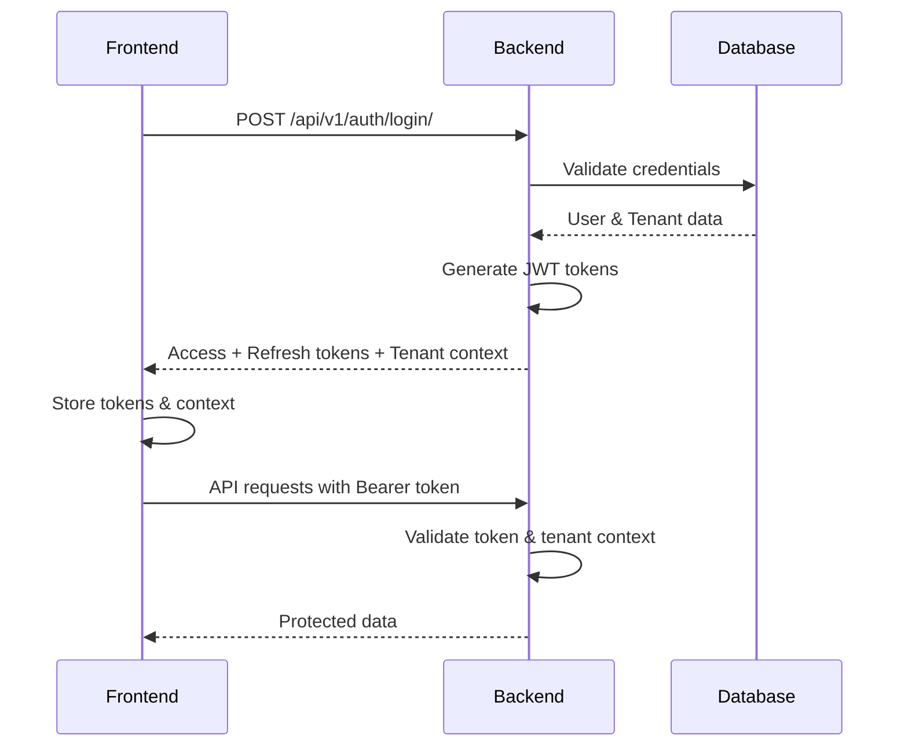

# 🔐 Authentication Integration Guide

## Overview

This guide covers the complete authentication integration between the Django backend and React frontend for the Circle-Based Multi-Tenant Platform.

## 🏗️ Backend Authentication Architecture

### Authentication Flow



### Key Components

#### 1. **User Model** (`apps/users/models.py`)

- Extended Django User model with tenant relationships
- Tenant type detection (Corporate, Circle, Vendor)
- User profile management

#### 2. **Authentication Views** (`apps/users/views.py`)

- `LoginView`: Custom login with tenant context
- `LogoutView`: Token invalidation
- `VerifyTokenView`: Token verification and user data
- `UserProfileView`: Profile management

#### 3. **Serializers** (`apps/users/serializers.py`)

- `LoginSerializer`: Credential validation
- `TenantContextSerializer`: Tenant hierarchy data
- `UserProfileSerializer`: User profile data

#### 4. **JWT Configuration** (`config/settings/base.py`)

- Access token: 60 minutes
- Refresh token: 24 hours
- Token rotation enabled
- Blacklist after rotation

## 🚀 API Endpoints

### Authentication Endpoints

| Endpoint                        | Method  | Description     | Auth Required |
| ------------------------------- | ------- | --------------- | ------------- |
| `/api/v1/auth/login/`           | POST    | User login      | No            |
| `/api/v1/auth/logout/`          | POST    | User logout     | Yes           |
| `/api/v1/auth/refresh/`         | POST    | Refresh token   | No            |
| `/api/v1/auth/verify/`          | GET     | Verify token    | Yes           |
| `/api/v1/auth/profile/`         | GET/PUT | User profile    | Yes           |
| `/api/v1/auth/change-password/` | PUT     | Change password | Yes           |
| `/api/v1/auth/forgot-password/` | POST    | Forgot password | No            |
| `/api/v1/auth/reset-password/`  | POST    | Reset password  | No            |

### Login Request/Response

#### Request

```json
{
  "email": "user@example.com",
  "password": "password123"
}
```

#### Response

```json
{
  "access": "eyJ0eXAiOiJKV1QiLCJhbGciOiJIUzI1NiJ9...",
  "refresh": "eyJ0eXAiOiJKV1QiLCJhbGciOiJIUzI1NiJ9...",
  "user": {
    "id": 1,
    "username": "user@example.com",
    "email": "user@example.com",
    "first_name": "John",
    "last_name": "Doe",
    "full_name": "John Doe",
    "tenant_type": "Circle"
  },
  "user_profile": {
    "user": {...},
    "tenant": {
      "id": "uuid",
      "tenant_type": "Circle",
      "organization_name": "Vodafone MPCG",
      "circle_code": "MPCG"
    },
    "designation": "Engineer"
  },
  "tenant_context": {
    "currentTenant": {...},
    "accessibleCircles": [...],
    "primaryCircle": {...},
    "corporateAccess": false,
    "crossCirclePermissions": [...],
    "userPermissions": [...],
    "user": {...},
    "userProfile": {...}
  }
}
```

## 🔧 Setup Instructions

### 1. Database Setup

```bash
# Create and apply migrations
python manage.py makemigrations
python manage.py migrate

# Create superuser
python manage.py createsuperuser
```

### 2. Create Test Data

```python
# Create test tenants and users
python manage.py shell

from apps.tenants.models import Tenant, TelecomCircle
from apps.users.models import User

# Create telecom circle
circle = TelecomCircle.objects.create(
    circle_code='MPCG',
    circle_name='Madhya Pradesh & Chhattisgarh'
)

# Create corporate tenant
corporate = Tenant.objects.create(
    tenant_type='Corporate',
    organization_name='Vodafone India',
    organization_code='VOD_CORP',
    primary_contact_email='corporate@vodafone.com',
    subdomain='vodafone-corporate'
)

# Create circle tenant
circle_tenant = Tenant.objects.create(
    tenant_type='Circle',
    parent_tenant=corporate,
    organization_name='Vodafone MPCG',
    organization_code='VOD_MPCG',
    circle=circle,
    circle_code='MPCG',
    primary_contact_email='mpcg@vodafone.com',
    subdomain='vodafone-mpcg'
)

# Create test user
user = User.objects.create_user(
    username='test@mpcg.com',
    email='test@mpcg.com',
    password='testpass123',
    first_name='Test',
    last_name='User',
    tenant=circle_tenant
)
```

### 3. Test Authentication

```bash
# Run the test script
python test_auth.py
```

### 4. Frontend Integration

The frontend is already configured to work with these endpoints:

- **API Base URL**: `http://localhost:8000/api/v1`
- **Authentication**: JWT Bearer tokens
- **Tenant Context**: Automatic injection in requests

## 🔒 Security Features

### 1. **JWT Token Security**

- Short-lived access tokens (60 minutes)
- Refresh token rotation
- Token blacklisting on logout
- Secure token storage

### 2. **Tenant Isolation**

- Complete data separation between tenants
- Tenant context validation on every request
- Cross-tenant access control

### 3. **Permission System**

- Role-based access control
- Tenant-specific permissions
- Cross-circle permissions for corporate users

### 4. **Input Validation**

- Email format validation
- Password strength requirements
- Tenant status validation

## 🧪 Testing

### Manual Testing

1. **Start the backend server**:

   ```bash
   python manage.py runserver
   ```

2. **Test login endpoint**:

   ```bash
   curl -X POST http://localhost:8000/api/v1/auth/login/ \
     -H "Content-Type: application/json" \
     -d '{"email": "test@mpcg.com", "password": "testpass123"}'
   ```

3. **Test protected endpoint**:
   ```bash
   curl -X GET http://localhost:8000/api/v1/auth/verify/ \
     -H "Authorization: Bearer YOUR_ACCESS_TOKEN"
   ```

### Automated Testing

```bash
# Run authentication tests
python manage.py test apps.users.tests.test_authentication

# Run all tests
python manage.py test
```

## 📚 API Documentation

### Swagger UI

- URL: `http://localhost:8000/swagger/`
- Interactive API documentation
- Test endpoints directly

### ReDoc

- URL: `http://localhost:8000/redoc/`
- Clean, responsive documentation

### API Schema

- URL: `http://localhost:8000/swagger.json`
- OpenAPI 3.0 specification

## 🔄 Frontend Integration

### Environment Variables

Create `.env` file in frontend:

```env
REACT_APP_API_BASE_URL=http://localhost:8000/api/v1
```

### Authentication Flow

1. **Login**: User enters credentials
2. **Token Storage**: Frontend stores JWT tokens
3. **Tenant Context**: Frontend stores tenant information
4. **API Requests**: Automatic token injection
5. **Token Refresh**: Automatic refresh on expiration
6. **Logout**: Token invalidation and cleanup

### Error Handling

The frontend handles various authentication errors:

- `401`: Invalid credentials or expired token
- `403`: Insufficient permissions
- `410`: Tenant inactive
- `423`: Account locked

## 🚨 Troubleshooting

### Common Issues

1. **CORS Errors**

   - Check `CORS_ALLOWED_ORIGINS` in settings
   - Ensure frontend URL is included

2. **Token Expiration**

   - Check JWT token lifetime settings
   - Verify refresh token rotation

3. **Tenant Context Issues**

   - Ensure user has valid tenant assignment
   - Check tenant activation status

4. **Database Connection**
   - Verify PostgreSQL connection
   - Check database migrations

### Debug Mode

Enable debug mode for detailed error messages:

```python
DEBUG = True
```

## 📈 Monitoring

### Logging

- Authentication attempts logged
- Token refresh events tracked
- Error responses captured

### Metrics

- Login success/failure rates
- Token refresh frequency
- API endpoint usage

## 🔮 Future Enhancements

1. **Multi-Factor Authentication**

   - SMS/Email verification
   - TOTP support

2. **SSO Integration**

   - SAML 2.0 support
   - OAuth 2.0 providers

3. **Advanced Security**

   - Rate limiting
   - IP whitelisting
   - Session management

4. **Audit Trail**
   - Login/logout events
   - Permission changes
   - Tenant switches

---

## 🎯 Next Steps

1. **Create test users** for each tenant type
2. **Test the complete authentication flow**
3. **Implement forgot password functionality**
4. **Add user profile management**
5. **Set up production environment**

The authentication system is now fully integrated and ready for development and testing!
